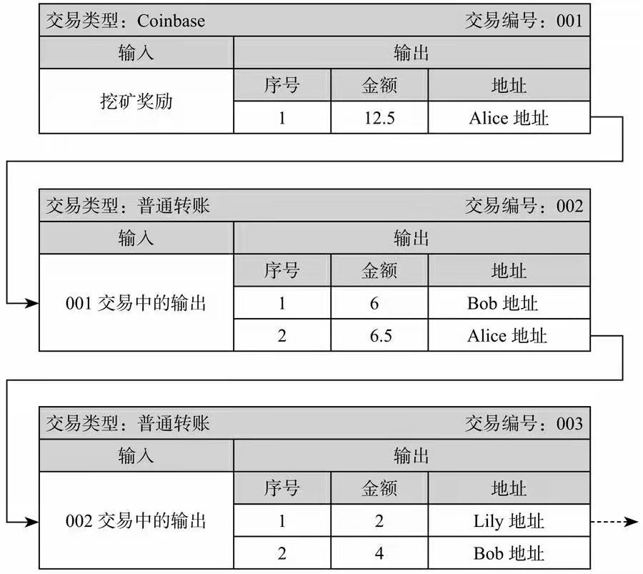
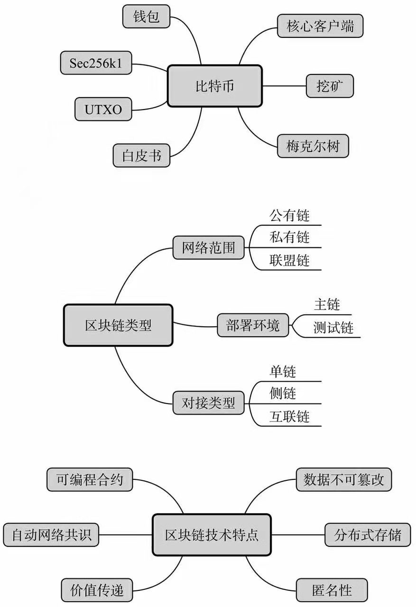

&emsp;&emsp;UTXO(Unspent Transaction Output,"未花费事务输出")，比特币的交易中不是通过账户的增减来实现的，而是一笔笔关联的输入/输出交易事务，每一笔交易都要花费"输入"，然后产生"输出",这个产生的输出就是所谓的UTXO。由于没有账户的概念，因此当输入部分的金额大于所选的输出时，必须给自己找零，这个找零也是作为交易的一部分包含在输出中。

&emsp;&emsp;利用私钥签名解锁自己的某一条UTXO(也就是之前的输出)，然后使用对方的公钥锁定新的输出，成功后，这笔新的输出就成为了对方的UTXO。

