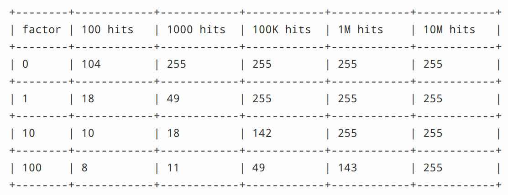

## 将Redis用作LRU缓存

将Redis用作缓存时，通常很方便
的做法是在添加新数据时自动将旧数据逐出。此行为在开发人员社区中是众所周知的，因为它是流行的memcached缓存系统的默认行为。

从Redis版本4.0开始，引入了新的LFU（最不常用）驱逐策略。 本文档中有单独章节对此进行介绍。

## Maxmemory配置指令

maxmemory配置redis最大可用的内存，可以通过`redis.conf`文件配置，也可以使用`config set`命令在运行时进行配置。

例如，为了配置100 MB的内存限制，可以在redis.conf文件中使用以下指令。

```
maxmemory 100mb
```
将maxmemory设置为零意味着没有内存限制。 这是64位系统的默认行为，而32位系统使用3GB的隐式内存限制。

当达到指定的最大内存时，可以在称为策略的不同行为之间进行选择。 Redis可能会对使用使用更多内存的命令返回错误，或者它可以逐出某些旧数据，以便在每次添加新数据时满足内存限制。

## 驱逐策略

当使用了`maxmemory-policy`配置指令，在达到最大内存限制时，redis会按照配置进行处理。

有以下可用策略:

* noeviction:当达到内存限制并且客户端尝试执行可能导致使用更多内存的命令时，返回错误

* allkeys-lru:通过lru算法尝试先删除较不常用的键(包括没有超时属性的和具有超时属性的)来为添加的新数据腾出空间。

* volatile-lru:通过尝试删除带有过期时间的较不常用的(LRU)键来为添加的新数据腾出空间。

* allkeys-random:随机删除key

* volatile-random:随机删除带有过期时间的key

* volatile-ttl:删除带有过期时间的key，优先移除ttl短的key

如果没有满足驱逐条件的key，那么volatile-lru, volatile-random和volatile-ttl将变得和noeviction策略一样。

选择正确的逐出策略很重要，具体取决于应用程序的访问模式，但是您可以在应用程序运行时在运行时重新配置该策略，并使用Redis INFO输出监视缓存未命中和命中的次数，以调整设置。

## 驱逐过程如何进行

重要的是要了解驱逐过程的工作方式，如下：

* 客户端运行新命令，从而添加更多数据。
* Redis会检查内存使用情况，如果大于最大内存限制，则会根据策略逐出密钥。
* 执行新命令，依此类推

## 近似LRU算法

Redis的LRU算法不是精确的实现。 这意味着Redis无法选择最好的驱逐候选者，即过去访问最多的访问者。 取而代之的是，它将尝试对LRU算法进行近似处理，方法是对少量key进行采样，然后从采样的key中驱出最好的（访问时间最旧）key。

但是，自Redis 3.0起，对该算法进行了改进，使其还可以收集一批优秀的驱逐对象。 这改善了算法的性能，使其能够更接近真实的LRU算法的行为。

Redis LRU算法的重要意义在于，可以通过更改样本数量来检查每次逐出，从而调整算法的精度。此参数由以下配置指令控制：

```
maxmemory-samples 5
```

Redis之所以不使用真正的LRU实现，是因为它占用更多内存。以下是Redis使用的LRU近似与真实LRU比较的图形比较。


生成上述图形的测试，用给定数量的key填充Redis服务器。 key是从第一个到最后一个访问的，因此第一个key是使用LRU算法驱逐的最佳候选者。 后来又添加了50％的key，以强制淘汰一半的旧key。

在图表中可以看到三种点，形成三个不同的带。

* 浅灰色带是被逐出的对象
* 灰带是未逐出的对象
* 绿带是添加的对象

在理论上的LRU实现中，我们期望在旧key中，前半部分将过期。相反，Redis LRU算法只会概率地使较早的key过期。

如你所见，与Redis 2.8相比，Redis 3.0在5个样本上做得更好，但是Redis 2.8仍保留了最新访问的大多数对象。在Redis 3.0中使用10的样本大小，近似值非常接近Redis 3.0的理论性能。

请注意，LRU只是预测未来将访问给定key的可能性的模型。 此外，如果你的数据访问模式与幂律极为相似，则大多数访问将位于LRU近似算法能够很好处理的key集合中。

可以以一些额外的CPU使用为代价将样本大小增加到10，以接近真实的LRU，并检查这是否会导致缓存未命中率有所不同。

可以通过使用`CONFIG SET maxmemory-samples <count>`命令以不同的样本大小值进行生产实验。

## LFU

从Redis 4.0开始，可以使用新的“最少使用”逐出模式。 在某些情况下，此模式可能会更好地工作（提供更好的命中率/未命中率），因为使用LFU Redis会尝试跟踪key的访问频率，因此，很少使用的key会被驱逐，而经常使用的key则有更大机会保留在内存中。

如果使用LRU，最近访问过但实际上几乎从未请求过的key不会过期，因此风险在于驱逐将来有更高机会被要求使用的key。 LFU没有这个问题，通常能更好地适应不同的访问模式。

要配置LFU模式，可以使用以下策略：

* volatile-lfu  对带有过期时间的key使用近似LFU驱逐
* allkeys-lfu 使用近似的LFU驱逐所有key

LFU近似于LRU：它使用概率计数器(Morris counters)，以便仅使用每个对象几个位来估计对象访问频率，并结合一个衰减周期，以便使计数器随时间减少：在某些时候，我们不在将key视为被频繁访问，即使过去被访问过，这样算法就可以适应访问模式的变化。

这些信息的采样方式与LRU发生的情况类似（如本文档前面的部分所述），以便选择驱逐候选人。

然而，与LRU不同的是，LFU具有某些可调参数：例如，如果一个频繁项不再被访问，那么它应该以多快的速度降低其排名？也可以调整Morris计数器的范围，以便更好地使算法适应特定的用例。

默认情况下，Redis 4.0配置为:

* 在大约一百万个请求时使计数器饱和
* 每隔一分钟使计数器衰减一次

这些应该是合理的值，并且已经过实验测试，但是用户可能希望使用这些配置设置选择的最佳值。

可以在源代码中的redis.conf文件中找到有关如何调整这些参数的说明，但简要地说，它们是：

```
lfu-log-factor 10
lfu-decay-time 1
```

衰减时间是显而易见的时间，它是在采样时发现计数器早于该值应衰减的分钟数。 特殊值0表示：每次扫描时总是使计数器衰减，并且很少有用。

计数器对数因子会更改为使频率计数器达到饱和所需的命中次数，该计数器刚好在0-255的范围内。 因数越高，为了达到最大值需要更多的访问。 根据下表，系数越低，计数器的分辨率越低，分辨率越高：

