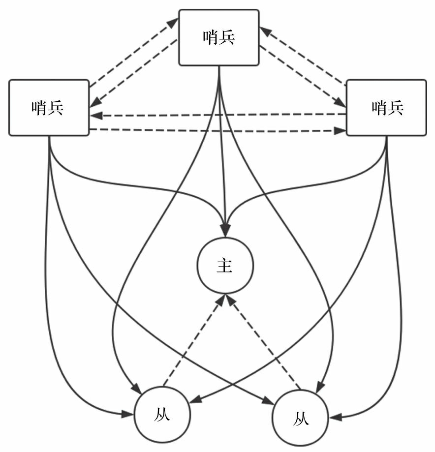

redis sentinel
--

哨兵用于保证redis集群的高可用，当主节点发生故障后，哨兵会选择一个从节点作为新的主节点。sentinel为了避免单点故障一般会部署多台。

哨兵会与redis集群的每个节点都会建立2个连接,一个是命令连接另一个是消息连接。命令连接用于向redis节点发送如info、ping等相关命令，消息连接用于向redis节点上创建的channel发送哨兵节点信息,其它哨兵会进行订阅创建的channel从而实现哨兵的互相发现。

当哨兵发现redis主节点的ping响应时间大于阀值down-after-milliseconds或角色从master变成slave时会被标记为S_DOWN(主观下线)，如果大多数哨兵将主节点标记为S_DOWN，则主节点被标记为O_DOWN(客观下线),之后就开始进行故障转移操作。

## 核心配置
哨兵启动所需配置文件在[sentinel.conf](https://raw.githubusercontent.com/antirez/redis/unstable/sentinel.conf),其中最关键的是要指名监控的redis主节点。

    sentinel monitor <master-name> <ip> <redis-port> <quorum>

master-name:给监控的redis集群起一个名字,如果有多个哨兵，通过该名称组成一个哨兵集群。

ip:主节点ip

port:主节点端口

quorum:需要至少quorum个哨兵且大部分哨兵认定主节点处于O_DOWN状态才能进行故障转移切换到新的主节点

## 启动哨兵

    ./redis-server ../sentinel.conf --sentinel
    或
    ./redis-sentinel ../sentinel.conf

通过以上方式redis启动后会进入哨兵模式,在main方法中也会读取哨兵配置文件加载相关配置，配置文件中是没有从节点的相关配置的，哨兵会通过info命令获取主节点的从节点，之后会将从节点信息保存到配置文件中，所以需要配置文件有读写权限。哨兵在进行监视和故障转移过程中配置信息可能会发生变换，发生变化后会对配置文件进行重写。
   
    int checkForSentinelMode(int argc, char **argv) {
        int j;

        if (strstr(argv[0],"redis-sentinel") != NULL) return 1;
        for (j = 1; j < argc; j++)
            if (!strcmp(argv[j],"--sentinel")) return 1;
        return 0;
    }    

哨兵逻辑具体是在serverCorn中触发的

    if (server.sentinel_mode) sentinelTimer();  

## 哨兵操作流程     

整体流程如下，其中最关键的是sentinelHandleDictOfRedisInstances,在其中完成了整个监控与failover操作

    void sentinelTimer(void) {
        //是否进入titl模式
        sentinelCheckTiltCondition();
        //sentinel流程处理
        sentinelHandleDictOfRedisInstances(sentinel.masters);
        //在子进程中处理队列中的job
        sentinelRunPendingScripts();
        //处理子进程的返回结果
        sentinelCollectTerminatedScripts();
        //kill执行job超时的子进程
        sentinelKillTimedoutScripts();
        
        server.hz = CONFIG_DEFAULT_HZ + rand() % CONFIG_DEFAULT_HZ;
    }

    void sentinelHandleDictOfRedisInstances(dict *instances) {
        dictIterator *di;
        dictEntry *de;
        sentinelRedisInstance *switch_to_promoted = NULL;

        /* There are a number of things we need to perform against every master. */
        di = dictGetIterator(instances);
        while((de = dictNext(di)) != NULL) {
            sentinelRedisInstance *ri = dictGetVal(de);
            //sentinel处理流程
            sentinelHandleRedisInstance(ri);
            if (ri->flags & SRI_MASTER) {
                //从节点走sentinel处理流程
                sentinelHandleDictOfRedisInstances(ri->slaves);
                //其它sentinels节点走sentinel处理流程
                sentinelHandleDictOfRedisInstances(ri->sentinels);
                //failover结束
                if (ri->failover_state == SENTINEL_FAILOVER_STATE_UPDATE_CONFIG) {
                    switch_to_promoted = ri;
                }
            }
        }
        //切换主节点
        if (switch_to_promoted)
            sentinelFailoverSwitchToPromotedSlave(switch_to_promoted);
        dictReleaseIterator(di);
    }

### sentinelHandleRedisInstance

* 与redis节点建立命令连接与消息连接

* 周期性执行ping，info,publish命令

* 检查是否主观下线

* 判断主节点是否客观下线

* 判断能否对主节点进行故障转移

* 故障转移状态流转处理

* 询问其它哨兵监视的主节点的状态

---

    void sentinelHandleRedisInstance(sentinelRedisInstance *ri) {
        /* ========== MONITORING HALF ============ */
        /* Every kind of instance */
        //重新连接redis节点 同时订阅redis节点上的__sentinel__:hello通道
        sentinelReconnectInstance(ri);
        //周期性发送PING、INFO、PUBLISTH命令
        sentinelSendPeriodicCommands(ri);        
        if (sentinel.tilt) {
            if (mstime()-sentinel.tilt_start_time < SENTINEL_TILT_PERIOD) return;
            sentinel.tilt = 0;
            sentinelEvent(LL_WARNING,"-tilt",NULL,"#tilt mode exited");
        }

        /* Every kind of instance */
        //检查是否主观下线
        sentinelCheckSubjectivelyDown(ri);

        /* Masters and slaves */
        if (ri->flags & (SRI_MASTER|SRI_SLAVE)) {
            /* Nothing so far. */
        }

        /* Only masters */
        if (ri->flags & SRI_MASTER) {
            //判断是否客观下线 如果满足客观下线则添加标记
            sentinelCheckObjectivelyDown(ri);
            //判断能否进行failover 如果能failover状态改为SENTINEL_FAILOVER_STATE_WAIT_START
            //添加SRI_FAILOVER_IN_PROGRESS标记
            if (sentinelStartFailoverIfNeeded(ri))
                //询问其它sentinel监视的master状态
                sentinelAskMasterStateToOtherSentinels(ri,SENTINEL_ASK_FORCED);
            //failover状态流转处理
            sentinelFailoverStateMachine(ri);
            //询问其它sentinel监视的master状态
            sentinelAskMasterStateToOtherSentinels(ri,SENTINEL_NO_FLAGS);
        }
    }

### 周期性操作    

哨兵可以同时监控多个redis集群,每个哨兵监控的redis集群在配置文集中都配置了一个名字,监控名字相同的哨兵组成了一个哨兵集群。哨兵集群中的节点通过与redis节点建立消息连接来交换信息，消息连接建立后会订阅redis节点上的“__sentinel__:hello”频道,哨兵集群中的节点会订阅每个redis节点上的频道也也会向频道中发送自身的信息，信息格式:

    /* Format is composed of 8 tokens:
        * 0=当前哨兵的ip,1=当前哨兵的端口,2=当前哨兵的id,3=当前哨兵的epoch,4=配置的监视集群名称,
        * 5=主节点ip,6=主节点端口,7=主节点配置信息的epoch. */

经过以上过程，哨兵集群中的每个节点就知道了其它节点的相关信息。

哨兵会周期性向redis节点发送info命令用于获取节点的相关信息，如:

* 主节点有那些从节点
* redis节点的id
* 从节点与主节点断开的时间
* 当前redis节点的角色是主节点还是从节点
* redis节点角色与哨兵监控的不一致处理
* redis节点重新连接到哨兵监控的主节点上
* ...

哨兵会周期性向集群中的其它哨兵发送"sentinel is-master-down-by-addr 主节点ip 主节点端口 epoch 哨兵id(\*)"命令用于获取其它哨兵对主节点的状态判断与请求投票。当传递的是哨兵id则其它节点会对该哨兵进销投票，如果传递的是"*"则只会获取状态。只有发起投票哨兵的信息比要求投票的哨兵新才会将票投给发起者，否则只返回上次投票的结果。

    char *sentinelVoteLeader(sentinelRedisInstance *master, uint64_t req_epoch, char *req_runid, uint64_t *leader_epoch) {
        //请求投票的sentinel epoch>当前sentinel epoch
        if (req_epoch > sentinel.current_epoch) {
            sentinel.current_epoch = req_epoch;
            sentinelFlushConfig();
            sentinelEvent(LL_WARNING,"+new-epoch",master,"%llu",
                (unsigned long long) sentinel.current_epoch);
        }
        //满足投票条件
        if (master->leader_epoch < req_epoch && sentinel.current_epoch <= req_epoch)
        {
            sdsfree(master->leader);
            master->leader = sdsnew(req_runid);
            master->leader_epoch = sentinel.current_epoch;
            sentinelFlushConfig();
            sentinelEvent(LL_WARNING,"+vote-for-leader",master,"%s %llu",
                master->leader, (unsigned long long) master->leader_epoch);   
            //自己投给自己时            
            if (strcasecmp(master->leader,sentinel.myid))
                master->failover_start_time = mstime()+rand()%SENTINEL_MAX_DESYNC;
        }
        //如果不满足投票条件则返回之前的投票结果
        *leader_epoch = master->leader_epoch;
        return master->leader ? sdsnew(master->leader) : NULL;
    }

   ### 故障转移 

   在大多数哨兵将主节点标记为主观下线后,哨兵会触发故障转移流程,在进行failover之前需要先选择出一个哨兵作为leader来进行failover操作。failover流程如下:

   * 从哨兵集群中选择一个作为leader
   * 从leader哨兵监视的子节点中选择一个升级为主节点
   * 断开从节点与主节点的连接
   * 将从节点升级为主节点
   * 其它节点连接到新的主节点
   ---

    void sentinelFailoverStateMachine(sentinelRedisInstance *ri) {
        serverAssert(ri->flags & SRI_MASTER);

        if (!(ri->flags & SRI_FAILOVER_IN_PROGRESS)) return;

        switch(ri->failover_state) {
            case SENTINEL_FAILOVER_STATE_WAIT_START:
                //选出leader,只有leader所在的sentinel才会进行后续流程
                sentinelFailoverWaitStart(ri);
                break;
            case SENTINEL_FAILOVER_STATE_SELECT_SLAVE:
                //选择一个从节点准备升级为master
                sentinelFailoverSelectSlave(ri);
                break;
            case SENTINEL_FAILOVER_STATE_SEND_SLAVEOF_NOONE:
                //断开从节点与主节点的连接
                sentinelFailoverSendSlaveOfNoOne(ri);
                break;
            case SENTINEL_FAILOVER_STATE_WAIT_PROMOTION:
                //将从节点升级为主节点 在info命令的响应中将状态改为SENTINEL_FAILOVER_STATE_RECONF_SLAVES
                sentinelFailoverWaitPromotion(ri);
                break;
            case SENTINEL_FAILOVER_STATE_RECONF_SLAVES:
                //从节点连接新的主节点
                sentinelFailoverReconfNextSlave(ri);
                break;
        }
    } 

选择某个哨兵成功leader需要满足:投票的节点数量>=阈值quorum && 超过一半节点进行了投票。

    //遍历所有的sentinel选择leader
    char *sentinelGetLeader(sentinelRedisInstance *master, uint64_t epoch) {
        dict *counters;
        dictIterator *di;
        dictEntry *de;
        unsigned int voters = 0, voters_quorum;
        char *myvote;
        char *winner = NULL;
        uint64_t leader_epoch;
        uint64_t max_votes = 0;

        serverAssert(master->flags & (SRI_O_DOWN|SRI_FAILOVER_IN_PROGRESS));
        counters = dictCreate(&leaderVotesDictType,NULL);
        //参与投票的sentinel包括自身
        voters = dictSize(master->sentinels)+1; /* All the other sentinels and me.*/

        /* Count other sentinels votes */
        di = dictGetIterator(master->sentinels);
        while((de = dictNext(di)) != NULL) {
            sentinelRedisInstance *ri = dictGetVal(de);
            //sentinel对当前epoch阶段进行了投票 投给了某个sentinel
            if (ri->leader != NULL && ri->leader_epoch == sentinel.current_epoch)
                //统计对sentinel的投票信息  runid->票数
                sentinelLeaderIncr(counters,ri->leader);
        }
        dictReleaseIterator(di);
        di = dictGetIterator(counters);
        while((de = dictNext(di)) != NULL) {
            uint64_t votes = dictGetUnsignedIntegerVal(de);
            if (votes > max_votes) {
                max_votes = votes;
                winner = dictGetKey(de);
            }
        }
        dictReleaseIterator(di);
        //将自己这一票投给胜利者  如果还没有投票信息到达则投票给自己
        if (winner)
            myvote = sentinelVoteLeader(master,epoch,winner,&leader_epoch);
        else
            myvote = sentinelVoteLeader(master,epoch,sentinel.myid,&leader_epoch);
        //投票成功 则统计
        if (myvote && leader_epoch == epoch) {
            uint64_t votes = sentinelLeaderIncr(counters,myvote);

            if (votes > max_votes) {
                max_votes = votes;
                winner = myvote;
            }
        }
        voters_quorum = voters/2+1;
        //投票的节点>=阈值quorum && 超过一半节点进行了投票
        if (winner && (max_votes < voters_quorum || max_votes < master->quorum))
            winner = NULL;
        winner = winner ? sdsnew(winner) : NULL;
        sdsfree(myvote);
        dictRelease(counters);
        return winner;
    }

进行故障转移的哨兵选择完成后，还需要在选择的哨兵监视的从节点中选择一个升级为主节点。排序规则：优先级->复制偏移->runid字典顺序

    //选择一个从节点
    sentinelRedisInstance *sentinelSelectSlave(sentinelRedisInstance *master) {
        sentinelRedisInstance **instance =
            zmalloc(sizeof(instance[0])*dictSize(master->slaves));
        sentinelRedisInstance *selected = NULL;
        int instances = 0;
        dictIterator *di;
        dictEntry *de;
        mstime_t max_master_down_time = 0;

        if (master->flags & SRI_S_DOWN)
            max_master_down_time += mstime() - master->s_down_since_time;
        max_master_down_time += master->down_after_period * 10;

        di = dictGetIterator(master->slaves);
        //排序不满足条件的从节点
        while((de = dictNext(di)) != NULL) {
            sentinelRedisInstance *slave = dictGetVal(de);
            mstime_t info_validity_time;

            if (slave->flags & (SRI_S_DOWN|SRI_O_DOWN)) continue;
            if (slave->link->disconnected) continue;
            if (mstime() - slave->link->last_avail_time > SENTINEL_PING_PERIOD*5) continue;
            //优先级为0的从节点排除
            if (slave->slave_priority == 0) continue;
            if (master->flags & SRI_S_DOWN)
                info_validity_time = SENTINEL_PING_PERIOD*5;
            else
                info_validity_time = SENTINEL_INFO_PERIOD*3;
            if (mstime() - slave->info_refresh > info_validity_time) continue;
            if (slave->master_link_down_time > max_master_down_time) continue;
            instance[instances++] = slave;
        }
        dictReleaseIterator(di);
        if (instances) {
            //优先级->复制偏移->runid字典顺序
            //按照上边的顺序排序选择第一个slave
            qsort(instance,instances,sizeof(sentinelRedisInstance*),
                compareSlavesForPromotion);
            selected = instance[0];
        }
        zfree(instance);
        return selected;
    }

新的主节点选择完毕后,其它节点连接到新的主节点、更新哨兵监视的配置信息后即完成了整个故障转移流程。

## 哨兵事件

哨兵在监视和故障转移过程中，在不同状态发下会发出不同的事件，这些事件可以发布到频道中让外部系统感知到哨兵的变换情况也可以将哨兵的变换保存到日志文件中,如果配置了脚本也会触发执行。

    //sentinel事件 记录日志  发布channl 执行脚本
    void sentinelEvent(int level, char *type, sentinelRedisInstance *ri,
                    const char *fmt, ...) {
        va_list ap;
        char msg[LOG_MAX_LEN];
        robj *channel, *payload;

        /* Handle %@ */
        if (fmt[0] == '%' && fmt[1] == '@') {
            sentinelRedisInstance *master = (ri->flags & SRI_MASTER) ?
                                            NULL : ri->master;

            if (master) {
                snprintf(msg, sizeof(msg), "%s %s %s %d @ %s %s %d",
                    sentinelRedisInstanceTypeStr(ri),
                    ri->name, ri->addr->ip, ri->addr->port,
                    master->name, master->addr->ip, master->addr->port);
            } else {
                snprintf(msg, sizeof(msg), "%s %s %s %d",
                    sentinelRedisInstanceTypeStr(ri),
                    ri->name, ri->addr->ip, ri->addr->port);
            }
            fmt += 2;
        } else {
            msg[0] = '\0';
        }

        /* Use vsprintf for the rest of the formatting if any. */
        if (fmt[0] != '\0') {
            va_start(ap, fmt);
            vsnprintf(msg+strlen(msg), sizeof(msg)-strlen(msg), fmt, ap);
            va_end(ap);
        }

        /* Log the message if the log level allows it to be logged. */
        if (level >= server.verbosity)
            serverLog(level,"%s %s",type,msg);

        //如果指定频道存在则发布到指定的频道中
        if (level != LL_DEBUG) {
            channel = createStringObject(type,strlen(type));
            payload = createStringObject(msg,strlen(msg));
            pubsubPublishMessage(channel,payload);
            decrRefCount(channel);
            decrRefCount(payload);
        }

        //执行脚本
        if (level == LL_WARNING && ri != NULL) {
            sentinelRedisInstance *master = (ri->flags & SRI_MASTER) ?
                                            ri : ri->master;
            if (master && master->notification_script) {
                sentinelScheduleScriptExecution(master->notification_script,
                    type,msg,NULL);
            }
        }
    }
