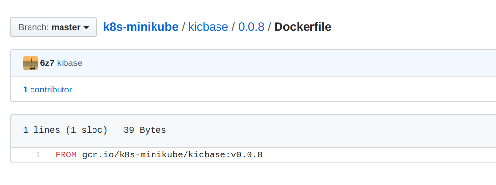
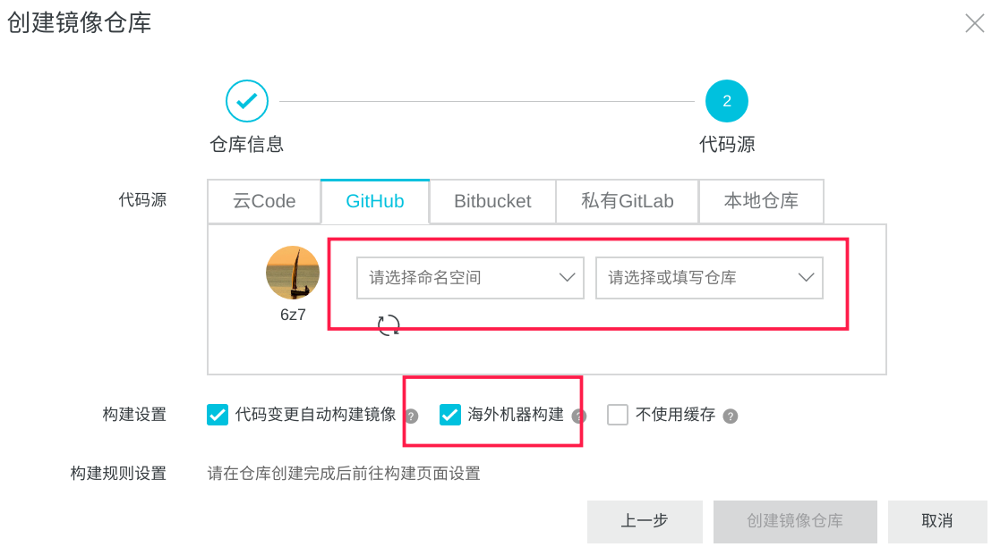
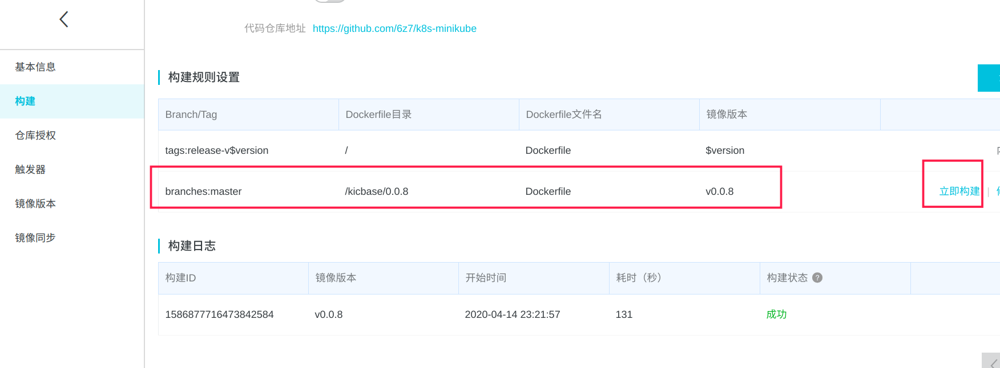

## image重命名

`docker tag imageid name:tag`

`docker images --format "{{.Repository}}:{{.Tag}}@{{.Digest}}"`

重命名后Digest变成了none，目前找到的方案是手动修改并重启，如下

```
查看docker镜像保存位置 docker info|grep Dir

守护进程重启
sudo systemctl daemon-reload
重启docker服务
sudo systemctl restart docker
关闭docker
sudo systemctl stop docker


docker tag 后没有digest，可以手动修改`/var/lib/docker/image/overlay2/repositories.json`文件，添加对应的digest，重启docker服务即可。
```
 

## gcr.io无法下载问题

1.使用三方提供的镜像

2.挂代理

即使挂了代理 `docker pull gcr.io/k8s-minikube/kicbase:v0.0.8`依然无法下载，是由于当docker通过systemd引导启动时默认不会读取这些变量，所以需要手动修改service启动文件，在其中加入环境变量解决。
```shell
$ vim /usr/lib/systemd/system/docker.service
[Service]
Environment="ALL_PROXY=socks5://1127.0.0.1:1080"

$ systemctl daemon-reload
$ systemctl restart docker
```

3.借助阿里云手动同步需要的image

a. github上创建Dockerfile包含需要的镜像

b. 阿里云上创建一个仓库，配置从github导入，并配置构建规则




## 启动

`minikube start --image-mirror-country=cn --image-repository=registry.cn-hangzhou.aliyuncs.com/google_containers`


echo " find .|xargs grep v0.0.8"|sudo sh

## 停止

`minikube stop`

## 清理本地状态

如果您之前安装过 Minikube，并运行了：

`minikube start`

并且 minikube start 返回了一个错误：

`machine does not exist`

那么，你需要清理 minikube 的本地状态：

`minikube delete`

## 引用:

[安装 Minikube](https://kubernetes.io/zh/docs/tasks/tools/install-minikube/)