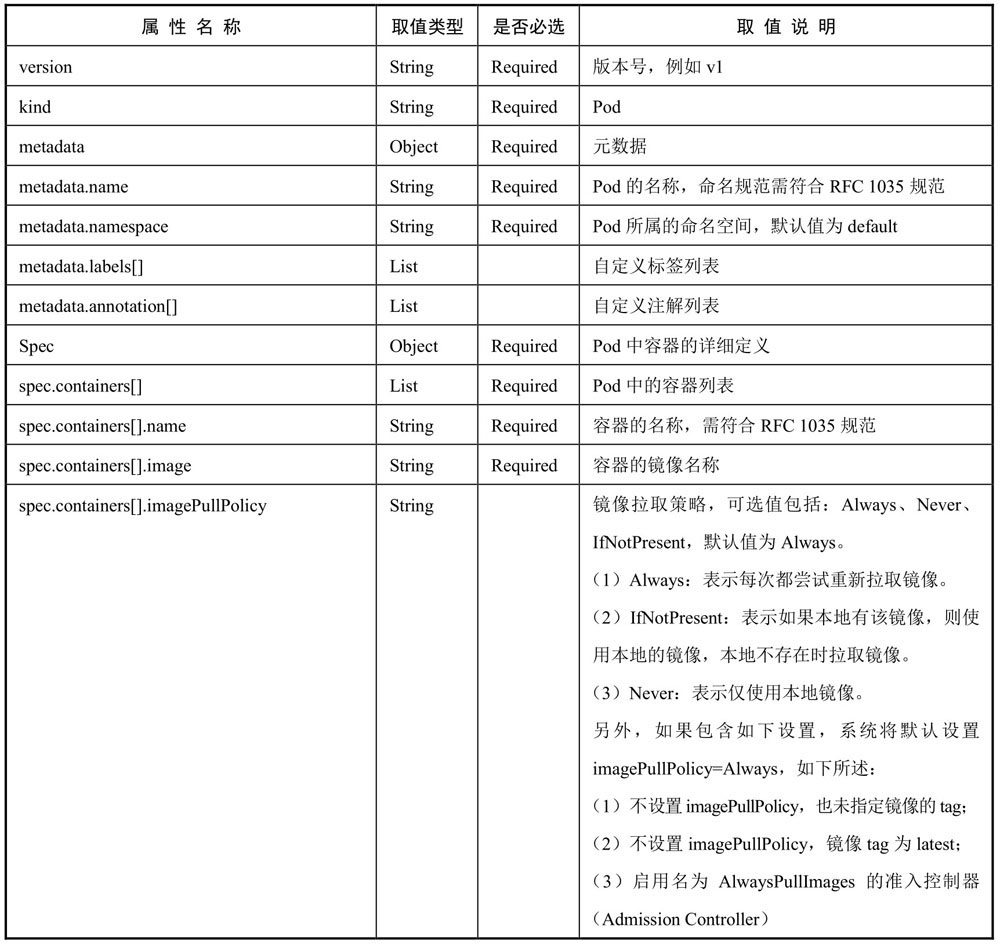
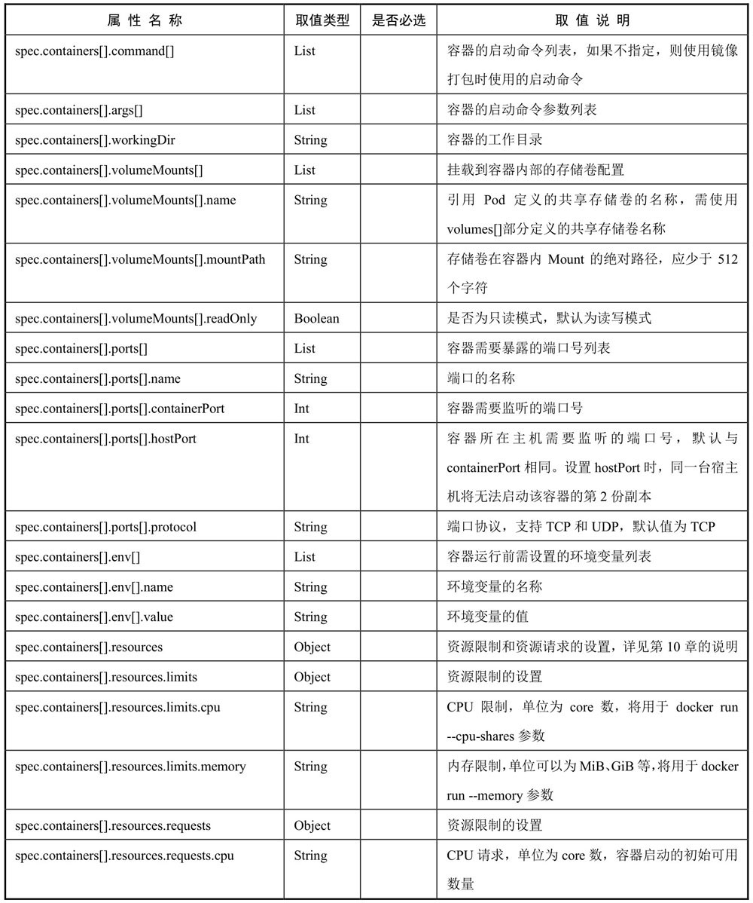
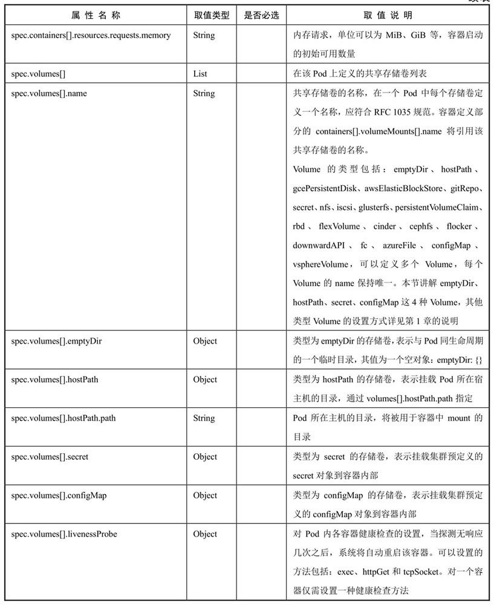
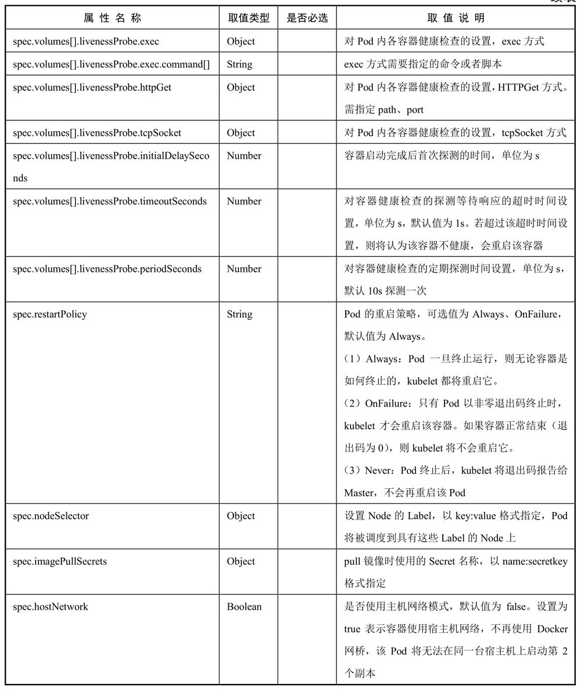
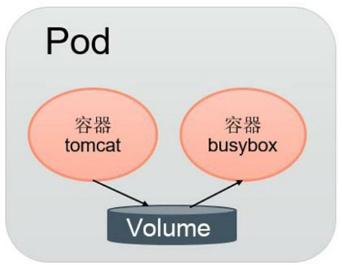
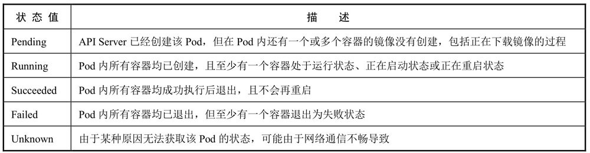

# Pod

## Pod定义

YAML格式的Pod定义文件

```
        apiVersion: v1
        kind: Pod
        metadata:
          name: string
          namespace: string
          labels:
            - name: string
          annotations:
            - name: string
        spec:
          containers:
          - name: string
            image: string
            imagePullPolicy: [Always | Never | IfNotPresent]
            command: [string]
            args: [string]
            workingDir: string
            volumeMounts:
            - name: string
              mountPath: string
              readOnly: boolean
            ports:
            - name: string
              containerPort: int
              hostPort: int
              protocol: string
            env:
            - name: string
          value: string
        resources:
          limits:
            cpu: string
            memory: string
          requests:
            cpu: string
            memory: string
        livenessProbe:
          exec:
            command: [string]
          httpGet:
            path: string
            port: number
            host: string
            scheme: string
            httpHeaders:
            - name: string
              value: string
          tcpSocket:
            port: number
          initialDelaySeconds: 0
          timeoutSeconds: 0
          periodSeconds: 0
          successThreshold: 0
          failureThreshold: 0
        securityContext:
          privileged: false
      restartPolicy: [Always | Never | OnFailure]
      nodeSelector: object
      imagePullSecrets:
    -    name: string
      hostNetwork: false
      volumes:
      - name: string
         emptyDir: {}
         hostPath:
           path: string
         secret:
           secretName: string
           items:
              - key: string
                path: string
            configMap:
              name: string
              items:
              - key: string
                path: string
```






## Pod的基本用法

Kubernetes系统中对长时间运行容器的要求是：其主程序需要一直在前台执行。如果我们创建的Docker镜像的启动命令是后台执行程序，则在kubelet创建包含这个容器的Pod之后运行完该命令，即认为Pod执行结束，将立刻销毁该Pod。

Pod可以由1个或多个容器组合而成，属于同一个Pod的多个容器应用之间相互访问时仅需要通过localhost就可以通信。

## 静态Pod

静态Pod是由kubelet进行管理的仅存在于特定Node上的Pod。它们不能通过API Server进行管理，无法与ReplicationController、Deployment或者DaemonSet进行关联，并且kubelet无法对它们进行健康检查。静态Pod总是由kubelet创建的，并且总在kubelet所在的Node上运行。

创建静态Pod有两种方式：配置文件方式和HTTP方式

由于静态Pod无法通过API Server直接管理，所以在Master上尝试删除这个Pod时，会使其变成Pending状态，且不会被删除。

## Pod容器共享Volume

同一个Pod中的多个容器能够共享Pod级别的存储卷Volume。Volume可以被定义为各种类型，多个容器各自进行挂载操作，将一个Volume挂载为容器内部需要的目录。



```
apiVersion: v1
kind: Pod
metadata:
  name: volume-pod
spec:
  containers:
  - name: tomcat
    image: tomcat
    ports:
    - containerPort: 8080
    volumeMounts:
    - name: app-logs
      mountPath: /usr/local/tomcat/logs  
  - name: busybox
    image: busybox
    command: ["sh", "-c", "tail -f /logs/catalina*.log"]
    volumeMounts:
    - name: app-logs
      mountPath: /logs
  volumes:
  - name: app-logs
    emptyDir: {}   
    
```

## Pod的配置管理

### ConfigMap概述

ConfigMap供容器使用的典型用法如下：

* 生成为容器内的环境变量。
* 设置容器启动命令的启动参数（需设置为环境变量）。
* 以Volume的形式挂载为容器内部的文件或目录。

### 创建ConfigMap资源对象

```
apiVersion: v1
kind: ConfigMap
metadata:
  name: cm-appvars
data:
  apploglevel: info
  appdatadir: /var/data

```

### 在Pod中使用ConfigMap

ConfigMap允许你将配置文件与镜像文件分离，以使容器化的应用程序具有可移植性

**通过环境变量方式使用ConfigMap**

```
apiVersion: v1
kind: Pod
metadata:
  name: dapi-test-pod
spec:
  containers:
    - name: test-container
      image: k8s.gcr.io/busybox
      command: [ "/bin/sh", "-c", "env" ]
      env:
        # Define the environment variable
        - name: SPECIAL_LEVEL_KEY
          valueFrom:
            configMapKeyRef:
              # The ConfigMap containing the value you want to assign to SPECIAL_LEVEL_KEY
              name: special-config
              # Specify the key associated with the value
              key: special.how
  restartPolicy: Never
```

**通过volumeMount使用ConfigMap**

```
apiVersion: v1
kind: Pod
metadata:
  name: dapi-test-pod
spec:
  containers:
    - name: test-container
      image: k8s.gcr.io/busybox
      command: [ "/bin/sh", "-c", "ls /etc/config/" ]
      volumeMounts:
      - name: config-volume
        mountPath: /etc/config
  volumes:
    - name: config-volume
      configMap:
        # Provide the name of the ConfigMap containing the files you want
        # to add to the container
        name: special-config
  restartPolicy: Never

```

## 在容器内获取Pod信息（DownwardAPI）

每个Pod在被成功创建出来之后，都会被系统分配唯一的名字、IP地址，并且处于某个Namespace中，那么我们如何在Pod的容器内获取Pod的这些重要信息呢？答案就是使用Downward API。

## Pod生命周期和重启策略

Pod的状态:



Pod的重启策略（RestartPolicy）应用于Pod内的所有容器，并且仅在Pod所处的Node上由kubelet进行判断和重启操作。当某个容器异常退出或者健康检查失败时，kubelet将根据RestartPolicy的设置来进行相应的操作。Pod的重启策略包括Always、OnFailure和Never，默认值为Always。

* Always：当容器失效时，由kubelet自动重启该容器。
* OnFailure：当容器终止运行且退出码不为0时，由kubelet自动重启该容器。
* Never：不论容器运行状态如何，kubelet都不会重启该容器。

kubelet重启失效容器的时间间隔以sync-frequency乘以2n来计算，例如1、2、4、8倍等，最长延时5min，并且在成功重启后的10min后重置该时间。

Pod的重启策略与控制方式息息相关，当前可用于管理Pod的控制器包括ReplicationController、Job、DaemonSet及直接通过kubelet管理（静态Pod）。每种控制器对Pod的重启策略要求如下:

* RC和DaemonSet：必须设置为Always，需要保证该容器持续运行。
* Job：OnFailure或Never，确保容器执行完成后不再重启。
* kubelet：在Pod失效时自动重启它，不论将RestartPolicy设置为什么值，也不会对Pod进行健康检查。

## Pod健康检查和服务可用性检查

Kubernetes对Pod的健康状态可以通过两类探针来检查： LivenessProbe和ReadinessProbe，kubelet定期执行这两类探针来诊断容器的健康状况。

（1）LivenessProbe探针：用于判断容器是否存活（Running状态），如果LivenessProbe探针探测到容器不健康，则kubelet将杀掉该容器，并根据容器的重启策略做相应的处理。如果一个容器不包含LivenessProbe探针，那么kubelet认为该容器的LivenessProbe探针返回的值永远是Success。

（2）ReadinessProbe探针：用于判断容器服务是否可用（Ready状态），达到Ready状态的Pod才可以接收请求。对于被Service管理的Pod，Service与Pod Endpoint的关联关系也将基于Pod是否Ready进行设置。如果在运行过程中Ready状态变为False，则系统自动将其从Service的后端Endpoint列表中隔离出去，后续再把恢复到Ready状态的Pod加回后端Endpoint列表。这样就能保证客户端在访问Service时不会被转发到服务不可用的Pod实例上。

LivenessProbe和ReadinessProbe均可配置以下三种实现方式：

1. ExecAction：在容器内部执行一个命令，如果该命令的返回码为0，则表明容器健康。
2. TCPSocketAction：通过容器的IP地址和端口号执行TCP检查，如果能够建立TCP连接，则表明容器健康。
3. HTTPGetAction：通过容器的IP地址、端口号及路径调用HTTP Get方法，如果响应的状态码大于等于200且小于400，则认为容器健康。

对于每种探测方式，都需要设置initialDelaySeconds和timeoutSeconds两个参数，它们的含义分别如下:
* initialDelaySeconds：启动容器后进行首次健康检查的等待时间，单位为s。
* timeoutSeconds：健康检查发送请求后等待响应的超时时间，单位为s。当超时发生时，kubelet会认为容器已经无法提供服务，将会重启该容器。

## Pod调度