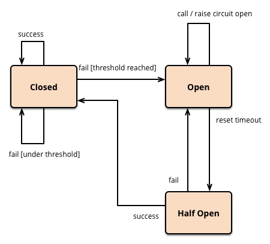

## 断路器模式

软件行业中的断路器类似生活中的空气开关，当失败请求量超过阈值，将直接拒绝后续的请求保护后边的服务。与空气开关的区别在于，空气开关在跳闸后需要手动推上去，而软件行业中的开关在检测到请求成功后会自动恢复。

从这个状态图可以看到，断路器有三种状态：关闭、开放、半开放。

最开始处于关闭状态，一旦检测到错误到达一定阈值，便转为开放状；
这时候会有个 reset timeout，即开始准备恢复了，转移到半开放状态；
尝试放行一部分请求到后端，一旦检测成功便回归到关闭状态，即恢复服务；