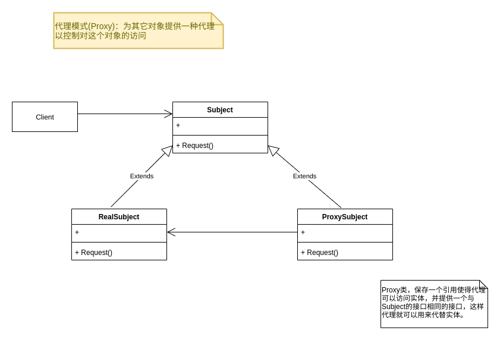

## 代理模式(Proxy)



```go
type Subject interface {
	Request()
}

type RealSubject struct {

}

func (rs *RealSubject) Request() {
	fmt.Println("真实的请求:")
}

type Proxy struct {
	realSubject *RealSubject
}

func (p *Proxy) Request() {
	if p.realSubject==nil{
		fmt.Println("nil")
	}
	p.realSubject.Request()
}


func TestProxy_Request(t *testing.T) {
	proxy := Proxy{ realSubject: &RealSubject{}}
	proxy.Request()
}
```