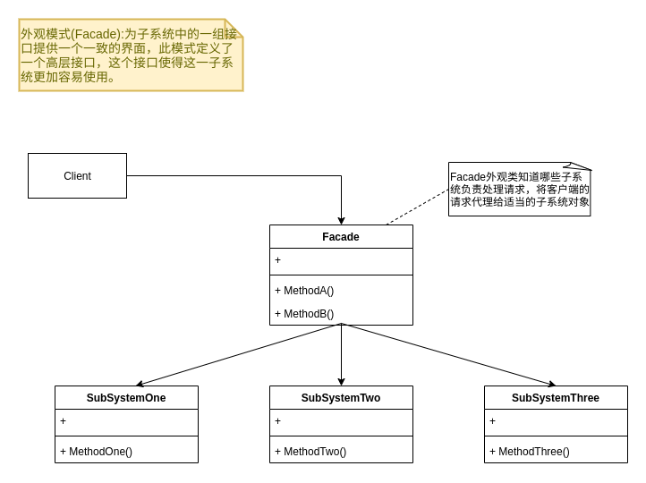

## 外观模式(Facade)



```go
type SubSystemOne struct {
}

func (so *SubSystemOne) MethodOne() {
	fmt.Println("子系统方法一")
}

type SubSystemTwo struct {
}

func (so *SubSystemTwo) MethodTwo() {
	fmt.Println("子系统方法二")
}

type SubSystemThree struct {
}

func (so *SubSystemThree) MethodThree() {
	fmt.Println("子系统方法三")
}

type Facade struct {
	one   *SubSystemOne
	two   *SubSystemTwo
	three *SubSystemThree
}

func New() *Facade {
	var facade = Facade{
		one:   &SubSystemOne{},
		two:   &SubSystemTwo{},
		three: &SubSystemThree{},
	}
	return &facade
}

func (f *Facade) MethodA() {
	fmt.Println("方法组A()")
	f.one.MethodOne()
	f.two.MethodTwo()

}

func (f *Facade) MethodB() {
	fmt.Println("方法组B()")
	f.two.MethodTwo()
	f.three.MethodThree()
}


func TestFacade_MethodA(t *testing.T) {
	facade:=BehavioralPattern.New()
	facade.MethodA()
}

func TestFacade_MethodB(t *testing.T) {
	facade := BehavioralPattern.New()
	facade.MethodB()
}
```