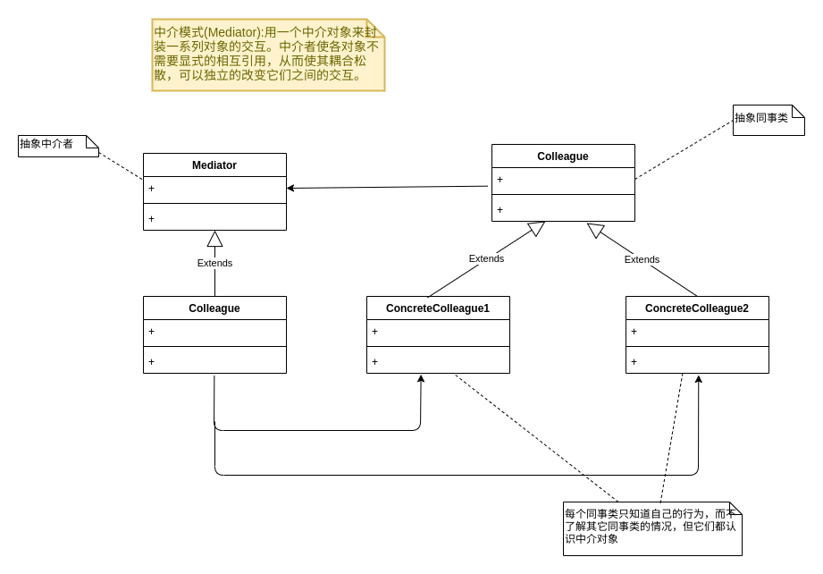

## 中介者模式(Mediator)



```go

type Mediator interface {
	Send(string,interface{})
}

type ConcreteMediator struct {
	ConcreteColleague1 *ConcreteColleague1
	ConcreteColleague2 *ConcreteColleague2
}

func (cm *ConcreteMediator)Send(message string,colleague interface{})  {
	if _,ok:= colleague.(*ConcreteColleague1);ok{
         cm.ConcreteColleague2.Notify(message)
	}else {
		cm.ConcreteColleague1.Notify(message)
	}
}

func NewMediator() *ConcreteMediator  {
	return &ConcreteMediator{}
}


type Colleague struct {
	 m *ConcreteMediator
}


type ConcreteColleague1 struct {
	Colleague
}

func (cc *ConcreteColleague1)Send(message string)  {
	cc.m.Send(message,cc)
}

func (cc *ConcreteColleague1)Notify(message string)  {
	fmt.Println("同事1得到消息:",message)
}

func NewColleague1(mediator *ConcreteMediator) *ConcreteColleague1 {
	colleague1 := ConcreteColleague1{}
	colleague1.m=mediator
	return &colleague1
}

type ConcreteColleague2 struct {
	Colleague
}

func (cc *ConcreteColleague2)Send(message string)  {
	cc.m.Send(message,cc)
}

func (cc *ConcreteColleague2)Notify(message string)  {
	fmt.Println("同事2得到消息:",message)
}

func NewColleague2(mediator *ConcreteMediator) *ConcreteColleague2{
	colleague2 := ConcreteColleague2{}
	colleague2.m=mediator
	return &colleague2
}


func TestCase(t *testing.T) {
	mediator := NewMediator()
	colleague1 := NewColleague1(mediator)
	colleague2 := NewColleague2(mediator)

	mediator.ConcreteColleague1=colleague1
	mediator.ConcreteColleague2=colleague2

	colleague1.Send("吃饭了吗")
	colleague2.Send("没呢，你打算请客?")
}
```