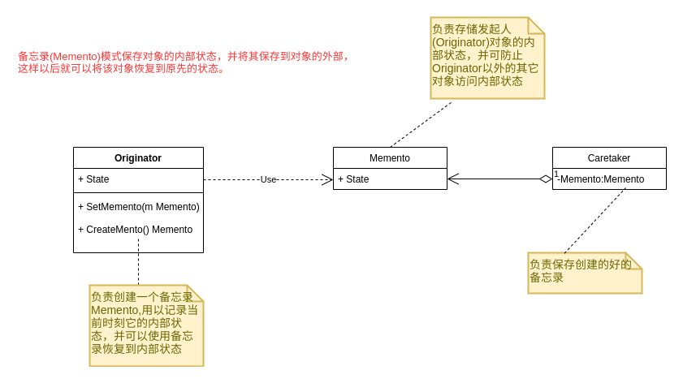

## 备忘录模式(Memento)



```go
// 发起人，负责创建一个备忘录
type Originator struct {
	State string
}

func (o *Originator) CreateMemento() Memento {
	return NewMemento(o.State)
}

func (o *Originator) SetMemento(memento Memento) {
	o.State =memento.state
}

func (o *Originator)Show()  {
	fmt.Println("当前状态:",o.State)
}

// 备忘录，存储要保存的状态
type Memento struct {
	state string
}

func NewMemento(state string) Memento {
	memento := Memento{
		state: state,
	}
	return memento
}

func (m *Memento) GetState() string {
	return m.state
}

// 管理者，负责保存备忘录
type Caretaker struct {
	Memento Memento
}


func TestMemento_GetState(t *testing.T) {
	originator := Originator{}
	originator.State="On"
	originator.Show()

	memento := originator.CreateMemento()

	caretaker := Caretaker{}
	caretaker.Memento=memento

	originator.State="Off"
	originator.Show()

    originator.SetMemento(caretaker.Memento)
	originator.Show()
}
```