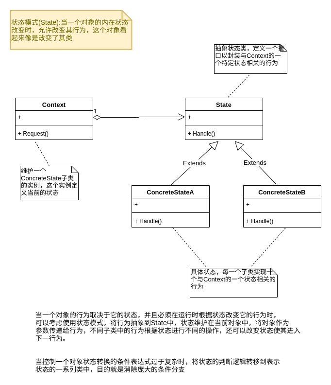

## 状态模式(State)



```go
type Context struct {
	state State
}

func (c *Context) GetState() State {
	return c.state
}

func (c *Context) SetState(state State) {
	c.state = state
	fmt.Println("当前状态:" + reflect.TypeOf(state).Elem().Name())
}

func (c *Context) Request() {
	c.GetState().Handle(c)
}

func NewContext(state State) Context {
	c := Context{}
	c.SetState(state)
	return c
}

type State interface {
	Handle(context *Context)
}

type ConcreteStateA struct {
}

func (s *ConcreteStateA) Handle(context *Context) {
	context.SetState(&ConcreteStateB{})
}

type ConcreteStateB struct {
}

func (s *ConcreteStateB) Handle(context *Context) {
	context.SetState(&ConcreteStateA{})
}

func TestState(t *testing.T) {	 
	context := NewContext(&ConcreteStateA{})
	context.Request()
	context.Request()
	context.Request()
}
```