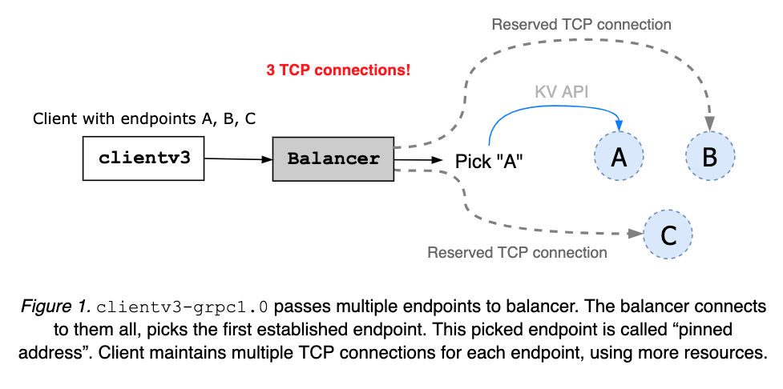
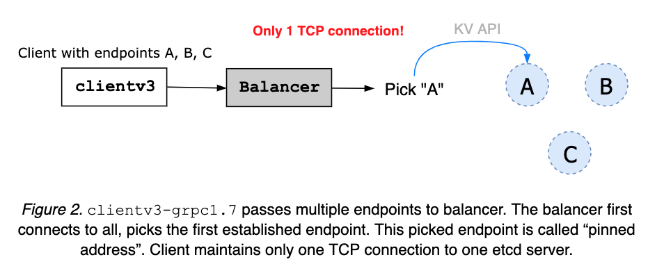
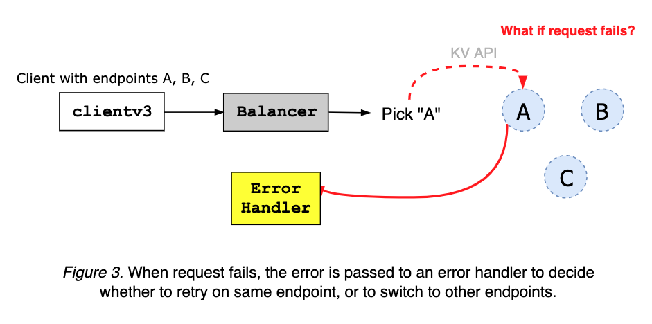
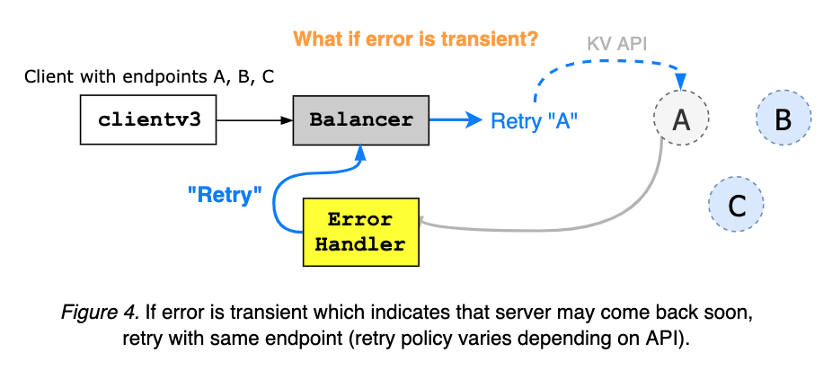
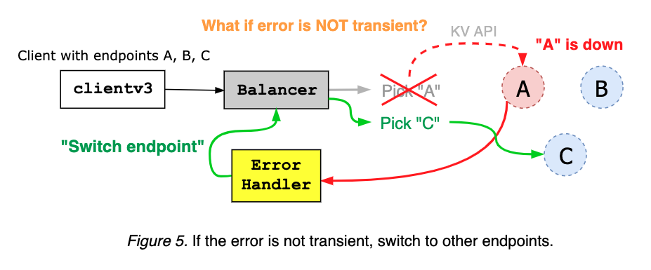
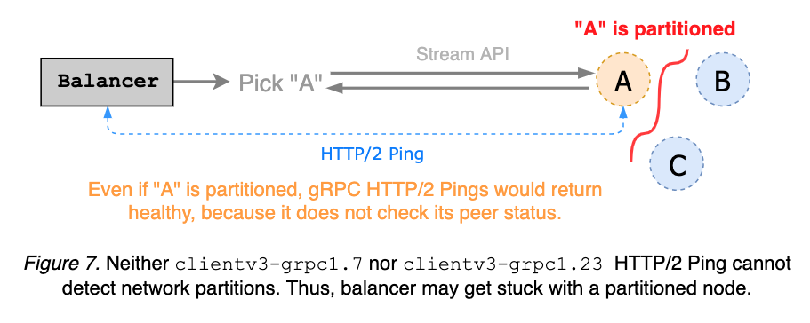
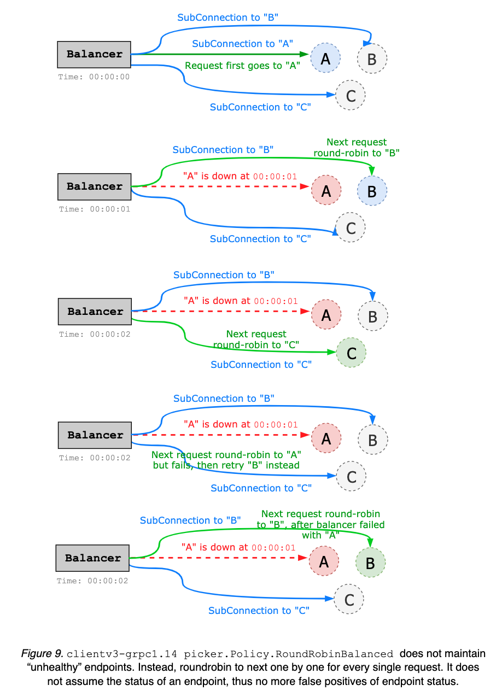

# etcd客户端设计

## 介绍

etcd服务器已经通过多年的故障注入测试证明了它的健壮性。复杂的应用程序逻辑已经由etcd服务器及其数据存储处理。尽管服务器组件是正确的，但它与客户端的组合需要一组不同的复杂协议，以保证其在错误条件下的正确性和高可用性。理想情况下，etcd服务器提供许多物理机的一个逻辑集群视图，并且客户端在副本之间实现自动故障转移。该文档介绍了客户端架构决策及其实现细节。

## 词汇表 

clientv3: etcd Official Go client for etcd v3 API.

clientv3-grpc1.0: Official client implementation, with grpc-go v1.0.x, which is used in latest etcd v3.1.

clientv3-grpc1.7: Official client implementation, with grpc-go v1.7.x, which is used in latest etcd v3.2 and v3.3.

clientv3-grpc1.23: Official client implementation, with grpc-go v1.23.x, which is used in latest etcd v3.4.

平衡器(Balancer):etcd客户端负载均衡实现了重试和故障转移。etcd客户端会自动在多个节点之间自动负载均衡。

端点(Endpoints):客户端可以连接到的etcd服务器端点列表。

固定端点(Pinned endpoint):当配置了多个服务端点时，为了减少与集群的连接数，<=v3.3的客户端的平衡器会选择其中的一个建立tcp连接。在v3.4中，对每个请求平衡器会询调度一个端点进行连接，从而使负载更均匀地分配。

客户端连接(Client Connection):已经通过gRPC Dial与etcd服务端建立连接

子连接(Sub Connection):gRPC SubConn接口。每个子连接都包含一个地址列表。平衡器从已解析的地址列表中选择一个创建SubConn。gRPC ClientConn可以映射到到多个SubConn(如，example.com解析为10.10.10.1与10.10.10.2两个子连接)。etcd v3.4均衡器使用内部解析器为每个端点建立一个子连接。

暂时断开连接(Transient disconnect):当gRPC服务器返回状态错误码Unavailable。

## 对客户端的要求

正确性(Correctness)

活性(Liveness)

有效性(Effectiveness)

可移植性(Portability)

## 客户概况

etcd客户端实现以下组件:

* 建立与etcd集群的gRPC连接的平衡器

* 将RPC发送到etcd服务器的API客户端

* 错误处理程序，用于确定是重试失败的请求还是切换端点

语言可能在如何建立初始连接（例如配置TLS），如何编码和发送协议缓冲区消息到服务器，如何处理流RPC等方面有所不同。但是，从etcd服务器返回的错误将是相同的。因此错误处理和重试策略也应该如此。

例如，etcd服务器可能返回"rpc error: code = Unavailable desc = etcdserver: request timed out"，这是临时错误，需要重试。或return rpc error: code = InvalidArgument desc = etcdserver: key is not provided，这意味着请求无效，不应重试。Go客户端可以使用解析错误`google.golang.org/grpc/status.FromError`，而Java客户端可以使用解析错误`io.grpc.Status.fromThrowable`。

**clientv3-grpc1.0：平衡器概述**

clientv3-grpc1.0配置有多个etcd端点时，维护多个TCP连接，然后选择一个地址并使用它发送所有客户端请求。保持固定的地址，直到关闭客户端对象。当客户端收到错误时，它会随机选择另一个并重试。

**clientv3-grpc1.0：平衡器限制**

clientv3-grpc1.0打开多个TCP连接可以提供更快的故障转移，但需要更多的资源。平衡器不了解集群节点的运行状况或集群中成员身份。因此平衡器可能卡在一个故障或分区的节点上。

**clientv3-grpc1.7：平衡器概述**

clientv3-grpc1.7维护与选定的etcd服务器的一个TCP连接。当给定多个群集终结点时，客户端首先尝试将它们全部连接。一旦一个连接建立，平衡器便将地址固定，关闭其它地址。固定的地址将一直保持到关闭客户端对象为止。来自服务器或客户端网络故障的错误将发送到客户端错误处理程序。

客户端错误处理程序从gRPC服务器获取错误，并根据错误代码和消息确定是在同一端点上重试还是切换到其它地址。

流RPC（例如Watch和KeepAlive）通常是无超时请求的。相反，客户端可以发送定期HTTP / 2 ping来检查固定端点的状态。如果服务器不响应ping，则平衡器将切换到其它端点。

**clientv3-grpc1.7：平衡器限制**

clientv3-grpc1.7平衡器发送HTTP/2 keepalive来检测是否断开连接。这是一种简单的gRPC服务器ping机制，无需考虑群集成员身份，因此无法检测网络分区。由于分区的gRPC服务器仍然可以响应客户端ping，因此平衡器可能会卡在分区的节点上。理想情况下，keepalive ping在请求超时之前检测分区并触发端点切换。

clientv3-grpc1.7平衡器维护不健康端点的列表。断开连接的地址将添加到“不健康”列表中，并且在等待一段时间之后才视能被再次使用。该等待时间被硬编码为拨号时设置的超时时间，默认值为5秒。平衡器对于哪些端点不健康可能有误报。例如，端点A可能会在被列入黑名单后立即返回，但在接下来的5秒钟内仍然无法使用。

**clientv3-grpc1.23：平衡器概述**

clientv3-grpc1.7与旧的gRPC接口紧密耦合，以至于每一个gRPC依赖项升级都会破坏客户端行为。大多数开发和调试工作都致力于解决这些客户端行为更改。结果，由于对服务器连接性的错误假设，其实现变得过于复杂。

clientv3-grpc1.23的主要目标是简化平衡器故障转移逻辑。无需维护可能会过时的不健康端点的列表，只要客户端与当前端点断开连接，只需循环到下一个端点即可。由于不维护端点状态。因此不需要复杂的状态跟踪。

在内部，当给定多个端点时，clientv3-grpc1.23创建多个子连接（每个端点一个子连接），而clientv3-grpc1.7仅创建到固定端点的一个连接。例如，在5节点群集中，clientv3-grpc1.23平衡器将需要5个TCP连接，而clientv3-grpc1.7仅需要一个，通过保留TCP连接池，clientv3-grpc1.23可能会消耗更多资源，但会为负载平衡器提供更灵活的故障转移性能。默认的平衡策略是循环轮询，但可以轻松扩展以支持其它类型的策略。clientv3-grpc1.23使用gRPC解析程序实现平衡器选择器策略，以便将复杂的平衡工作委派给上游gRPC。clientv3-grpc1.7手动处理每个gRPC连接和故障转移，使实现变得更复杂。clientv3-grpc1.23在gRPC拦截器链中实现重试功能，该功能可自动处理gRPC内部错误并启用更高级的重试策略（如backoff）,而clientv3-grpc1.7手动处理gRPC错误并进行重试。

**clientv3-grpc1.23：平衡器限制**

可以通过缓存每个端点的状态来进行改进。例如，平衡器可以预先对每个服务器执行ping操作，以维护运行状况良好的候选列表，并在进行轮询时使用此信息。或者，当断开连接时，平衡器可以确定健康端点的优先级。这可能会使平衡器的实现复杂化，因此可以在以后的版本中解决。

客户端的keepalive ping仍然不知道网络分区。流请求可能会卡在分区节点上。需要更高级运行状况检查以了解集群成员的状态。

当前，重试逻辑是通过拦截器手动处理的。可以通过[官方gRPC重试](https://github.com/grpc/proposal/blob/master/A6-client-retries.md)来简化。