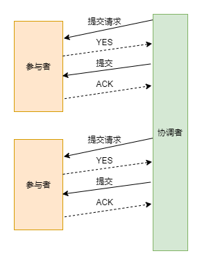
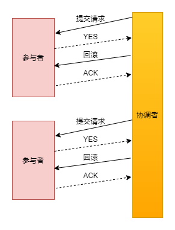
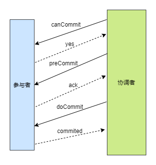

# 分布式事务

刚性事务：ACID

柔性事务：不同于 ACID 的刚性事务，在分布式场景下基于 BASE 理论，就出现了柔性事务的概念。要想通过柔性事务来达到最终的一致性

## 分布式事务解决方案

* 2PC/XA
* 3PC
* TCC
* Saga
* 本地消息表
* 可靠消息最终一致性
* 尽最大努力通知
 
### 2PC

二阶段提交 (Two-phase Commit)

在分布式系统中，每个节点都知道自己的操作是成功还是失败，但是不知道其它节点的情况，当一个事务跨越多个节点时，为了保持事务的ACID特性，需要引入一个协调者来统一掌握其它参与节点的情况，来决定是否把操作结果进行提交或回滚。

二阶段提交的算法思路可以概括为：参与者将操作成败通知协调者，再由协调者根据所有参与者的反馈情报决定各参与者是否要提交操作还是中止操作。

二阶段：

1. 准备阶段(投票阶段)

2. 提交阶段(执行阶段)

**准备阶段**

事务协调者 (事务管理器) 给每个参与者 (资源管理器) 发送 Prepare 消息，每个参与者要么直接返回失败，要么在本地执行事务，写本地的 redo 和 undo 日志，但不提交。

可以将准备阶段进一步分为以下三个阶段：

1. 协调者向所有参数者发送是否可以执行提交操作的请求，并等待各参与者的响应
2. 参与者执行事务操作，并将Undo和Redo信息写入日志
3. 各参与者响应协调者节点发起的询问，如果参与节点的事务操作执行成功则返回一个YES,返回返回一个NO

**提交阶段**

如果协调者收到了参与者的失败消息或超时，直接给每个参与者发送回滚(Rollback)消息，否则，则发送提交(Commit)消息。参与者根据协调者的指令执行提交或者回滚操作，释放所有事务处理过程中使用的锁资源。

提交阶段分两种情况:

1. 当协调者从所有参与者获取到YES时

2. 如果有任一节点在第一阶段返回了NO或协调者在第一阶段等待询问结果超时之前无法获取到所有参与者节点响应信息时

**缺点**

1. 同步阻塞

    执行过程中，所有参与节点都是事务阻塞的。当参与者占用公共资源时，其它第三方节点访问公共资源不得不处于阻塞状态

2. 单点故障

    由于协调者的重要性，一旦协调者发生故障。参与者会一直阻塞下去
    
3. 数据不一致

    在提交阶段，如果协调者向参与者发送Commit请求后，发生了局部网络异常或者在发送Commit请求过程中发生了故障，这会导致只有一部分参与者接收到了Commit请求从而进行了事务提交，其它未接收到请求的节点不会进行事务提交

4. 不确定性

    协调者在发出Commit消息之后宕机，而接收到这条消息的参与者也同时宕机了，此时即使通过选举协议产生了新的协调者，那么这个节点的事务状态也是不确定的，无法知道事务是否已经执行。

## 3PC

三阶段提交 (Three-phase Commit)

与二阶段相比，三阶段有两个改动点：

1. 同时在协调者与参与者中都引入超时机制
2. 在第一个阶段与第二阶段中引入一个准备阶段，保证在最后提交阶段之前各参与节点状态是一致的

>1.解决阻塞问题：将2PC中的第一阶段一分为二，提供了一个CanCommit阶段，此阶段并不锁定资源，这样可以大幅降低了阻塞概率  
>2.解决单点问题：在参与者这边也引入了超时机制

CanCommit:协调者通知参与者检查能否进行事务提交操作

PreCommit：CanCommit阶段所有参与者都返回了YES，则协调者则发送PreCommit消息，让参与者执行事务操作，参与者根据结果响应协调者YES或NO；如果在超时时间内没收到所有参与节点的YES响应，则执行事务中断操作

DoCommit：协调者如果在超时时间内没收到所有的参与者的ACK或收到了NO,则执行终止操作，反之则执行提交操作。

>在DoCommit阶段，如果参与者无法及时接收到来自协调者的doCommit或者rebort请求时，会在等待超时之后，会继续进行事务的提交。（其实这个应该是基于概率来决定的，当进入第三阶段时，说明参与者在第二阶段已经收到了PreCommit请求，那么协调者产生PreCommit请求的前提条件是他在第二阶段开始之前，收到所有参与者的CanCommit响应都是Yes。（一旦参与者收到了PreCommit，意味他知道大家其实都同意修改了）所以，一句话概括就是，当进入第三阶段时，由于网络超时等原因，虽然参与者没有收到commit或者abort响应，但是他有理由相信：成功提交的几率很大。）

**2PC与3PC的区别**

相对于 2PC，3PC 主要解决的单点故障问题，并减少阻塞，因为一旦参与者无法及时收到来自协调者的信息之后，他会默认执行 commit。而不会一直持有事务资源并处于阻塞状态。但是这种机制也会导致数据一致性问题，因为，由于网络原因，协调者发送的abort响应没有及时被参与者接收到，那么参与者在等待超时之后执行了commit 操作。这样就和其他接到 abort 命令并执行回滚的参与者之间存在数据不一致的情况。

## TCC(Try Confirm Cancel)

TCC 事务机制相比于上面介绍的 XA，解决了其几个缺点：

1. 解决了协调者单点，由主业务方发起并完成这个业务活动。业务活动管理器也变成多点，引入集群。

2. 同步阻塞：引入超时，超时后进行补偿，并且不会锁定整个资源，将资源转换为业务逻辑形式，粒度变小。

3. 数据一致性，有了补偿机制之后，由业务活动管理器控制一致性
 
Try阶段：尝试执行，完成所有业务检查（一致性）, 预留必须业务资源（准隔离性）

Confirm阶段：确认执行真正执行业务，不作任何业务检查，只使用Try阶段预留的业务资源，Confirm 操作满足幂等性。要求具备幂等设计，Confirm失败后需要进行重试。

Cancel阶段：取消执行，释放Try阶段预留的业务资源 Cancel操作满足幂等性Cancel阶段的异常和Confirm 阶段异常处理方案基本上一致。

基于 TCC 实现分布式事务，会将原来只需要一个接口就可以实现的逻辑拆分为 Try、Confirm、Cancel 三个接口，所以代码实现复杂度相对较高

**需要注意的问题**

* 空回滚
* 悬挂
* 幂等

## Saga

Saga和TCC一样，也是一种补偿事务，但是它没有try阶段，而是把分布式事务看作一组本地事务构成的事务链。

事务链中的每一个正向事务操作，都对应一个可逆的事务操作。Saga 事务协调器负责按照顺序执行事务链中的分支事务，分支事务执行完毕，即释放资源。如果某个分支事务失败了，则按照反方向执行事务补偿操作。

Saga 事务是可以保障事务的三个特性：

* 原子性：Saga协调器可以协调事务链中的本地事务要么全部提交，要么全部回滚。
* 一致性：Saga事务可以实现最终一致性。
* 持久性：基于本地事务，所以这个特性可以很好实现。

>Saga不保证事务隔离性的

## 本地消息表

## 可靠消息最终一致性

## 尽最大努力通知

最大努力通知是最简单的一种柔性事务，适用于一些最终一致性时间敏感度低的业务，且被动方处理结果 不影响主动方的处理结果。

这个方案的大致意思就是：

1. 系统 A 本地事务执行完之后，发送个消息到 MQ；
2. 这里会有个专门消费 MQ 的服务，这个服务会消费 MQ 并调用系统 B 的接口；
3. 要是系统 B 执行成功就 ok 了；要是系统 B 执行失败了，那么最大努力通知服务就定时尝试重新调用系统 B, 反复 N 次，最后还是不行就放弃。

## 参考

http://47.103.216.138/archives/681

https://yq.aliyun.com/articles/763698

https://xiaomi-info.github.io/2020/01/02/distributed-transaction/

https://blog.csdn.net/alitech2017/article/details/106404701/