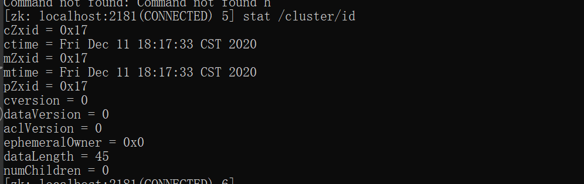

# Base

czxid;//该数据节点被创建时的事务id

mzxid;// 该数据节点被修改时最新的事物id

ctime; // 该数据节点创建时间

mtime; // 该数据节点最后修改时间

version; // 当前节点版本号

cversion;// 子节点版本号

aversion; // 当前节点acl版本号

ephemeralOwner; // 临时节点标示，当前节点如果是临时节点，则存储的创建者的会话id（sessionId），如果不是，那么值=0

dataLength;// 当前节点数据长度

numChildren; // 当前节点子节点个数

pzxid; // 当前节点的父级节点事务ID

zxid表示的是zookeeper的事务ID，由64位数字组成，分为高32位和低32位

高32位：Epoch周期数，值为最新的领导的对应的id，其实就是就是一个递增的数字

低32位：计数器，一个递增的计数器，当处理了一个事务，值+1
