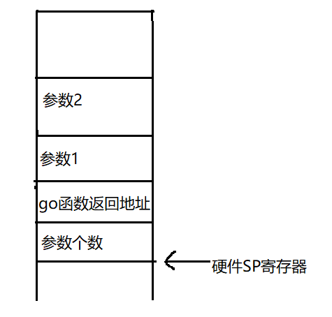
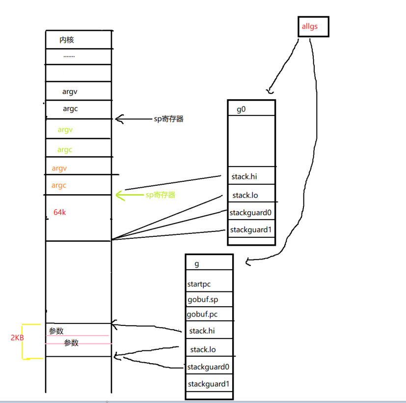

# go调度--G的创建与退出流程

我们知道g在go中代表一个协程，用于执行指定的函数。在前面的文章[go调度--1启动入口](./go调度--1启动入口.md)我们分析了go的启动流程，在`runtime·rt0_go`函数的汇编代码中有段`CALL	runtime·newproc`指令，这段代码就是用于创建执行函数所需要的g的。

我们先看下`runtime·newproc`这段指令的上下文:

```
	MOVQ	$runtime·mainPC(SB), AX		// entry
	PUSHQ	AX
	PUSHQ	$0			// arg size
	CALL	runtime·newproc(SB)
```
1. main函数的地址传送到AX寄存器(此main函数是proc.go中的)
2. 将AX中的值压入栈
3. 将函数参数的数量压入栈(main函数没有参数)

在开发中我们会使用go关键字创建一个go协程，反汇编后可以看到go关键字也是调用`runtime.newproc`创建g的。
```
func main() {
  go func(a ,b int) {
    fmt.Println("hi,goroutine ")
  }(1,2)
}
 
"".main STEXT size=88 args=0x0 locals=0x28
	0x0000 00000 (demo.go:9)	TEXT	"".main(SB), ABIInternal, $40-0
	0x0000 00000 (demo.go:9)	MOVQ	(TLS), CX
	0x0009 00009 (demo.go:9)	CMPQ	SP, 16(CX)
	0x000d 00013 (demo.go:9)	JLS	81
	0x000f 00015 (demo.go:9)	SUBQ	$40, SP
	0x0013 00019 (demo.go:9)	MOVQ	BP, 32(SP)
	0x0018 00024 (demo.go:9)	LEAQ	32(SP), BP 
	0x001d 00029 (demo.go:10)	MOVL	$16, (SP)
  // g上要执行的函数的地址
	0x0024 00036 (demo.go:10)	LEAQ	"".main.func1·f(SB), AX
  // 函数地址放入栈上 8(SP)
	0x002b 00043 (demo.go:10)	MOVQ	AX, 8(SP)
  // 参数值1 放入栈上 16(SP)
	0x0030 00048 (demo.go:10)	MOVQ	$1, 16(SP)
  // 参数值2 放入栈上 24(SP)
	0x0039 00057 (demo.go:10)	MOVQ	$2, 24(SP)
	0x0042 00066 (demo.go:10)	CALL	runtime.newproc(SB)
	0x0047 00071 (demo.go:13)	MOVQ	32(SP), BP
	0x004c 00076 (demo.go:13)	ADDQ	$40, SP
	0x0050 00080 (demo.go:13)	RET
	0x0051 00081 (demo.go:13)	NOP 
	0x0051 00081 (demo.go:9)	CALL	runtime.morestack_noctxt(SB)
	0x0056 00086 (demo.go:9)	JMP	0
```

结合[go汇编](./go汇编.md)相关的信息，我们可以画出在调用`CALL	runtime.newproc(SB)`时,当前栈的布局:



带着上边的基础知识，我们来看下`newproc`是如何创建出g的和g是如何退出的

## 创建G

1. 通过函数地址定位参数的起始位置;切换到g0上执行newproc1，由于启动时当前g就是g0所以无需切换
```go
func newproc(siz int32, fn *funcval) {
	// &fn+8字节
	argp := add(unsafe.Pointer(&fn), sys.PtrSize)
	gp := getg()
	pc := getcallerpc()
	systemstack(func() {
		newproc1(fn, argp, siz, gp, pc)
	})
}
```

2. 计算参数大小对齐后所需空间的大小;从P上获取一个空闲的g或者创建一个栈大小为2KB的新g
```go
func newproc1(fn *funcval, argp unsafe.Pointer, narg int32, callergp *g, callerpc uintptr) {
	_g_ := getg()

	if fn == nil {
		_g_.m.throwing = -1 // do not dump full stacks
		throw("go of nil func value")
	}
	acquirem() // disable preemption because it can be holding p in a local var
	siz := narg
	siz = (siz + 7) &^ 7

	if siz >= _StackMin-4*sys.RegSize-sys.RegSize {
		throw("newproc: function arguments too large for new goroutine")
	}	

	_p_ := _g_.m.p.ptr()
	newg := gfget(_p_)
	if newg == nil {
		newg = malg(_StackMin)
		casgstatus(newg, _Gidle, _Gdead)
		allgadd(newg)
	}
	if newg.stack.hi == 0 {
		throw("newproc1: newg missing stack")
	}

	if readgstatus(newg) != _Gdead {
		throw("newproc1: new g is not Gdead")
	}
```
3. 根据参数大小，计算出参数所需空间大小，确定SP的地址;将调用者栈上的参数数据复制到g的栈上
```go

	totalSize := 4*sys.RegSize + uintptr(siz) + sys.MinFrameSize 
	totalSize += -totalSize & (sys.SpAlign - 1)                  // align to spAlign
	sp := newg.stack.hi - totalSize
	// sp地址
	spArg := sp
	if usesLR {
		// caller's LR
		*(*uintptr)(unsafe.Pointer(sp)) = 0
		prepGoExitFrame(sp)
		spArg += sys.MinFrameSize
	}
	if narg > 0 {
		// 复制参数到g的栈上
		memmove(unsafe.Pointer(spArg), argp, uintptr(narg))	 
		if writeBarrier.needed && !_g_.m.curg.gcscandone {
			f := findfunc(fn.fn)
			stkmap := (*stackmap)(funcdata(f, _FUNCDATA_ArgsPointerMaps))
			if stkmap.nbit > 0 {
				// We're in the prologue, so it's always stack map index 0.
				bv := stackmapdata(stkmap, 0)
				bulkBarrierBitmap(spArg, spArg, uintptr(bv.n)*sys.PtrSize, 0, bv.bytedata)
			}
		}
	}
```
4. 初始化调度结构g.sched,sched中用于保存g运行所需寄存器的相关地址和要执行的函数等信息。
```go	

	memclrNoHeapPointers(unsafe.Pointer(&newg.sched), unsafe.Sizeof(newg.sched))
	newg.sched.sp = sp
	newg.stktopsp = sp
	// g退出时返回的命令地址
	// funcPC(goexit) + 1 ：goexit的一条指令的位置
	newg.sched.pc = funcPC(goexit) + sys.PCQuantum 
	newg.sched.g = guintptr(unsafe.Pointer(newg))
	// 调整g开始执行的位置，pc和sp地址
	gostartcallfn(&newg.sched, fn)
	newg.gopc = callerpc
	newg.ancestors = saveAncestors(callergp)
	// g要执行的函数的指令地址
	newg.startpc = fn.fn
	if _g_.m.curg != nil {
		newg.labels = _g_.m.curg.labels
	}
	if isSystemGoroutine(newg, false) {
		atomic.Xadd(&sched.ngsys, +1)
	}
	newg.gcscanvalid = false
```
5. 修改g的状态为_Grunnable，设置goid，加入运行队列上等待被调度
```go	
	casgstatus(newg, _Gdead, _Grunnable)

	if _p_.goidcache == _p_.goidcacheend {		 
		_p_.goidcache = atomic.Xadd64(&sched.goidgen, _GoidCacheBatch)
		_p_.goidcache -= _GoidCacheBatch - 1
		_p_.goidcacheend = _p_.goidcache + _GoidCacheBatch
	}
	newg.goid = int64(_p_.goidcache)
	_p_.goidcache++
	if raceenabled {
		newg.racectx = racegostart(callerpc)
	}
	if trace.enabled {
		traceGoCreate(newg, newg.startpc)
	}
	runqput(_p_, newg, true)

	if atomic.Load(&sched.npidle) != 0 && atomic.Load(&sched.nmspinning) == 0 && mainStarted {
		wakep()
	}
	releasem(_g_.m)
}
```


## 小结

`newproc`先切换到g0，在创建g时默认开辟2kb的栈空间，同时会根据参数的数量，计算出SP的位置，然后在将调用者栈空间上的参数复制到g的栈空间，初始化的g的状态为设置为`_Grunnable`并加入到P的运行队列上等待被调度运行。新创建的g大致示意图如下:




## G退出流程

## gostartcall

通过调整pc和sp的地址，保证当g执行完指定的函数fn时，返回地址为[goexit](https://github.com/6z7/go/blob/release-branch.go1.13/src/runtime/asm_amd64.s#L1356)的下一条指令

```go
func gostartcall(buf *gobuf, fn, ctxt unsafe.Pointer) {
	sp := buf.sp //newg的栈顶，目前newg栈上只有fn函数的参数，sp指向的是fn的第一参数
	if sys.RegSize > sys.PtrSize {
		sp -= sys.PtrSize
		*(*uintptr)(unsafe.Pointer(sp)) = 0
	}
	// 为返回地址预留空间，
	sp -= sys.PtrSize
	// 预留的地址空间 放入goexit下一个指令的地址
	*(*uintptr)(unsafe.Pointer(sp)) = buf.pc
	// 重新设置sp
	buf.sp = sp
	// 当g被调度时，从pc寄存器指定的位置开始执行，初始时是runtime.main
	buf.pc = uintptr(fn)
	buf.ctxt = ctxt
}
```
## runtime·goexit
goexist的下一条指定的地址，即`runtime·goexit1`。goexist1中会切换到g0来执行实际的退出的函数[goexit0](https://github.com/6z7/go/blob/release-branch.go1.13/src/runtime/proc.go#L2668)
```
TEXT runtime·goexit(SB),NOSPLIT,$0-0
	BYTE	$0x90	// NOP
	CALL	runtime·goexit1(SB)	// does not return   //proc.go
	// traceback from goexit1 must hit code range of goexit
	BYTE	$0x90	// NOP

func goexit1() {
	if raceenabled {
		racegoend()
	}
	if trace.enabled {
		traceGoEnd()
	}
	// 切换到go栈调用goexit0
	mcall(goexit0)
}
```

## goexit0

goexit0函进完成G行退出前的一系列扫尾操作，此操作是在g0上执行的:

* g的状态修改为`_Gdead`
* 清空g保存的一些信息
* 将退出的g放入到P的空闲g缓存或全局调度sched的空闲g缓存中
* 释放g的栈空间
* 解绑g和m之关系
* 再次进入调度流程

```go
func goexit0(gp *g) {
	_g_ := getg()  //g0
	 
	casgstatus(gp, _Grunning, _Gdead)
	if isSystemGoroutine(gp, false) {
		atomic.Xadd(&sched.ngsys, -1)
	}
	//清空g保存的一些信息
	gp.m = nil
	locked := gp.lockedm != 0
	gp.lockedm = 0
	_g_.m.lockedg = 0
	gp.paniconfault = false
	gp._defer = nil // should be true already but just in case.
	gp._panic = nil // non-nil for Goexit during panic. points at stack-allocated data.
	gp.writebuf = nil
	gp.waitreason = 0
	gp.param = nil
	gp.labels = nil
	gp.timer = nil

	if gcBlackenEnabled != 0 && gp.gcAssistBytes > 0 {
		// Flush assist credit to the global pool. This gives
		// better information to pacing if the application is
		// rapidly creating an exiting goroutines.
		scanCredit := int64(gcController.assistWorkPerByte * float64(gp.gcAssistBytes))
		atomic.Xaddint64(&gcController.bgScanCredit, scanCredit)
		gp.gcAssistBytes = 0
	}

	// Note that gp's stack scan is now "valid" because it has no
	// stack.
	gp.gcscanvalid = true
	// 解绑g和m之关系
	dropg()

	if GOARCH == "wasm" { // no threads yet on wasm
		gfput(_g_.m.p.ptr(), gp)
		schedule() // never returns
	}

	if _g_.m.lockedInt != 0 {
		print("invalid m->lockedInt = ", _g_.m.lockedInt, "\n")
		throw("internal lockOSThread error")
	}
	// 将dead状态的g缓冲到p或全局上,需要创建g时直接复用
	gfput(_g_.m.p.ptr(), gp)
	if locked {
		// The goroutine may have locked this thread because
		// it put it in an unusual kernel state. Kill it
		// rather than returning it to the thread pool.

		// Return to mstart, which will release the P and exit
		// the thread.
		if GOOS != "plan9" { // See golang.org/issue/22227.
			gogo(&_g_.m.g0.sched)
		} else {
			// Clear lockedExt on plan9 since we may end up re-using
			// this thread.
			_g_.m.lockedExt = 0
		}
	}
	//下面再次调用schedule
	schedule()
}
```

通过上边分析可以看到，g执行完成后在退出操作时会调用schedule函数，重新获取g来执行。退出的流程如下:

exist-->runtime·goexit-->goexit1-->goexit0->schedule

其中在goexit1函数中会通过mcall方法切换到g0来执行后续的流程。mcall是通过汇编实现的，来进行寄存器上下文的切换.

```
// 切换到g0 在执行fn
TEXT runtime·mcall(SB), NOSPLIT, $0-8
	MOVQ	fn+0(FP), DI

    //保存当前g的上下文信息到当前g.sched中
	get_tls(CX)
	// AX=当前g
	MOVQ	g(CX), AX	// save state in g->sched
	// mcall返回地址放入BX
	MOVQ	0(SP), BX	// caller's PC
	MOVQ	BX, (g_sched+gobuf_pc)(AX)
	LEAQ	fn+0(FP), BX	// caller's SP
	MOVQ	BX, (g_sched+gobuf_sp)(AX)
	MOVQ	AX, (g_sched+gobuf_g)(AX)
	MOVQ	BP, (g_sched+gobuf_bp)(AX)

     //找到g0的指针
	// switch to m->g0 & its stack, call fn
	MOVQ	g(CX), BX
	MOVQ	g_m(BX), BX
	MOVQ	m_g0(BX), SI
	//此刻，SI = g0， AX = g，所以这里在判断g 是否是 g0，如果g == g0则一定是哪里代码写错了
	CMPQ	SI, AX	// if g == m->g0 call badmcall
	JNE	3(PC)
	MOVQ	$runtime·badmcall(SB), AX
	JMP	AX
	//把g0的地址设置到线程本地存储之中
	MOVQ	SI, g(CX)	// g = m->g0
	//恢复g0的栈顶指针到SP，这一条指令完成了栈的切换，从g的栈切换到了g0的栈
	// g0.sched.sp的位置
	MOVQ	(g_sched+gobuf_sp)(SI), SP	// sp = m->g0->sched.sp
	// 当前g压入栈
	PUSHQ	AX  //当前的g
	MOVQ	DI, DX
	// di=fn的地址
	MOVQ	0(DI), DI
	// 调用fn
	CALL	DI
	POPQ	AX
	// fn不会返回，如果执行到这直接报错
	MOVQ	$runtime·badmcall2(SB), AX
	JMP	AX
	RET
```

由于schedule函数一直在g0上被循环调度执行，如何保证g0的栈不会被撑爆呢？关键就在上边这段汇编中，mcall进行g0切换时，SP每次都恢复到同一位置，之所以能够这样是因为schedule函数永不返回，因此在schedule函数执行期间开辟的栈空间可以直接被回收。所以循环调度schedule时恢复到[g0最后一次保存的栈空间位置处](https://github.com/6z7/go/blob/release-branch.go1.13/src/runtime/proc.go#L1190)即可。