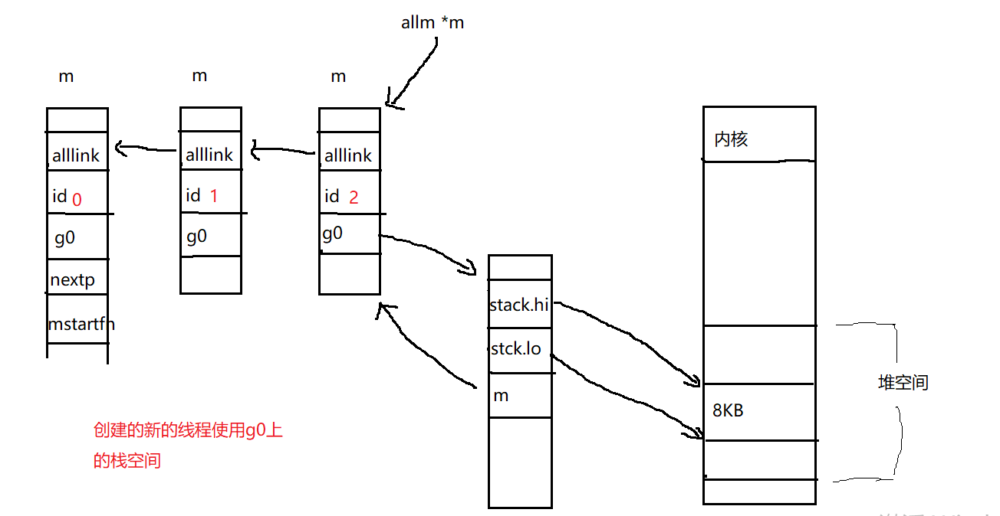

# 创建M

 Go中的M是物理线程的抽象，创建M就是创建一个新的系统线程。M的创建通过[newm](https://github.com/6z7/go/blob/release-branch.go1.13/src/runtime/proc.go#L1803)实现。

## newm

newm中先创建并初始化一个M，然后在调用newosproc来创建一个新的线程。

```go
 func newm(fn func(), _p_ *p) {
	mp := allocm(_p_, fn)
	mp.nextp.set(_p_)
	mp.sigmask = initSigmask
    ....
	newm1(mp)
}

func newm1(mp *m) {
	...
	execLock.rlock() // Prevent process clone.
	// 創建线程，设置线程的pc寄存器和sp寄存器和tls
	newosproc(mp)
	execLock.runlock()
}
```
## allocm

创建并初始化M，给新创建的m分配id，将新创建的m加入到全局m的分片中，其中也会释放一些等待释放的m关联的stack,可以腾出一些空间用。

先创建的g0分配8kb的栈空间,这是因为g0上的栈空间是给liux线程使用的。

```go

func allocm(_p_ *p, fn func()) *m {
	_g_ := getg()
	acquirem() // disable GC because it can be called from sysmon
	if _g_.m.p == 0 {
		acquirep(_p_) // temporarily borrow p for mallocs in this function
	}

	// Release the free M list. We need to do this somewhere and
	// this may free up a stack we can use.
	// 释放一些等待释放的m关联的stack,可以腾出一些空间用
	if sched.freem != nil {
		lock(&sched.lock)
		var newList *m
		for freem := sched.freem; freem != nil; {
			if freem.freeWait != 0 {
				next := freem.freelink
				freem.freelink = newList
				newList = freem
				freem = next
				continue
			}
			// 释放g0上分配的系统内存
			stackfree(freem.g0.stack)
			freem = freem.freelink
		}
		sched.freem = newList
		unlock(&sched.lock)
	}

	mp := new(m)
	mp.mstartfn = fn
	// 初始化m
	mcommoninit(mp)

	// In case of cgo or Solaris or illumos or Darwin, pthread_create will make us a stack.
	// Windows and Plan 9 will layout sched stack on OS stack.
	if iscgo || GOOS == "solaris" || GOOS == "illumos" || GOOS == "windows" || GOOS == "plan9" || GOOS == "darwin" {
		mp.g0 = malg(-1)
	} else {
        // 为m创建一个g，8kb大小栈
        // linux线程栈大小8kb
		mp.g0 = malg(8192 * sys.StackGuardMultiplier)
	}
	mp.g0.m = mp

	if _p_ == _g_.m.p.ptr() {
		releasep()
	}
	releasem(_g_.m)

	return mp
}

// 初始化m
func mcommoninit(mp *m) {
	_g_ := getg()

	// g0 stack won't make sense for user (and is not necessary unwindable).
	if _g_ != _g_.m.g0 {
		callers(1, mp.createstack[:])
	}

	lock(&sched.lock)
	if sched.mnext+1 < sched.mnext {
		throw("runtime: thread ID overflow")
	}
	mp.id = sched.mnext
	sched.mnext++
	checkmcount()  //检查已创建系统线程是否超过了数量限制（10000）

	mp.fastrand[0] = 1597334677 * uint32(mp.id)
	mp.fastrand[1] = uint32(cputicks())
	if mp.fastrand[0]|mp.fastrand[1] == 0 {
		mp.fastrand[1] = 1
	}

	//创建用于信号处理的gsignal，只是简单的从堆上分配一个g结构体对象,然后把栈设置好就返回了
	mpreinit(mp)
	if mp.gsignal != nil {
		mp.gsignal.stackguard1 = mp.gsignal.stack.lo + _StackGuard
	}

	//所有m的链表
	// Add to allm so garbage collector doesn't free g->m
	// when it is just in a register or thread-local storage.
	mp.alllink = allm

	// 更新allm指向新的m
	// NumCgoCall() iterates over allm w/o schedlock,
	// so we need to publish it safely.
	atomicstorep(unsafe.Pointer(&allm), unsafe.Pointer(mp))
	unlock(&sched.lock)

	// Allocate memory to hold a cgo traceback if the cgo call crashes.
	if iscgo || GOOS == "solaris" || GOOS == "illumos" || GOOS == "windows" {
		mp.cgoCallers = new(cgoCallers)
	}
}

```

M创建完成并初始化完成后，大致示意图如下：



## newosproc

newosproc会调用clone函数创建一个新的线程来执行指定的启动入口函数`mstart`，
[clone函数](https://github.com/6z7/go/blob/release-branch.go1.13/src/runtime/sys_linux_amd64.s#L540)是通过汇编实现的。

```go
func newosproc(mp *m) {
	stk := unsafe.Pointer(mp.g0.stack.hi)
	/*
	 * note: strace gets confused if we use CLONE_PTRACE here.
	 */
	if false {
		print("newosproc stk=", stk, " m=", mp, " g=", mp.g0, " clone=", funcPC(clone), " id=", mp.id, " ostk=", &mp, "\n")
	}

	// Disable signals during clone, so that the new thread starts
	// with signals disabled. It will enable them in minit.
	var oset sigset
	sigprocmask(_SIG_SETMASK, &sigset_all, &oset)
	// 第一个参数：需要从父进程继承哪些资源
	// 第二个参数：堆栈空间 设置子进程的esp寄存器   linux 8kb
	// 第三个参数：m
	// 第四个参数：g0
	// 第五个参数：新进程执行的函数入口
	ret := clone(cloneFlags, stk, unsafe.Pointer(mp), unsafe.Pointer(mp.g0), unsafe.Pointer(funcPC(mstart)))
	sigprocmask(_SIG_SETMASK, &oset, nil)

	if ret < 0 {
		print("runtime: failed to create new OS thread (have ", mcount(), " already; errno=", -ret, ")\n")
		if ret == -_EAGAIN {
			println("runtime: may need to increase max user processes (ulimit -u)")
		}
		throw("newosproc")
	}
}
```

# clone

调用系统clone函数创建一个新的线程，该系统调用会返回2次，一次是父线程的返回，一次是新创建的子线程的返回。

父线程直接返回到调用者，子线程需要设置子线程的SP寄存器,然后调用传入的mstart函数，mstart函数中会进行循环调度不会返回。

```
// int32 clone(int32 flags, void *stk, M *mp, G *gp, void (*fn)(void));
TEXT runtime·clone(SB),NOSPLIT,$0
    // flags
	MOVL	flags+0(FP), DI
    // 栈底位置
	MOVQ	stk+8(FP), SI
	MOVQ	$0, DX
	MOVQ	$0, R10

	// Copy mp, gp, fn off parent stack for use by child.
	// Careful: Linux system call clobbers CX and R11.
    // m
	MOVQ	mp+16(FP), R8
    // g0
	MOVQ	gp+24(FP), R9
    // fn
	MOVQ	fn+32(FP), R12

	MOVL	$SYS_clone, AX
	SYSCALL

	// In parent, return.
    // 父线程直接返回
	CMPQ	AX, $0
	JEQ	3(PC)
	MOVL	AX, ret+40(FP)
	RET

	// In child, on new stack.
    // 子线程设置栈
	MOVQ	SI, SP

	// If g or m are nil, skip Go-related setup.
	CMPQ	R8, $0    // m
	JEQ	nog
	CMPQ	R9, $0    // g
	JEQ	nog

	// Initialize m->procid to Linux tid
    // 子线程pid
	MOVL	$SYS_gettid, AX
	SYSCALL
	MOVQ	AX, m_procid(R8)

	// Set FS to point at m->tls.
    // FS=&m.tls
	LEAQ	m_tls(R8), DI
	CALL	runtime·settls(SB)

	// In child, set up new stack
	get_tls(CX)
    // g0.m=m
	MOVQ	R8, g_m(R9)
    // tls=&g0
	MOVQ	R9, g(CX)
	CALL	runtime·stackcheck(SB)

nog:
	// Call fn
    // fn=mstart   这个函数中会循环调度不会返回    
	CALL	R12

	// It shouldn't return. If it does, exit that thread.
	MOVL	$111, DI
	MOVL	$SYS_exit, AX
	SYSCALL
	JMP	-3(PC)	// keep exiting
```
