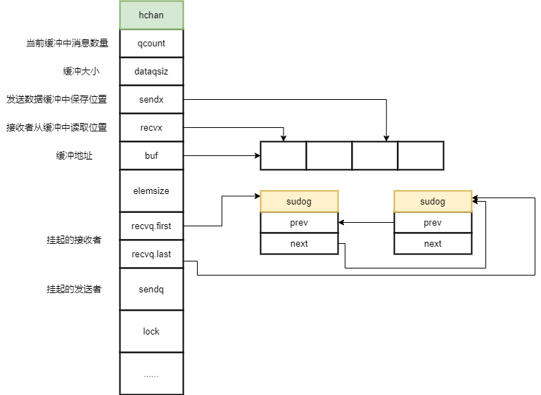

# channel源码分析

channel是go中常用的一种类型，用于在不同协程之前同步信息。其源码位于[runtime/chan.go](https://github.com/6z7/go/blob/master/src/runtime/chan.go)文件中。

先通过一个简单的使用chan例子,查看生成的汇编代码,来看看channel的实际使用过程。
```go
func main() {
            ch := make(chan int)
            go func() {
                ch<-1
            }()
            fmt.Println(<-ch)
        }

```
对应的主要汇编代码如下:
```
"".main STEXT size=555 args=0x0 locals=0xf0
	0x0000 00000 (demo2.go:9)	TEXT	"".main(SB), ABIInternal, $240-0
	0x0000 00000 (demo2.go:9)	MOVQ	(TLS), CX
	0x0009 00009 (demo2.go:9)	LEAQ	-112(SP), AX
	0x000e 00014 (demo2.go:9)	CMPQ	AX, 16(CX)
	0x0012 00018 (demo2.go:9)	JLS	545
	0x0018 00024 (demo2.go:9)	SUBQ	$240, SP
	0x001f 00031 (demo2.go:9)	MOVQ	BP, 232(SP)
	0x0027 00039 (demo2.go:9)	LEAQ	232(SP), BP	
	0x002f 00047 (demo2.go:10)	LEAQ	type.chan int(SB), AX	
	0x0036 00054 (demo2.go:10)	MOVQ	AX, (SP)
	0x003a 00058 (demo2.go:10)	MOVQ	$0, 8(SP)
	0x0043 00067 (demo2.go:10)	CALL	runtime.makechan(SB)
	0x0048 00072 (demo2.go:10)	MOVQ	16(SP), AX	
	0x004d 00077 (demo2.go:10)	MOVQ	AX, "".ch+88(SP)
	0x0052 00082 (demo2.go:11)	MOVL	$8, (SP)	
	0x0059 00089 (demo2.go:11)	LEAQ	"".main.func1·f(SB), CX	
	0x0060 00096 (demo2.go:11)	MOVQ	CX, 8(SP)	
	0x0065 00101 (demo2.go:11)	MOVQ	AX, 16(SP)
	0x006a 00106 (demo2.go:11)	CALL	runtime.newproc(SB)
	0x006f 00111 (demo2.go:14)	MOVQ	$0, ""..autotmp_8+72(SP)	
	0x0078 00120 (demo2.go:14)	MOVQ	"".ch+88(SP), AX	
	0x007d 00125 (demo2.go:14)	MOVQ	AX, (SP)	
	0x0081 00129 (demo2.go:14)	LEAQ	""..autotmp_8+72(SP), AX	
	0x0086 00134 (demo2.go:14)	MOVQ	AX, 8(SP)
	0x008b 00139 (demo2.go:14)	CALL	runtime.chanrecv1(SB)
	0x0090 00144 (demo2.go:14)	MOVQ	""..autotmp_8+72(SP), AX
	0x0095 00149 (demo2.go:14)	MOVQ	AX, (SP)
	......
"".main.func1 STEXT size=72 args=0x8 locals=0x18
	0x0000 00000 (demo2.go:11)	TEXT	"".main.func1(SB), ABIInternal, $24-8
	0x0000 00000 (demo2.go:11)	MOVQ	(TLS), CX
	0x0009 00009 (demo2.go:11)	CMPQ	SP, 16(CX)
	0x000d 00013 (demo2.go:11)	JLS	65
	0x000f 00015 (demo2.go:11)	SUBQ	$24, SP
	0x0013 00019 (demo2.go:11)	MOVQ	BP, 16(SP)
	0x0018 00024 (demo2.go:11)	LEAQ	16(SP), BP	
	0x001d 00029 (demo2.go:12)	MOVQ	"".ch+32(SP), AX	
	0x0022 00034 (demo2.go:12)	MOVQ	AX, (SP)	
	0x0026 00038 (demo2.go:12)	LEAQ	""..stmp_0(SB), AX	
	0x002d 00045 (demo2.go:12)	MOVQ	AX, 8(SP)
	0x0032 00050 (demo2.go:12)	CALL	runtime.chansend1(SB)
	0x0037 00055 (demo2.go:13)	MOVQ	16(SP), BP
	0x003c 00060 (demo2.go:13)	ADDQ	$24, SP
	0x0040 00064 (demo2.go:13)	RET
	0x0041 00065 (demo2.go:13)	NOP	
	0x0041 00065 (demo2.go:11)	CALL	runtime.morestack_noctxt(SB)
	0x0046 00070 (demo2.go:11)	JMP	0
```	
其中与channel相关的主要是以下操作:

* runtime.makechan ： 创建channel对象
* runtime.chansend1： 发送消息  
* runtime.chanrecv1： 接收消息
 

## makechan

makechan用于创建一个指定缓冲大小的channel,在运行时channel的使用hchan结构来管理。
```go
func makechan(t *chantype, size int) *hchan {
	elem := t.elem

	// compiler checks this but be safe.
	if elem.size >= 1<<16 {
		throw("makechan: invalid channel element type")
	}
	if hchanSize%maxAlign != 0 || elem.align > maxAlign {
		throw("makechan: bad alignment")
	}

	mem, overflow := math.MulUintptr(elem.size, uintptr(size))
	if overflow || mem > maxAlloc-hchanSize || size < 0 {
		panic(plainError("makechan: size out of range"))
	}
 
	var c *hchan
	switch {
	case mem == 0:	 
		c = (*hchan)(mallocgc(hchanSize, nil, true))	 
		c.buf = c.raceaddr()
	case elem.ptrdata == 0:
	 
		c = (*hchan)(mallocgc(hchanSize+mem, nil, true))
		c.buf = add(unsafe.Pointer(c), hchanSize)
	default:
		// Elements contain pointers.
		c = new(hchan)
		c.buf = mallocgc(mem, elem, true)
	}

	c.elemsize = uint16(elem.size)
	c.elemtype = elem
	c.dataqsiz = uint(size)

	if debugChan {
		print("makechan: chan=", c, "; elemsize=", elem.size, "; dataqsiz=", size, "\n")
	}
	return c
}
```

hchan的结构如下:
```go
    //chan结构
    type hchan struct {
        //当前缓冲中的消息数量
        qcount   uint           // total data in the queue
        //chan缓冲大小 make(chan int,10)
        dataqsiz uint           // size of the circular queue
        //chan缓冲数组
        buf      unsafe.Pointer // points to an array of dataqsiz elements
        //chn中元素类型的大小 make(chan int)
        elemsize uint16
        //chan是否关闭
        closed   uint32
        //chn中元素类型
        elemtype *_type // element type
        //发送数据保存缓冲位置
        sendx    uint   // send index
        //接收索引
        recvx    uint   // receive index
        //chnn接收者等待队列
        recvq    waitq  // list of recv waiters
        //chann发送者等待队列
        sendq    waitq  // list of send waiters
        //互斥锁       
        lock mutex
    }
 ```   



## runtime.chanrecv1

接收消息,大致过程如下:

0. 对于nil channel，阻塞调用直接挂起唤醒后报错，非阻塞则直接返回(false, false)

1. 尝试无锁快速判断，如果同时满足以下条件直接返回(false, false)

    * 非阻塞   
    * chan没有缓冲且还没有发送者
    * chan有缓冲且缓冲空
    * channel未关闭

2. chann已关闭且缓冲中没有数据，直接返回(true, false)

3. 有发送者被挂起,直接将发送者的消息返回给接收者(true, true)

4. chann缓冲中有消息，则直接取缓冲中的消息返回(true, true)

5. 非阻塞时如果没有收到消息直接返回(false, false)

6. 挂起当前g，将当前g加入到接收者队列上

7. 挂起的g被唤醒(发送者在唤醒挂起的接收者时将数据复制给接收者)

```go
// 接收消息保存到ep
//ep:保存接收的数据,为nil的话将忽略接收数据
// 如果block=false没有数据到达时 returns (false, false)

func chanrecv(c *hchan, ep unsafe.Pointer, block bool) (selected, received bool) {
  
    // 如果在 nil channel 上进行 recv 操作，会永远阻塞
    if c == nil {
        if !block {
            return
        }
        gopark(nil, nil, waitReasonChanReceiveNilChan, traceEvGoStop, 2)
        throw("unreachable")
    }
    
    //非阻塞&&chan未关闭&&(没有缓冲&&没有发送者阻塞||有缓冲&&缓冲为空)
    //满足以上条件直接返回
    if !block&& (c.dataqsiz == 0 && c.sendq.first == nil ||
        c.dataqsiz > 0 && atomic.Loaduint(&c.qcount) == 0) &&
        atomic.Load(&c.closed) == 0 {
        return
    }

    var t0 int64
    if blockprofilerate > 0 {
        t0 = cputicks()
    }

    lock(&c.lock)

    //chan已经关闭且缓冲中没有消息可读,直接返回
    //通过此处可以看到从已经关闭的chan读取数据时不会报错
    if c.closed != 0 && c.qcount == 0 {           
        unlock(&c.lock)
        if ep != nil {
            typedmemclr(c.elemtype, ep)
        }
        return true, false
    }

    //有发送者被挂起,直接将发送者的消息返回给接收者
    if sg := c.sendq.dequeue(); sg != nil {	 
        recv(c, sg, ep, func() { unlock(&c.lock) }, 3)
        return true, true
    }

    //缓冲中有消息
    if c.qcount > 0 {
        // Receive directly from queue
        //缓冲中c.recvx位置处的消息
        qp := chanbuf(c, c.recvx)           
        if ep != nil {
            //将缓冲中的数据复制到接收者ep
            typedmemmove(c.elemtype, ep, qp)
        }
        //清空缓冲中c.recvx位置处的值,留给发送者使用
        typedmemclr(c.elemtype, qp)
        //接收索引+1，下次读取缓冲中的下一个值
        c.recvx++
        //缓冲中的数据已经接收完毕(索引从0开始)从头开始
        if c.recvx == c.dataqsiz {
            c.recvx = 0
        }
        //消息数量-1
        c.qcount--
        unlock(&c.lock)
        return true, true
    }

    //非阻塞时如果没有收到消息直接返回
    if !block {
        unlock(&c.lock)
        return false, false
    }

    //没有数据可以接收，则挂起当前g       
    gp := getg()
    //获取Sudog保存当前信息
    mysg := acquireSudog()
    mysg.releasetime = 0
    if t0 != 0 {
        mysg.releasetime = -1
    }       
    //保存接收者,唤醒时会将发送的消息赋值给elm
    mysg.elem = ep
    mysg.waitlink = nil
    gp.waiting = mysg
    mysg.g = gp
    mysg.isSelect = false
    mysg.c = c
    gp.param = nil
    c.recvq.enqueue(mysg)
    goparkunlock(&c.lock, waitReasonChanReceive, traceEvGoBlockRecv, 3)

    //g被唤醒后续操作      
    if mysg != gp.waiting {
        throw("G waiting list is corrupted")
    }
    gp.waiting = nil
    if mysg.releasetime > 0 {
        blockevent(mysg.releasetime-t0, 2)
    }
    //被唤醒后 如果gp.param == nil则代表chan已经被关闭
    //close时会将阻塞的接收者的gp.param设置为nil,发送者唤醒时会将gp.param赋值为被唤醒者的sudog
    closed := gp.param == nil
    gp.param = nil
    mysg.c = nil
    releaseSudog(mysg)
    return true, !closed
}


// 从挂起的发送者上接收消息,此时缓冲中的消息数量不会变

// c:接受者的chan
// sg:代表被阻塞的发送者
// ep:保存数据的接收者
// unlockf:唤醒g时的回调操作
// 如果没有缓冲即同步chan,直接从发送者copy数据到ep,之后唤醒被阻塞的g
// 如果是异步chan,则先chan缓冲中copy数据到ep,再将发送者的数据放到缓冲中,之后唤醒被阻塞的g     
func recv(c *hchan, sg *sudog, ep unsafe.Pointer, unlockf func(), skip int) {
    //没有设置缓冲 make(chan int)这种形式
    if c.dataqsiz == 0 {           
        if ep != nil {                
            //将发送数据直接copy到接收者上
            recvDirect(c.elemtype, sg, ep)
        }
    } else {            
        // chan有缓冲 只有缓冲已经填满，才会走到这里(只有带缓冲的chan已经满才会造成发送者阻塞才会走到此处)
        //缓冲中的c.recvx处保存的数据
        qp := chanbuf(c, c.recvx) 
        //从缓冲中copy数据到接收者ep
        if ep != nil {
            typedmemmove(c.elemtype, ep, qp)
        }           
        //qp位置处的值已经被消费 复制给了ep
        //从sender中copy数据到缓冲中
        //从缓冲队列c.recvx取出值,并将发送者的数据保存到队列中,此时缓冲数量没有变换
        typedmemmove(c.elemtype, qp, sg.elem)
        //消费者位置+1
        c.recvx++
        //缓冲已满
        if c.recvx == c.dataqsiz {
            c.recvx = 0
        }
        //缓冲已满时发送者会将c.sendx = 0,即此处c.sendx=0
        //c.recvx是缓冲中下次被访问的位置，空出来后可以给发送者使用，
        //所以将发送者的位置设置为下次空出来的位置			    	    
        c.sendx = c.recvx // c.sendx = (c.sendx+1) % c.dataqsiz
    }
    sg.elem = nil
    gp := sg.g
    unlockf()
    //指向阻塞的发送者 gp.param==nil代表chan已经被关闭
    gp.param = unsafe.Pointer(sg)
    if sg.releasetime != 0 {
        sg.releasetime = cputicks()
    }
    //唤醒发送者g
    goready(gp, skip+1)
}
```

## runtime.chansend1

chansend1简单调用chansend用来发送消息。大致过程如下:

0. 如果是nil chann，非阻塞时直接返回false，阻塞时报错

1. 尝试无锁快速判断，如果同时满足以下条件直接返回false

    * 非阻塞
    * channel未关闭
    * chan没有缓冲且还没有接收者
    * chan有缓冲且缓冲已满

2. 如果chann已经关闭直接panic

3. 如果有接收者在等待，则直接将发送的数据复制给接收者，并唤醒接收者，返回true。

4. chann缓冲未满，则直接放入chann缓冲中，返回true

5. chann缓冲已满，如果非阻塞则直接返回false,反之挂起当前g,并将g放入发送者等待队列

6. g被唤醒，检查chann是否已经被关闭，如果已关闭则直接panic,否则返回true

```go
// c <- x

// ep:发送的数据地址
// block:缓冲满时是否阻塞
// callerpc:c <- x操作的下一条指令的位置

func chansend(c *hchan, ep unsafe.Pointer, block bool, callerpc uintptr) bool {
    //var a chan int
    // nil chan
    if c == nil {
        if !block {
            return false
        }
        //挂起
        gopark(nil, nil, waitReasonChanSendNilChan, traceEvGoStop, 2)
        throw("unreachable")
    }
  
    if !block && c.closed == 0 && ((c.dataqsiz == 0 && c.recvq.first == nil) ||
        (c.dataqsiz > 0 && c.qcount == c.dataqsiz)) {
        return false
    }

    lock(&c.lock)

    //chan已经关闭则panic
    if c.closed != 0 {
        unlock(&c.lock)
        panic(plainError("send on closed channel"))
    }
     
    if sg := c.recvq.dequeue(); sg != nil {      
        send(c, sg, ep, func() { unlock(&c.lock) }, 3)
        return true
    }

    //缓冲没有满
    if c.qcount < c.dataqsiz {     
        qp := chanbuf(c, c.sendx)        
        //将发送数据ep保存到缓冲中
        typedmemmove(c.elemtype, qp, ep)
        c.sendx++
        //缓冲满了即c.qcount = c.dataqsiz
        if c.sendx == c.dataqsiz {
            c.sendx = 0
        }
        //缓冲中数量+1
        c.qcount++
        unlock(&c.lock)
        return true
    }

    //缓冲已满 非阻塞则直接返回，否则挂起当前g
    if !block {
        unlock(&c.lock)
        return false
    }

    // Block on the channel. Some receiver will complete our operation for us.
    gp := getg()
    mysg := acquireSudog()
    mysg.releasetime = 0
    if t0 != 0 {
        mysg.releasetime = -1
    }       
    //保存发送者的要发送数据指针
    mysg.elem = ep
    mysg.waitlink = nil
    mysg.g = gp
    mysg.isSelect = false
    mysg.c = c
    gp.waiting = mysg
    //param=nil 代表chan已关闭
    gp.param = nil
    //发送者入队
    c.sendq.enqueue(mysg)
    //挂起当前发送者
    goparkunlock(&c.lock, waitReasonChanSend, traceEvGoBlockSend, 3)
    
    KeepAlive(ep)

    // someone woke us up.
    if mysg != gp.waiting {
        throw("G waiting list is corrupted")
    }
    gp.waiting = nil
    //唤醒后检查chan是否已经被关闭,close时会清空该标志
    //所以关闭时如果有发送者被挂起close后唤醒时会触发panic
    if gp.param == nil {
        if c.closed == 0 {
            throw("chansend: spurious wakeup")
        }
        panic(plainError("send on closed channel"))
    }
    gp.param = nil       
    mysg.c = nil
    releaseSudog(mysg)
    return true
}

//直接将发送者数据赋值给挂起的接收者
func send(c *hchan, sg *sudog, ep unsafe.Pointer, unlockf func(), skip int) {       
    //elem是接收者保存接收值的指针,close时会清空elem
    if sg.elem != nil {
        //直接copy到接收者(sg.elem中保存的是接收者)
        sendDirect(c.elemtype, sg, ep)
        sg.elem = nil
    }
    gp := sg.g
    unlockf()
    //param=nil代表g被唤醒后chan已经被关闭,所以此处需要赋值
    gp.param = unsafe.Pointer(sg)
    if sg.releasetime != 0 {
        sg.releasetime = cputicks()
    }
    goready(gp, skip+1)
}
 ```   

## runtime.closechan

关闭chan

1. 关闭nil chan直接panic
2. 重复关闭chan直接panic
3. 设置关闭标记c.closed = 1
4. 遍历所有挂起的发送者与等待者队列，设置g.param=nil，让g被唤醒侯知道chan已经被关闭
5. 唤醒所有挂起的g

```go
func closechan(c *hchan) {    
    if c == nil {
        panic(plainError("close of nil channel"))
    }

    lock(&c.lock)
    //已关闭
    if c.closed != 0 {
        unlock(&c.lock)
        panic(plainError("close of closed channel"))
    }

    c.closed = 1

    var glist gList

    // release all readers
    for {
        sg := c.recvq.dequeue()
        if sg == nil {
            break
        }
        //设置接收数据的指针nil
        if sg.elem != nil {
            typedmemclr(c.elemtype, sg.elem)
            sg.elem = nil
        }
        if sg.releasetime != 0 {
            sg.releasetime = cputicks()
        }
        gp := sg.g
        //chan close标志,用与唤醒后让g感知到
        gp.param = nil
        if raceenabled {
            raceacquireg(gp, c.raceaddr())
        }
        glist.push(gp)
    }

    // release all writers (they will panic)
    for {
        sg := c.sendq.dequeue()
        if sg == nil {
            break
        }
        //设置发送数据的指针nil
        sg.elem = nil
        if sg.releasetime != 0 {
            sg.releasetime = cputicks()
        }
        gp := sg.g
        //chan close标志,用与唤醒后让g感知到
        gp.param = nil
        if raceenabled {
            raceacquireg(gp, c.raceaddr())
        }
        glist.push(gp)
    }
    unlock(&c.lock)

    // Ready all Gs now that we've dropped the channel lock.
    for !glist.empty() {
        gp := glist.pop()
        gp.schedlink = 0
        //唤醒所有挂起的发送者与接收者
        goready(gp, 3)
    }
}
```    