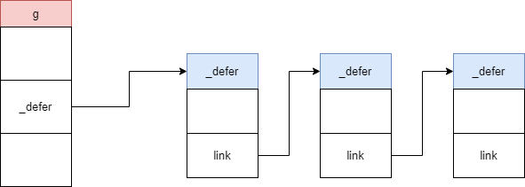

# defer源码分析

defer是go中用于声明在函数结束时必然执行的回调函数。

defer的源码在runtime/panic.go中(通过dlv调试,下断点b runtime.deferprocStack就可以找到)

对于defer，编译时逃逸分析后决定是分配在堆上还是栈上。不管是分配在哪里，都会使用到`_defer`数据结构用于在运行时保存定义的defer函数: 

 ```go  
type _defer struct {
    //函数的参数总大小包括返回值
    siz     int32 // includes both arguments and results
    //是否已经执行
    started bool
    //defer分配在堆上还是栈上
    heap    bool
    // 存储调用 defer 函数的函数的 sp 寄存器值
    sp      uintptr // sp at time of defer
    //存储 call deferproc 的下一条汇编指令的指令地址
    pc      uintptr
    //指向需要执行的匿名函数
    fn      *funcval
    //panic信息
    _panic  *_panic // panic that is running defer
    //下一个需要执行的defer
    link    *_defer
}
 ```

下面分别看下defer在栈或堆上的分配的情况

## defer分配在栈上

由于defer在栈上分配，所以在编译时已经确定了defer在栈上的分布情况。下面这段代码就是编译时构造的defer结构的[方法](https://github.com/6z7/go/blob/03250054f8512d35b10f17d3c886dbc4b1ad43c6/src/cmd/compile/internal/gc/ssa.go#L3836)，可以看到在_defer后边还有一个参数数组:

```go
func deferstruct(stksize int64) *types.Type {
     ......
    argtype := types.NewArray(types.Types[TUINT8], stksize)
	argtype.Width = stksize
	argtype.Align = 1
	// These fields must match the ones in runtime/runtime2.go:_defer and
	// cmd/compile/internal/gc/ssa.go:(*state).call.
	fields := []*types.Field{
		makefield("siz", types.Types[TUINT32]),
		makefield("started", types.Types[TBOOL]),
		makefield("heap", types.Types[TBOOL]),
		makefield("sp", types.Types[TUINTPTR]),
		makefield("pc", types.Types[TUINTPTR]),
		// Note: the types here don't really matter. Defer structures
		// are always scanned explicitly during stack copying and GC,
		// so we make them uintptr type even though they are real pointers.
		makefield("fn", types.Types[TUINTPTR]),
		makefield("_panic", types.Types[TUINTPTR]),
		makefield("link", types.Types[TUINTPTR]),
		makefield("args", argtype),
	}
......
}
```

举一个分配在栈的例子，通过反汇编看下defer在栈上是如何分配的。

```go
func main() {
	a, b := 1, 2
	defer func(a, b int) {
		fmt.Println(a, b)
	}(a, b)
}
```
通过`go tool compile -N -S -l demo.go`获取对应的汇编
```
"".main STEXT size=149 args=0x0 locals=0x68
	0x0000 00000 (demo.go:5)	TEXT	"".main(SB), ABIInternal, $104-0
	0x0000 00000 (demo.go:5)	MOVQ	(TLS), CX
	0x0009 00009 (demo.go:5)	CMPQ	SP, 16(CX)
	0x000d 00013 (demo.go:5)	JLS	139
	0x000f 00015 (demo.go:5)	SUBQ	$104, SP
	0x0013 00019 (demo.go:5)	MOVQ	BP, 96(SP)
	0x0018 00024 (demo.go:5)	LEAQ	96(SP), BP
	0x001d 00029 (demo.go:6)	MOVQ	$1, "".a+24(SP)
	0x0026 00038 (demo.go:6)	MOVQ	$2, "".b+16(SP)
	0x002f 00047 (demo.go:7)	MOVL	$16, ""..autotmp_3+32(SP)
	0x0037 00055 (demo.go:7)	PCDATA	$0, $1
	0x0037 00055 (demo.go:7)	LEAQ	"".main.func1·f(SB), AX
	0x003e 00062 (demo.go:7)	PCDATA	$0, $0
	0x003e 00062 (demo.go:7)	MOVQ	AX, ""..autotmp_3+56(SP)
	0x0043 00067 (demo.go:7)	MOVQ	"".a+24(SP), AX
	0x0048 00072 (demo.go:7)	MOVQ	AX, ""..autotmp_3+80(SP)
	0x004d 00077 (demo.go:7)	MOVQ	"".b+16(SP), AX
	0x0052 00082 (demo.go:7)	MOVQ	AX, ""..autotmp_3+88(SP)	
	0x0057 00087 (demo.go:7)	LEAQ	""..autotmp_3+32(SP), AX
	0x005c 00092 (demo.go:7)	MOVQ	AX, (SP)
	0x0060 00096 (demo.go:7)	CALL	runtime.deferprocStack(SB)
	0x0065 00101 (demo.go:7)	TESTL	AX, AX
	0x0067 00103 (demo.go:7)	JNE	123
	0x0069 00105 (demo.go:7)	JMP	107
	//On x86 the NOP instruction is XCHG AX, AX
	0x006b 00107 (demo.go:10)	XCHGL	AX, AX
	0x006c 00108 (demo.go:10)	CALL	runtime.deferreturn(SB)
	0x0071 00113 (demo.go:10)	MOVQ	96(SP), BP
	0x0076 00118 (demo.go:10)	ADDQ	$104, SP
	0x007a 00122 (demo.go:10)	RET
	0x007b 00123 (demo.go:7)	XCHGL	AX, AX
	0x007c 00124 (demo.go:7)	CALL	runtime.deferreturn(SB)
	0x0081 00129 (demo.go:7)	MOVQ	96(SP), BP
	0x0086 00134 (demo.go:7)	ADDQ	$104, SP
	0x008a 00138 (demo.go:7)	RET
	0x008b 00139 (demo.go:7)	NOP
	0x008b 00139 (demo.go:5)	PCDATA	$1, $-1
	0x008b 00139 (demo.go:5)	PCDATA	$0, $-1
	0x008b 00139 (demo.go:5)	CALL	runtime.morestack_noctxt(SB)
	0x0090 00144 (demo.go:5)	JMP	0
"".main.func1 STEXT size=260 args=0x10 locals=0x88
	0x0000 00000 (demo.go:7)	TEXT	"".main.func1(SB), ABIInternal, $136-16
	0x0000 00000 (demo.go:7)	MOVQ	(TLS), CX
	0x0009 00009 (demo.go:7)	LEAQ	-8(SP), AX
	0x000e 00014 (demo.go:7)	CMPQ	AX, 16(CX)
	0x0012 00018 (demo.go:7)	JLS	250
	0x0018 00024 (demo.go:7)	SUBQ	$136, SP
	0x001f 00031 (demo.go:7)	MOVQ	BP, 128(SP)
	0x0027 00039 (demo.go:7)	LEAQ	128(SP), BP
	0x002f 00047 (demo.go:8)	MOVQ	"".a+144(SP), AX
	0x0037 00055 (demo.go:8)	MOVQ	AX, (SP)
	0x003b 00059 (demo.go:8)	CALL	runtime.convT64(SB)
	0x0040 00064 (demo.go:8)	PCDATA	$0, $1
	0x0040 00064 (demo.go:8)	MOVQ	8(SP), AX
	0x0045 00069 (demo.go:8)	PCDATA	$0, $0
	......
	0x00fa 00250 (demo.go:7)	CALL	runtime.morestack_noctxt(SB)
	0x00ff 00255 (demo.go:7)	JMP	0

```
  
通过上边的汇编可以看到，关键部分是 **runtime.deferprocStack**与**runtime.deferreturn**。defer在栈上的分配如下图:


 ## runtime.deferprocStack

根据上述的汇编代码

```go    
// 将新的defer加入LIFO队列    
//go:nosplit
func deferprocStack(d *_defer) {
    gp := getg()
    // g0上不能执行defer
    if gp.m.curg != gp {
        // go code on the system stack can't defer
        throw("defer on system stack")
    }
   
    d.started = false
    d.heap = false
    d.sp = getcallersp()
    d.pc = getcallerpc()

    //构建链表，当前g上保存defer
    *(*uintptr)(unsafe.Pointer(&d._panic)) = 0
    *(*uintptr)(unsafe.Pointer(&d.link)) = uintptr(unsafe.Pointer(gp._defer))
    *(*uintptr)(unsafe.Pointer(&gp._defer)) = uintptr(unsafe.Pointer(d))    
    //隐式返回0  编译器生产的代码会插入判断，当程序发生 panic 之后会返回非0
    return0()
    
} 
```
return0的汇编实现
```
TEXT runtime·return0(SB), NOSPLIT, $0
	MOVL	$0, AX
	RET
```
 创建的defer会保存到`g._defer`上，多个defer会创建构成一个FIFO链表。




## runtime.deferproc

defer分配在堆上

```go
//go:nosplit
func deferproc(siz int32, fn *funcval) { 
    if getg().m.curg != getg() {
        // go code on the system stack can't defer
        throw("defer on system stack")
    }     
    sp := getcallersp()
    argp := uintptr(unsafe.Pointer(&fn)) + unsafe.Sizeof(fn)
    callerpc := getcallerpc()

    //创建defer
    d := newdefer(siz)
    if d._panic != nil {
        throw("deferproc: d.panic != nil after newdefer")
    }
    d.fn = fn
    d.pc = callerpc
    d.sp = sp
    switch siz {
    case 0:
        // Do nothing.
    case sys.PtrSize:
        *(*uintptr)(deferArgs(d)) = *(*uintptr)(unsafe.Pointer(argp))
    default:
        memmove(deferArgs(d), unsafe.Pointer(argp), uintptr(siz))
    }
    
   
    return0()   
}

//创建一个defer
func newdefer(siz int32) *_defer {
var d *_defer
sc := deferclass(uintptr(siz))
gp := getg()
//deferpool    [5][]*_defer
//如果参数大小<5使用缓存
if sc < uintptr(len(p{}.deferpool)) {
    pp := gp.m.p.ptr()
    //如果P上没有deferpool缓存，则从全局sched.deferpool转移一部分到P上
    if len(pp.deferpool[sc]) == 0 && sched.deferpool[sc] != nil {
        // Take the slow path on the system stack so
        // we don't grow newdefer's stack.
        systemstack(func() {
            lock(&sched.deferlock)
            //最多转移一半
            for len(pp.deferpool[sc]) < cap(pp.deferpool[sc])/2 && sched.deferpool[sc] != nil {
                d := sched.deferpool[sc]
                sched.deferpool[sc] = d.link
                d.link = nil
                pp.deferpool[sc] = append(pp.deferpool[sc], d)
            }
            unlock(&sched.deferlock)
        })
    }
    if n := len(pp.deferpool[sc]); n > 0 {
        d = pp.deferpool[sc][n-1]
        pp.deferpool[sc][n-1] = nil
        pp.deferpool[sc] = pp.deferpool[sc][:n-1]
    }
}
//参数大小大于>=5直接分配内存
if d == nil {
    // Allocate new defer+args.
    systemstack(func() {
        total := roundupsize(totaldefersize(uintptr(siz)))
        d = (*_defer)(mallocgc(total, deferType, true))
    })
    if debugCachedWork {
        // Duplicate the tail below so if there's a
        // crash in checkPut we can tell if d was just
        // allocated or came from the pool.
        d.siz = siz
        d.link = gp._defer
        gp._defer = d
        return d
    }
}
d.siz = siz
//分配在堆上
d.heap = true
d.link = gp._defer
//defer保存到g上
gp._defer = d
return d
}
```

## runtime.deferreturn

执行defer定义的方法

```go
func deferreturn(arg0 uintptr) {
    gp := getg()
    d := gp._defer
    if d == nil {
        return
    }
    sp := getcallersp()
    if d.sp != sp {
        return
    }

    // Moving arguments around.
    //
    // Everything called after this point must be recursively
    // nosplit because the garbage collector won't know the form
    // of the arguments until the jmpdefer can flip the PC over to
    // fn.
    switch d.siz {
    case 0:
        // Do nothing.
    case sys.PtrSize:
        *(*uintptr)(unsafe.Pointer(&arg0)) = *(*uintptr)(deferArgs(d))
    default:
        memmove(unsafe.Pointer(&arg0), deferArgs(d), uintptr(d.siz))
    }
    fn := d.fn
    d.fn = nil
    gp._defer = d.link
    freedefer(d)
    // 通过汇编实现调用fn并循环调用deferreturn直至结束
    // &arg0的地址就是defer的地址
    jmpdefer(fn, uintptr(unsafe.Pointer(&arg0)))
}
```
jmpdefer的汇编实现

```
// func jmpdefer(fv *funcval, argp uintptr)
// argp is a caller SP.
// called from deferreturn.
// 1. pop the caller
// 2. sub 5 bytes from the callers return
// 3. jmp to the argument
TEXT runtime·jmpdefer(SB), NOSPLIT, $0-16
    // defer的函数的地址
    MOVQ	fv+0(FP), DX	
    // 参数argp的地址，即调用者的SP地址
    MOVQ	argp+8(FP), BX
    // SP-8,即 调用者执行call runtime.deferreturn时压入栈的下一条指令的地址 
    LEAQ	-8(BX), SP	// caller sp after CALL
    // 恢复调用者的BP
    MOVQ	-8(SP), BP	
    // SP-5 指令恢复到call runtime.deferreturn位置
    SUBQ	$5, (SP)	// return to CALL again
    MOVQ	0(DX), BX
    // 执行函数fn
    // fn执行完成后，返回到deferreturn,再返回到调用者，由于调用者的返回地址被修改为call runtime.deferreturn的地址，则循环执行call runtime.deferreturn
    JMP	BX	 
```
runtime.deferreturn的上下文，CALL	runtime.deferreturn与下一条指令的地址相差5(00129-00124)
```
0x007c 00124 (demo.go:7)	CALL	runtime.deferreturn(SB)
0x0081 00129 (demo.go:7)	MOVQ	96(SP), BP
0x0086 00134 (demo.go:7)	ADDQ	$104, SP
0x008a 00138 (demo.go:7)	RET
```


