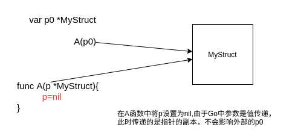

# 值类型与引用类型

Go中参数的传递都是值传递，引用类型传递的是对应的副本。这和Java/C#不一样，这些语言都是直接传递的是引用而不是副本。由于引用和引用的副本都指向同一个对象，通过副本修改对象的内容也会影响到外部，但是，如果只是改变副本本身(如设置为nil),则不会影响到外部。


## 值类型包括:

* struct   
   
   默认值是一个struct对象其中各个字段是其类型的默认值
   ```go
   type aa struct {
		name string
	}
	var c aa
	fmt.Printf("%+v",c)  //{name:}
   ```

* array
   
   默认值是一个指定长度的数组元素是对应类型的默认值
   ```go
   var a [2]int
   fmt.Println(a)  //[0 0]
   ```

* string

   默认值是空字符串

* int
   
   默认值0

* bool

   默认值false

* float32(flot64)

   默认值0

## 引用类型

* map

   默认值`nil`

* channel

   默认值`nil`

* slice

   默认值`nil`

* interface

   默认值`nil`

* 指针

   默认值`nil`


## 参数传递

Go中参数的传递都是值传递。如果参数是值类型则传递参数的副本，如果参数是引用类型则传递参数的指针副本。

如果传递的是指针副本，则在方法内对参数的修改会影响外部的参数，但是将指针副本设置为nil不会影响外部。




## nil

Go中的nil代表零值的意思，是`指针`、`通道`、`函数`、`接口`、`映射`和`切片`的零值。

```go
	var m map[string]int
	var sl []int
	var c chan int
	var p *int
	var i interface{}
	var f func()

	t.Log(m == nil)    // true
	t.Log(sl == nil)   // true
	t.Log(c == nil)    // true
	t.Log(p == nil)    // true
	t.Log(i == nil)    // true
	t.Log(f == nil)    // true
```

