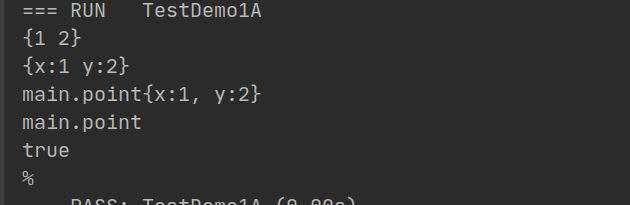
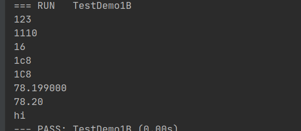
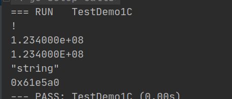

### Go中常用占位符

| 占位符 | 说明                       |
| ------ | -------------------------- |
| %v     | 对应类型值的默认格式       |
| %+v    | 结构体会输出字段名         |
| %#v    | Go语法表示的输出           |
| %T     | 输出值的数据类型           |
| %t     | 布尔类型输出 true 或 false |
| %%     | 输出%                      |

```go
    type point struct {
        x, y int
    }	
    var p = point{1, 2}

    fmt.Printf("%v\n", p)	
	fmt.Printf("%+v\n", p)	
	fmt.Printf("%#v\n", p)	
	fmt.Printf("%T\n", p)	
	fmt.Printf("%t\n", true)
	fmt.Printf("%%\n")
```



| 占位符   | 说明              |
| -------- | ----------------- |
| %d       | 十进制            |
| %b       | 二进制            |
| %o       | 八进制            |
| %x       | 十六进制,字母小写 |
| %X       | 十六进制,字母大写 |
| %f  %.2f | 浮点数            |
| %s       | 字符串            |
|          |                   |

```go
    fmt.Printf("%d\n", 123)
	
	fmt.Printf("%b\n", 14)
	
	fmt.Printf("%o\n", 14)

	 
	fmt.Printf("%x\n", 456)
	fmt.Printf("%X\n", 456)
	 
	fmt.Printf("%f\n", 78.199)
	fmt.Printf("%.2f\n", 78.199)
	
	fmt.Printf("%s\n", "hi")
	fmt.Printf("%s\n", []byte("hi"))
```



| 占位符 | 说明                                 |
| ------ | ------------------------------------ |
| %c     | 相应Unicode码点所表示的字符          |
| %e     | 科学计数法                           |
| %E     | 科学计数法                           |
| %q     | 双引号围绕的字符串原样输出包括双引号 |
| %p     | 十六进制表示，指针地址               |

```go
	fmt.Printf("%c\n", 33)
	fmt.Printf("%e\n", 123400000.0)
	fmt.Printf("%E\n", 123400000.0)	
	fmt.Printf("%q\n", "string")
	fmt.Printf("%p\n", &p)
```


