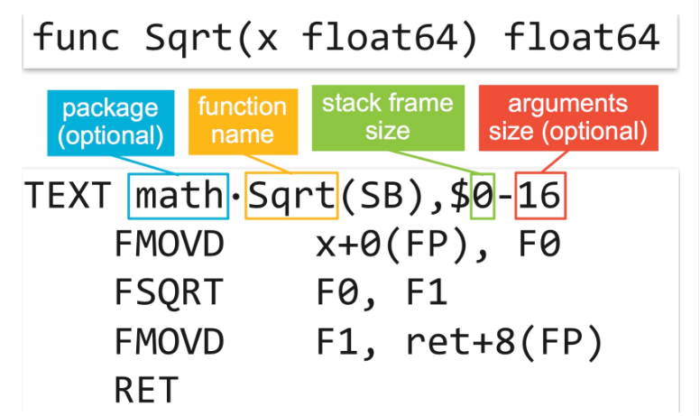

## go汇编

go使用的是类似Plan9风格的汇编,它不是对机器语言的直接表达,而是一种半抽象的指令集，需要经过编译器翻译成不同平台上的指令


```go
$ cat x.go
package main

func main() {
	println(3)
}
```
对应的go汇编代码
```go
$ GOOS=linux GOARCH=amd64 go tool compile -S x.go        # or: go build -gcflags -S x.go
"".main STEXT size=74 args=0x0 locals=0x10
	0x0000 00000 (x.go:3)	TEXT	"".main(SB), $16-0
	0x0000 00000 (x.go:3)	MOVQ	(TLS), CX
	0x0009 00009 (x.go:3)	CMPQ	SP, 16(CX)
	0x000d 00013 (x.go:3)	JLS	67
	0x000f 00015 (x.go:3)	SUBQ	$16, SP
	0x0013 00019 (x.go:3)	MOVQ	BP, 8(SP)
	0x0018 00024 (x.go:3)	LEAQ	8(SP), BP
	0x001d 00029 (x.go:3)	FUNCDATA	$0, gclocals·33cdeccccebe80329f1fdbee7f5874cb(SB)
	0x001d 00029 (x.go:3)	FUNCDATA	$1, gclocals·33cdeccccebe80329f1fdbee7f5874cb(SB)
	0x001d 00029 (x.go:3)	FUNCDATA	$2, gclocals·33cdeccccebe80329f1fdbee7f5874cb(SB)
	0x001d 00029 (x.go:4)	PCDATA	$0, $0
	0x001d 00029 (x.go:4)	PCDATA	$1, $0
	0x001d 00029 (x.go:4)	CALL	runtime.printlock(SB)
	0x0022 00034 (x.go:4)	MOVQ	$3, (SP)
	0x002a 00042 (x.go:4)	CALL	runtime.printint(SB)
	0x002f 00047 (x.go:4)	CALL	runtime.printnl(SB)
	0x0034 00052 (x.go:4)	CALL	runtime.printunlock(SB)
	0x0039 00057 (x.go:5)	MOVQ	8(SP), BP
	0x003e 00062 (x.go:5)	ADDQ	$16, SP
	0x0042 00066 (x.go:5)	RET
	0x0043 00067 (x.go:5)	NOP
	0x0043 00067 (x.go:3)	PCDATA	$1, $-1
	0x0043 00067 (x.go:3)	PCDATA	$0, $-1
	0x0043 00067 (x.go:3)	CALL	runtime.morestack_noctxt(SB)
	0x0048 00072 (x.go:3)	JMP	0
...
```

`FUNCDATA`和`PCDATA`指令包含gc时需要的信息，是由编译器生成的。

反汇编生成后的可执行文件得到的汇编代码:
```go
$ go build -o x.exe x.go
$ go tool objdump -s main.main x.exe
TEXT main.main(SB) /tmp/x.go
  x.go:3		0x10501c0		65488b0c2530000000	MOVQ GS:0x30, CX
  x.go:3		0x10501c9		483b6110		CMPQ 0x10(CX), SP
  x.go:3		0x10501cd		7634			JBE 0x1050203
  x.go:3		0x10501cf		4883ec10		SUBQ $0x10, SP
  x.go:3		0x10501d3		48896c2408		MOVQ BP, 0x8(SP)
  x.go:3		0x10501d8		488d6c2408		LEAQ 0x8(SP), BP
  x.go:4		0x10501dd		e86e45fdff		CALL runtime.printlock(SB)
  x.go:4		0x10501e2		48c7042403000000	MOVQ $0x3, 0(SP)
  x.go:4		0x10501ea		e8e14cfdff		CALL runtime.printint(SB)
  x.go:4		0x10501ef		e8ec47fdff		CALL runtime.printnl(SB)
  x.go:4		0x10501f4		e8d745fdff		CALL runtime.printunlock(SB)
  x.go:5		0x10501f9		488b6c2408		MOVQ 0x8(SP), BP
  x.go:5		0x10501fe		4883c410		ADDQ $0x10, SP
  x.go:5		0x1050202		c3			RET
  x.go:3		0x1050203		e83882ffff		CALL runtime.morestack_noctxt(SB)
  x.go:3		0x1050208		ebb6			JMP main.main(SB)
```
## Symbols

go汇编中定义了4个伪寄存器:

* FP(Frame pointer): arguments and locals(局部数据、输入参数、返回值)
* PC(Program counter): jumps and branches
* SB(Static base pointer):global symbols
* SP(Stack pointer): top of stack

所有用户定义的符号都被定义为相对于FP和SB的偏移。

SB伪寄存器可以认为是内存的起始地址，因此`foo(SB)`是`foo`在内存中的地址。这种方式用于命名全局函数和数据。在名字后边天加`<>`,如`foo<>(SB)`表示该符号仅在当前文件中可用。在名字后添加偏移，如`foo+4(SB)`表示foo的位置在相对于起始位置4个字节后的位置。

FP伪寄存器是一个虚拟帧指针，指向函数参数的位置。编译器维护一个虚拟帧指针，并将堆栈上的参数表示为该伪寄存器的偏移量。`0(FP)`表示函数的第一个参数， 8(FP)第二个参数(64位机器)。但是，当以这种方式引用函数参数时，必须在开头放置一个名称，如`first_arg+0(FP)`和`second_arg+8(FP)`。汇编程序强制执行此约定。名称没有特殊要求，通俗易懂即可。FP是一个伪寄存器，不是指的硬件寄存器FP。

在32位系统上，64位值的低32位和高32位是通过在名称后添加一个_lo或_hi后缀来区分的，如arg_lo+0(FP)或arg_hi+4(FP)。

SP伪寄存器是一个虚拟栈的指针，用于局部变量和为函数调用准备的参数。它指向本地栈帧的顶部，因此引用应该在范围内使用负偏移量[-framesize，0)：x-8(SP)，y-4(SP)，依此类推。

需要在SP添加一个名称前缀来区分是伪寄存器SP还是硬件寄存器SP。x-8(SP)和-8(SP)是不同的内存地址：前一个是相对于虚拟栈的位寄存器指针，后者则是相对于硬件寄存器SP的。

SP和PC是物理寄存器的别名，在Go汇编中使用SP和PC，需要带一个符号，像上边的FP一样。如果要访问硬件寄存器需要使用真实的R开头的名字。在ARM架构下，硬件SP和PC可以使用R13和R15访问。

分支和直接跳转地址使用的是相对于PC的偏移或跳转到指定label:

```go
label:
	MOVW $0, R1
	JMP label
```

每个label仅仅在所定义的函数内部可见，因此同一个文件中的不同函数中使用相同的lable是允许的。直接跳转和调用指令可以使用name(SB)，但不能用带偏移的方式，如name+4(SB)。

指令、寄存器和汇编程序指令总是大写。

在Go对象文件和二进制文件中，符号的全名是包路径，后跟句点和符号名：`fmt.Printf`或`math/rand.Int`。因为汇编器的解析器将句点(.)和斜杠(/)视为标点符号，所以这些字符串不能直接用作标识符名称。汇编程序允许在标识符中使用中间点字符U+00B7(·)和除法斜线U+2215(∕)，并将它们重写为句点和斜线。在汇编源文件中，上述符号需要写成`fmt·Printf`和 `math∕rand·Int`。使用`go tool compile -S`输出汇编代码时，显示的是替换后的句点和斜线符号。

大多数手写的汇编原文件中的符号名中不包含完整的路径，因为链接器在以句点开头的任何名称的开头插入当前对象文件的包路径：在math/rand包实现中的汇编源文件中，包中的Int函数可以通过`.Int`方式被引用。此约定避免了在包的源代码中硬编码包的导入路径，从而使代码从一个位置移动到另一个位置更加容易。

## 指令(Directives)

汇编程序使用各种指令将文本和数据绑定到符号名。例如，这里有一个简单的完整函数定义。`Text`指令声明符号runtime·profileloop和函数体后面的指令。Text部分的最后一个指令必须是某种跳转，通常是一个RET(伪)指令。符号后边，就是参数标识、帧大小和一个常量。

```
TEXT runtime·profileloop(SB),NOSPLIT,$8
	MOVQ	$runtime·profileloop1(SB), CX
	MOVQ	CX, 0(SP)
	CALL	runtime·externalthreadhandler(SB)
	RET
```

通常，在帧大小后边跟着一个参数大小，用减号`-`分割。帧大小$24-8表示函数有一个24字节的帧，并用8字节的参数调用，这些参数位于调用方的帧上。如果`Text`中没有指定`NOSPLIT`，参数大小必须提供。`go vet`会检查。

符号名使用中间点来分隔，并指定与静态基址伪寄存器SB的偏移量。将调用go源码下的runtime包中的profileloop函数。

全局数据符号由一系列`DATA`指令和一个`GLOBL指令`定义。每个`DATA`指令初始化相应内存的一部分。未显式初始化的内存为零。`DATA`指令的一般形式:

`DATA	symbol+offset(SB)/width, value`

将符号内存从指定偏移处到指定宽度的这段范围初始化为指定的值。

`GLOBAL`指令声明一个全局符号。形式：`GLOBL symbol(SB), FLAG, width`其中flag标示是可选的，width指定符号的大小(多少字节)。符号的默认值是0，可以使用DATA指令初始化。例如：
```
DATA divtab<>+0x00(SB)/4, $0xf4f8fcff
DATA divtab<>+0x04(SB)/4, $0xe6eaedf0
...
DATA divtab<>+0x3c(SB)/4, $0x81828384
GLOBL divtab<>(SB), RODATA, $64

GLOBL runtime·tlsoffset(SB), NOPTR, $4
```
声明并初始化了divtab<>符号, 一个只读的64字节表，每一项4字节的整数值，声明了runtime·tlsoffset符号，4字节空值，非指针。`<>`符号说明全局变量只在当前文件可见。

GLOBL指令可以有一个或两个参数。如果有两个参数，则第一个是bit mask(位掩码)。这些标识定义在头文件`textflag.h`中。

* NOPROF=1

	已经废弃不用
* DUPRK=2

	同一个文件中包含多个相同的符号，链接器选择其中一个使用
* NOSPLIT = 4
    
	用于TEXT指令中。无需插入函数序言进行检查是否需要进行栈分裂
* RODATA = 8	

	用于DATA和GLOBL指令，声明将数据放入只读段
* NOPTR = 16	

	用于DATA和GLOBL指令,数据不包含指针，因此gc时不需要扫描
* WRAPPER = 32

	(For TEXT items.) This is a wrapper function and should not count as disabling recover.
* NEEDCTXT = 64

	用于TEXT指令，函数是一个闭包，需要使用上下文寄存器

## Runtime Coordination 

为了gc正常进行，runtime必须知道全局数据中指针的位置。Go编译器在编译源码时记录这些信息，但是汇编必须显示定义出来。

NOPTR标记的数据符号被认为不包含指针数据。带有RODATA标志的数据符号被分配到只读存储器中，因此被视为隐式标记NOPTR。总大小小于指针的数据符号也被视为隐式标记的NOPTR。无法在汇编源文件中定义包含指针的符号，这样的符号必须在Go源文件中定义。

每个函数都需要写明在参数、结果和栈帧中使用到的指针位置。汇编中函数的名称不能包含包的名称，如syscall包中的函数Sysall，在汇编中应使用`·Syscall`的方式调用，而不是`syscall·Syscall`的方式。更复杂的场景，需要使用`funcdata.h`头文件中的伪指令进行处理。

## Architecture-specific details

g的运行时指针通过MMU中未使用的寄存器实现。如果源位于runtime包中，并且包含一个特殊的头`go-tls.h`，则为汇编程序定义一个依赖于操作系统的宏get-tls：

`#include "go_tls.h"`

在runtime中，get_tls宏用于获取g的指针，g的结构中也包含m的指针。`go_asm.h`头文件中包含g结构中每个元素的偏移位置。下面是一个，使用CX加载g和m的例子:

```
#include "go_tls.h"
#include "go_asm.h"
...
get_tls(CX)
MOVL	g(CX), AX     // Move g into AX.
MOVL	g_m(AX), BX   // Move g.m into BX.
```

go编译器为了方便汇编中访问struct的指定字段，会在编译过程中自动生成一个go_asm.h文件，该文件包含全部struct的每个字段偏移的宏定义。

寻址方式:

* (DI)(BX*2):DI+BX\*2
* 64(DI)(BX*2):DI+BX\*2+64


go编译器和链接器会保留寄存器，用作保存当前g。

---
函数在go汇编中的表示形式



如果函数属于当前包中包名可以省略，如果函数汇编中有`NOSPLIT`标志省略输入参数与返回值展会用的大小。$0-16说明函数栈大小为0字节，函数栈计算包括:局部变量、当前函数调用其它函数时传参数所需的空间，16表示当前函数的参数和返回值总共16字节。函数的


```
func zzz(a, b, c int) [3]int{
	var d [3]int
	d[0], d[1], d[2] = a, b, c
	return d
}

高地址位
          ┼───────────┼
          │  返回值g   │
          ┼───────────┼
          │  返回值f   │
          ┼───────────┼
          │  返回值e   │
          ┼───────────┼
          │  参数之c   │
          ┼───────────┼
          │  参数之b   │
          ┼───────────┼
          │  参数之a   │
          ┼───────────┼    <-- 伪FP
          │ 函数返回地址│
          ┼───────────┼
          │ CALLER BP │
          ┼───────────┼    <-- 伪SP
          │  变量之[2] │    <-- d0-8(SP)
          ┼───────────┼
          │  变量之[1] │    <-- d1-16(SP)
          ┼───────────┼
          │  变量之[0] │    <-- d2-24(SP)
          ┼───────────┼    <-- 硬件SP
低地址位

#include "textflag.h"

TEXT ·zzz(SB),NOSPLIT,$24-48    // $24值栈空间24byte，- 后面的48跟上面的含义一样，
                                // 在编译后，栈空间会被+8用于存储BP寄存器，这步骤由编译器自动添加
   MOVQ    $0, d-24(SP)         // 初始化d[0]
   MOVQ    $0, d-16(SP)         // 初始化d[1]
   MOVQ    $0, d-8(SP)          // 初始化d[2]
   MOVQ    a+0(FP), AX          // d[0] = a
   MOVQ    AX, d-24(SP)         //
   MOVQ    b+8(FP), AX          // d[1] = b
   MOVQ    AX, d-16(SP)         //
   MOVQ    c+16(FP), AX         // d[2] = c
   MOVQ    AX, d-8(SP)          //
   MOVQ    d-24(SP), AX         // d[0] = return [0]
   MOVQ    AX, r+24(FP)         //
   MOVQ    d-16(SP), AX         // d[1] = return [1]
   MOVQ    AX, r+32(FP)         //
   MOVQ    d-8(SP), AX          // d[2] = return [2]
   MOVQ    AX, r+40(FP)         //
   RET                          // return
```

go编译器会将函数栈空间自动加8，用于存储BP寄存器，跳过这8字节后才是函数栈上局部变量的内存。函数返回地址使用的是调用者的栈空间，CALLER BP由编辑器“透明”插入，因此，不算在当前函数的栈空间内


## 参考:

1. [golang 汇编](https://lrita.github.io/2017/12/12/golang-asm/)
2. [go asm](https://golang.org/doc/asm)
	


