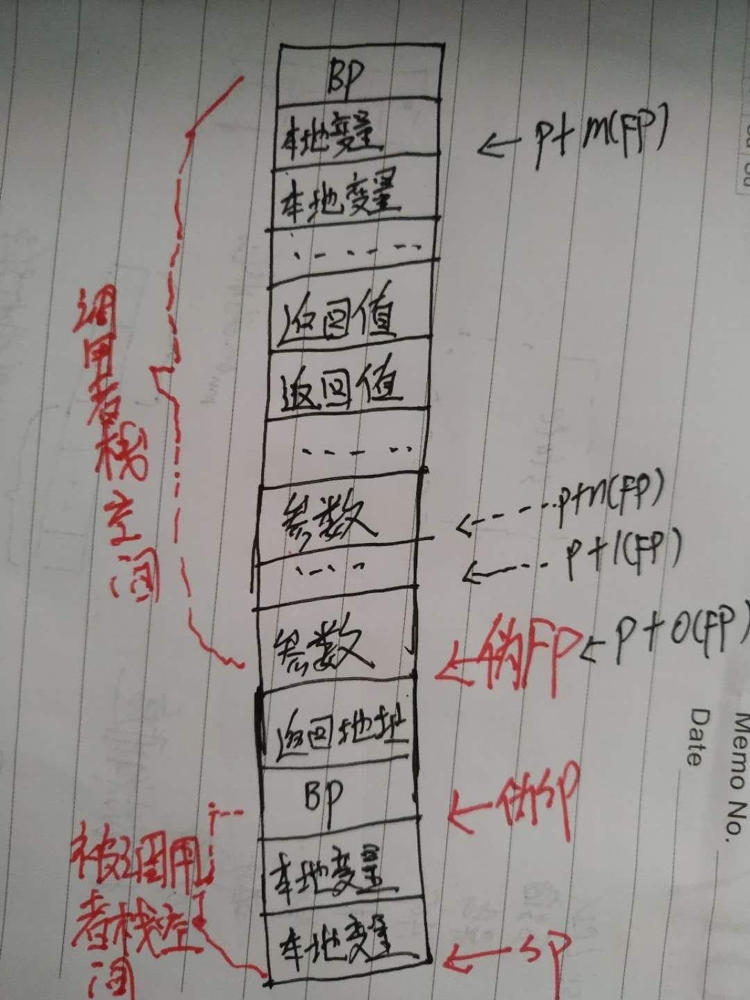
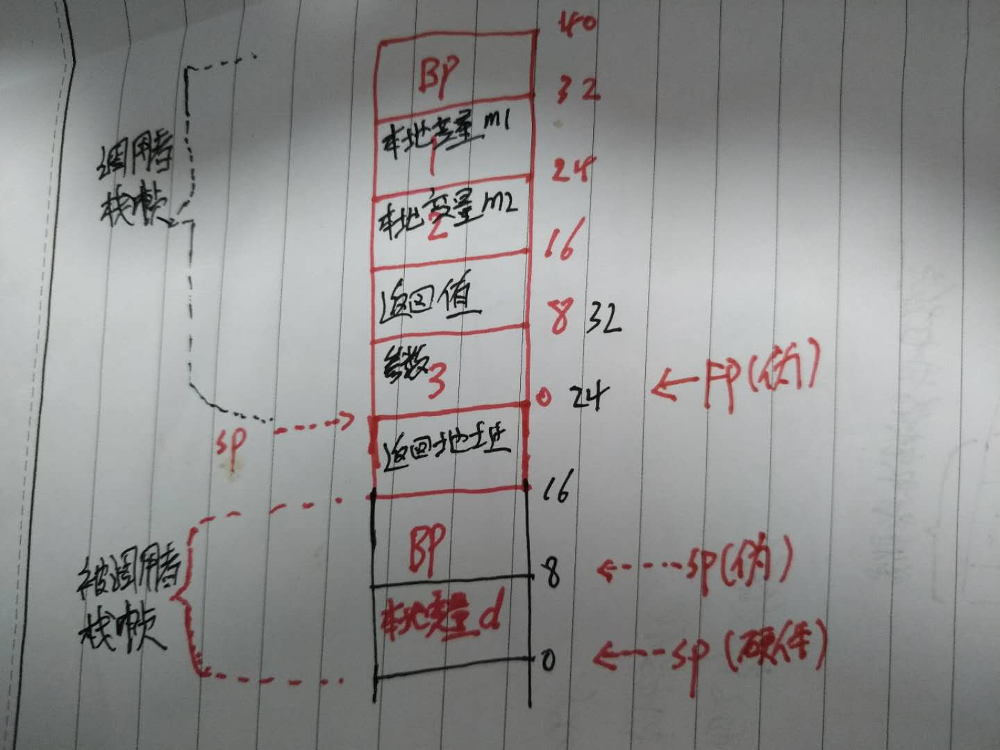

# go汇编

go使用的是类似Plan9风格的汇编,它不是对机器语言的直接表达,而是一种半抽象的指令集，需要经过汇编器器翻译成不同平台上的指令

## 获取go代码对应的汇编的方式:

* go tool compile -N -L -S  demo.go
* go build -gcflags="-N -L -S"  demo.go
* go tool objdump(反汇编二进制文件，需要先使用go build生成)

```go
func zzz(a int) [1]int{
  var d [1]int
  d[0]= a
  return d
}

func main() {
  m1:=1
  m2:=2
  zzz(m1+m2)
}
```
对应的go汇编代码
```
 "".zzz STEXT nosplit size=55 args=0x10 locals=0x10
    // 16-16:栈帧空间大小16字节-函数参数加返回值共16字节
    // 栈帧空间=BP(8字节)+本地变量d(8字节)
	0x0000 00000 (demo.go:9)	TEXT	"".zzz(SB), NOSPLIT|ABIInternal, $16-16
	0x0000 00000 (demo.go:9)	SUBQ	$16, SP
	0x0004 00004 (demo.go:9)	MOVQ	BP, 8(SP)
	0x0009 00009 (demo.go:9)	LEAQ	8(SP), BP
	0x000e 00014 (demo.go:9)	FUNCDATA	$0, gclocals·33cdeccccebe80329f1fdbee7f5874cb(SB)
	0x000e 00014 (demo.go:9)	FUNCDATA	$1, gclocals·33cdeccccebe80329f1fdbee7f5874cb(SB)
	0x000e 00014 (demo.go:9)	FUNCDATA	$2, gclocals·33cdeccccebe80329f1fdbee7f5874cb(SB)
	0x000e 00014 (demo.go:9)	PCDATA	$0, $0
	0x000e 00014 (demo.go:9)	PCDATA	$1, $0
	// 初始化返回值为0,反编译的汇编中的寄存器都是硬件寄存器不管有没有符号
	0x000e 00014 (demo.go:9)	MOVQ	$0, "".~r1+32(SP)
	// 本地变量d初始化为0
	0x0017 00023 (demo.go:10)	MOVQ	$0, "".d(SP)
	// 将参数a赋值给AX
	0x001f 00031 (demo.go:11)	MOVQ	"".a+24(SP), AX
	// 本地变量d=参数a的值
	0x0024 00036 (demo.go:11)	MOVQ	AX, "".d(SP)
	// 给返回值字段赋值
	0x0028 00040 (demo.go:12)	MOVQ	AX, "".~r1+32(SP)
	// 恢复BP
	0x002d 00045 (demo.go:12)	MOVQ	8(SP), BP
	// 收回分配的栈帧空间
	0x0032 00050 (demo.go:12)	ADDQ	$16, SP
	0x0036 00054 (demo.go:12)	RET
	
"".main STEXT size=82 args=0x0 locals=0x28
    // 40-0:函数所需栈帧空间-函数参数+返回值所占字节数
    // 栈帧空间=BP(8字节)+本地变量(m1,m2共16字节)+被动用函数的参数(8字节)+被调用函数的返回值(8字节)
	0x0000 00000 (demo.go:15)	TEXT	"".main(SB), ABIInternal, $40-0
	// CX=g
	0x0000 00000 (demo.go:15)	MOVQ	(TLS), CX
	// 16(CX)=g.stack.lo g使用的栈的栈底
	0x0009 00009 (demo.go:15)	CMPQ	SP, 16(CX)
    // 如果SP地址<g0.stack.lo地址，即栈寄存器地址超过了g可使用的栈的范围
    // 跳转到75偏移处
	0x000d 00013 (demo.go:15)	JLS	75
	// SP=SP-24  SP指针往下移开辟40字节的空间
	0x000f 00015 (demo.go:15)	SUBQ	$40, SP
	// 保存BP寄存器的值到SP+32处
    // BP中保存的是上一个函数的栈帧的起始位置
	0x0013 00019 (demo.go:15)	MOVQ	BP, 32(SP)
	// BP=sp+32 保存当前函数栈帧的起始位置到BP
	0x0018 00024 (demo.go:15)	LEAQ	32(SP), BP
	0x001d 00029 (demo.go:15)	FUNCDATA	$0, gclocals·33cdeccccebe80329f1fdbee7f5874cb(SB)
	0x001d 00029 (demo.go:15)	FUNCDATA	$1, gclocals·33cdeccccebe80329f1fdbee7f5874cb(SB)
	0x001d 00029 (demo.go:15)	FUNCDATA	$2, gclocals·33cdeccccebe80329f1fdbee7f5874cb(SB)
	0x001d 00029 (demo.go:16)	PCDATA	$0, $0
	0x001d 00029 (demo.go:16)	PCDATA	$1, $0
	0x001d 00029 (demo.go:16)	MOVQ	$1, "".m1+24(SP)
	0x0026 00038 (demo.go:17)	MOVQ	$2, "".m2+16(SP)
	0x002f 00047 (demo.go:18)	MOVQ	"".m1+24(SP), AX
	// AX=1+2
	0x0034 00052 (demo.go:18)	ADDQ	$2, AX
	// AX保存的当前函数栈帧的栈顶
	0x0038 00056 (demo.go:18)	MOVQ	AX, (SP)
	0x003c 00060 (demo.go:18)	CALL	"".zzz(SB)
	// 恢复BP
	0x0041 00065 (demo.go:19)	MOVQ	32(SP), BP
	// 收回分配的栈帧空间
	0x0046 00070 (demo.go:19)	ADDQ	$40, SP
	0x004a 00074 (demo.go:19)	RET
	0x004b 00075 (demo.go:19)	NOP
	0x004b 00075 (demo.go:15)	PCDATA	$1, $-1
	0x004b 00075 (demo.go:15)	PCDATA	$0, $-1
	0x004b 00075 (demo.go:15)	CALL	runtime.morestack_noctxt(SB)
	0x0050 00080 (demo.go:15)	JMP	0
```

`FUNCDATA`和`PCDATA`指令包含gc时需要的信息，是由编译器生成的。


## 常用指令

| 助记符 | 用途           | 举例                                                         |
| ------ | -------------- | ------------------------------------------------------------ |
| MOVQ   | 数据传送(8字节)       | `MOVQ AX,BX` 将AX的值赋给BX，如果AX是一个地址，则传递实际指向的值(解引用)|
| MOVL   | 数据传送(4字节)       | 同上|
| MOVB   | 数据传送(1字节)       | 同上|
| LEAQ   | 地址传送       | `LEAQ AX,BX` 将AX的值赋给BX |  
| SUBQ   | 相减并赋值     | `ADDQ BX, AX`  ,AX=AX-BX                                     |
| ADDQ   | 相加并赋值     | `ADDQ BX, AX` ,AX=AX+BX                                      |
| JMP    | 无条件转移指令 | `JMP 389`无条件转至0x0185地址处(十进制389转换成十六进制0x0185) |
| JLS    | 条件转移指令   | `JLS 389`上一行的比较结果，左边小于右边则执行跳到0x0185地址处(十进制389转换成十六进制0x0185) |

## 伪寄存器

go汇编中定义了4个伪寄存器:

* FP(Frame pointer): arguments and locals(函数本地变量、输入参数、返回值)
* PC(Program counter): jumps and branches
* SB(Static base pointer):global symbols
* SP(Stack pointer): top of stack(栈帧空间的基址,跳过BP)

伪FP、伪SP、硬件SP的大致分布如下图:



>被调用者的参数与返回值是分配在调用者栈帧空间中的

SB伪寄存器可以认为是内存的起始地址，因此`foo(SB)`是`foo`在内存中的地址。这种方式用于命名全局函数和数据。在名字后边添加`<>`,如`foo<>(SB)`表示该符号仅在当前文件中可用。在名字后添加偏移，如`foo+4(SB)`表示foo的位置在相对于起始位置4个字节后的位置。

FP伪寄存器是一个虚拟的指针，指向函数第一个参数的位置。`0(FP)`表示函数的第一个参数，8(FP)第二个参数(64位机器)。但是，当以这种方式引用函数参数时，必须在开头放置一个名称，如`first_arg+0(FP)`和`second_arg+8(FP)`。汇编程序强制执行此约定。名称没有特殊要求，符合语境即可。

在32位系统上，64位值的低32位和高32位是通过在名称后添加一个_lo或_hi后缀来区分的，如arg_lo+0(FP)或arg_hi+4(FP)。

SP伪寄存器指向函数栈帧的栈底(跳过BP)，可以用于访问本地变量。由于变量是向低地址访问增长，因此引用应该使用负偏移量[-framesize，0)：x-8(SP)，y-16(SP)，依此类推。

需要在SP添加一个名称前缀来区分是伪寄存器SP还是硬件寄存器SP。x-8(SP)和-8(SP)是不同的内存地址：前一个是伪存器指针，后者则是硬件寄存器SP。

SP和PC是物理寄存器的别名，在Go汇编中使用SP和PC，需要带一个符号，像上边的FP一样。如果要访问硬件寄存器需要使用真实的R开头的名字。在ARM架构下，硬件SP和PC可以使用R13和R15访问。

指令、寄存器和汇编程序指令总是大写。

在Go源文件中，符号的全名是包路径，后跟句点和符号名：`fmt.Printf`或`math/rand.Int`。因为汇编器的解析器将句点(.)和斜杠(/)视为标点符号，所以这些字符串不能直接用作标识符名称。汇编程序允许在标识符中使用中间点字符U+00B7(·)和除法斜线U+2215(∕)，并将它们重写为句点和斜线。在汇编源文件中，上述符号需要写成`fmt·Printf`和 `math∕rand·Int`。使用`go tool compile -S`输出汇编代码时，显示的是替换后的句点和斜线符号。

大多数手写的汇编原文件中的符号名中不包含完整的路径，因为链接器在以句点开头的任何名称的开头插入当前对象文件的包路径：在math/rand包实现中的汇编源文件中，包中的Int函数可以通过`.Int`方式被引用。此约定避免了在包的源代码中硬编码包的导入路径，从而使代码从一个位置移动到另一个位置更加容易。

## 指令格式

汇编程序使用各种指令将文本和数据绑定到符号名。例如，这里有一个简单的完整函数定义。`Text`指令声明符号runtime·profileloop和函数体后面的指令。Text部分的最后一个指令必须是某种跳转，通常是一个RET(伪)指令。符号后边，就是参数标识、帧大小和一个常量。

```
TEXT runtime·profileloop(SB),NOSPLIT,$8
	MOVQ	$runtime·profileloop1(SB), CX
	MOVQ	CX, 0(SP)
	CALL	runtime·externalthreadhandler(SB)
	RET
```


通常，在栈帧大小后边跟着一个参数大小，用减号`-`分割。帧大小$24-8表示函数栈帧24字节，参数和返回值大小8字节。如果`Text`中没有指定`NOSPLIT`，参数大小必须提供。`go vet`会检查。

符号名使用中间点来分隔，将调用go源码下的runtime包中的profileloop函数。

全局数据符号由一系列`DATA`指令和一个`GLOBL指令`定义。每个`DATA`指令初始化相应内存的一部分。未显式初始化的内存为零。`DATA`指令的一般形式:

`DATA	symbol+offset(SB)/width, value`

将符号内存从指定偏移处到指定宽度的这段范围初始化为指定的值。

`GLOBAL`指令声明一个全局符号。形式：`GLOBL symbol(SB), FLAG, width`其中flag标示是可选的，width指定符号的大小(多少字节)。符号的默认值是0，可以使用DATA指令初始化。例如：
```
DATA divtab<>+0x00(SB)/4, $0xf4f8fcff
DATA divtab<>+0x04(SB)/4, $0xe6eaedf0
...
DATA divtab<>+0x3c(SB)/4, $0x81828384
GLOBL divtab<>(SB), RODATA, $64

GLOBL runtime·tlsoffset(SB), NOPTR, $4
```
声明并初始化了divtab<>符号, 一个只读的64字节表，每一项4字节的整数值，声明了runtime·tlsoffset符号，4字节空值，非指针。`<>`符号说明全局变量只在当前文件可见。

GLOBL指令可以有一个或两个参数。如果有两个参数，则第一个是bit mask(位掩码)。这些标识定义在头文件`textflag.h`中。

* NOPROF=1

	已经废弃不用
* DUPRK=2

	同一个文件中包含多个相同的符号，链接器选择其中一个使用
* NOSPLIT = 4
    
	用于TEXT指令中。无需插入函数序言进行检查是否需要进行栈分裂
* RODATA = 8	

	用于DATA和GLOBL指令，声明将数据放入只读段
* NOPTR = 16	

	用于DATA和GLOBL指令,数据不包含指针，因此gc时不需要扫描
* WRAPPER = 32

	(For TEXT items.) This is a wrapper function and should not count as disabling recover.
* NEEDCTXT = 64

	用于TEXT指令，函数是一个闭包，需要使用上下文寄存器

## CPU架构相关

runtime包中有一个特殊的文件头引用`go-tls.h`，用来为汇编程序定义一个依赖于具体操作系统实现的宏`get-tls`：

`#include "go_tls.h"`

get_tls宏用于获取g的地址。

`go_asm.h`头文件中包含g结构中每个元素的偏移的宏定义。下面是一个，使用CX加载g和m的例子:

```
#include "go_tls.h"
#include "go_asm.h"
...
get_tls(CX)
MOVL	g(CX), AX     // Move g into AX.
MOVL	g_m(AX), BX   // Move g.m into BX.
```

>go编译器为了方便汇编中访问struct的指定字段，会在编译过程中自动生成一个go_asm.h文件。

## 函数栈帧布局

栈帧(Frame):函数调用时在栈上开辟的用于传递参数、记录函数返回地址、保存寄存器信息等的一段内存空间。

栈帧所占字节=本地变量+被调用函数返回值+被调用函数参数

我们还以上边使用的例子举例来分析下该函数的栈布局
```
func zzz(a int) [1]int{
  var d [1]int
  d[0]= a
  return d
}

func main() {
  m1:=1
  m2:=2
  zzz(m1+m2)
}
```

**先看下先看下main函数的栈帧与参数大小：$40-0**

main栈帧空间(40字节)=BP(8字节)+本地变量m1(8字节)+本地变量m2(8字节)+zzz返回值(8字节)+zzz参数(8字节)

参数大小(0字节)

**再看下zzz函数栈帧与参数大小:$16-16**

zzz栈帧空间(16字节)=BP(8字节)+本地变量d(8字节)

参数大小(16字节)=一个返回值(8字节)+一个参数(8字节)

>call指令调用函数后，会将函数返回时所需地址压入栈中，硬件寄存器SP地址向下移动一位

>go语言中被调用函数所需的参数与返回值所需空间是分配在调用者的栈帧空间中的；按照:本地变量->返回值->参数，的顺序由高地址空间向低地址空间分配，如果有多个返回值、参数的话，按照从右往左的顺序依次分配。

>BP计算器:一般在函数中用来保存进入函数时的sp的栈顶基址

根据以上分析，可以大致画出如下栈布局:




我们知道go汇编中有常用的伪寄存器SP和FP,但是它们的地址如何，与硬件SP的关系如何，现在还不太清楚。根据官方文档上的定义，上图中我们尝试标出了当前情况下的伪寄存器的位置，现在我们来验证下。

首先定义一个获取寄存器位置的函数:

>手写汇编中栈帧空间无需考虑BP寄存器所占空间

需要分两种情况，函数栈帧空间大于0和等于0的情况，因为栈帧空间为0时编译器也不会再插入BP寄存器所需的空间了,这样就会影响伪寄存器与硬件SP的相对位置。

由于上边的zzz函数有一个8字节的本地变量，所以这里我们也使用8字节的栈帧空间
```
// func output(int) (int, int, int)
TEXT ·output(SB), $8-32
    LEAQ 0(SP), DX // 硬件SP地址
    MOVQ DX, ret3+24(FP) // 第三个返回值
    LEAQ a+0(SP), BX //  伪SP的地址
    MOVQ BX, ret2+16(FP) // 第二个返回值
    LEAQ arg1+0(FP), AX
    MOVQ AX, ret1+8(FP)  // 第一个返回值
    RET

TEXT ·output2(SB), $0-32
    LEAQ 0(SP), DX // 硬件寄存器SP
    MOVQ DX, ret3+24(FP) // 第三个返回值
    LEAQ perhapsArg1+0(SP), BX // 当前函数栈大小 > 0，所以 FP 在 SP 的上方 16 字节处
    MOVQ BX, ret2+16(FP) // 第二个返回值
    LEAQ arg1+0(FP), AX
    MOVQ AX, ret1+8(FP)  // 第一个返回值
    RET    
```

我们在使用go代码调用这个汇编函数；

```
// 栈帧空间8字节
func output(int) (int, int, int) // 汇编函数声明

// 栈帧空间0字节
func output2(int) (int, int, int)

func main() {
	fmt.Println("---------栈帧空间8字节-----------")
	a, b, c := output(1)
	fmt.Println("伪FP地址:",a)
	fmt.Println("伪SP地址:",b)
	fmt.Println("硬件SP地址:",c)

	fmt.Println("---------栈帧空间0字节-----------")

	a2, b2, c2 := output2(2)
	fmt.Println("伪FP地址:",a2)
	fmt.Println("伪SP地址:",b2)
	fmt.Println("硬件SP地址:",c2)
}
```

得到的结果如下:

```
---------栈帧空间8字节-----------
伪FP地址: 824634240528
伪SP地址: 824634240512
硬件SP地址: 824634240504
---------栈帧空间0字节-----------
伪FP地址: 824634240528
伪SP地址: 824634240520
硬件SP地址: 824634240520
```

分析以上结果可以得知:

**当被调用的函数栈帧大于0(有本地变量)时:**

伪SP地址=硬件SP + 本地变量(8字节)

伪FP地址=伪SP+16字节(BP,函数返回地址)

**当被调用的函数栈帧等于0(无本地变量)时:**

伪SP地址=硬件SP

伪FP地址=伪SP+8字节(函数返回地址)

## 总结

通过上述的介绍，我们对go汇编的格式以及格式中每部分的意义都有了大致的了解，知道了伪SP、伪FP、硬件SP的关系、函数栈帧布局规则:`按照本地变量->返回值->参数的顺序由高地址空间向低地址空间分配，如果有多个返回值、参数的话，按照从右往左的顺序依次分配`。现在回忆下上边的函数布局图，en，终于清楚了! :smiley:

## 参考:

1. [golang 汇编](https://lrita.github.io/2017/12/12/golang-asm/)
2. [go asm](https://golang.org/doc/asm)
3. [go编译工具的使用之汇编](https://yuchanns.org/posts/2020/01/31/golang-assembly/)
4. [plan9 assembly 完全解析](https://github.com/cch123/golang-notes/blob/master/assembly.md)