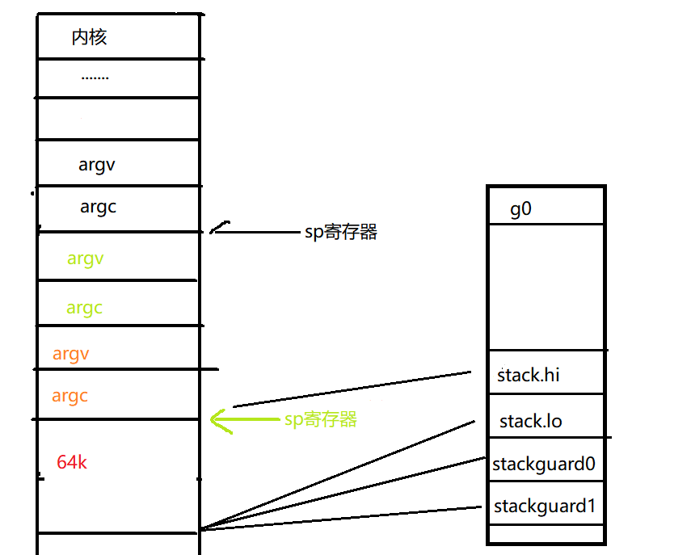

# go调度1--启动入口

我们都知道程序的执行入口都是main函数，但是go的执行入口却不是，在实际执行main函数之前进行了一系列的准备操作。这篇我们先看下go程序的启动的整体过程，具体以linux下的启动过程来看。

我们先找到go的执行入口，以下面的程序为例:
```go
func main() {
   fmt.Println("hi,world")
}
```

通过`readelf`命令可以看到程序的入口在`0x45c420`,使用dlv调试工具看到的也是这个值。


顺着这个入口往下走，会看到`runtime·rt0_go(SB)`函数。


## runtime·rt0_go(SB)

这个函数里，主要完成了以下操作:

1. 内存对齐、调整sp位置、复制argc与argv到新位置、给g0分配64kb左右的栈

```
TEXT runtime·rt0_go(SB),NOSPLIT,$0
	// copy arguments forward on an even stack
	MOVQ	DI, AX		// argc
	MOVQ	SI, BX		// argv
	SUBQ	$(4*8+7), SP		// 2args 2auto
	ANDQ	$~15, SP  // 内存对齐
	MOVQ	AX, 16(SP)
	MOVQ	BX, 24(SP)

	// create istack out of the given (operating system) stack.
	// _cgo_init may update stackguard.
	MOVQ	$runtime·g0(SB), DI
	LEAQ	(-64*1024+104)(SP), BX
	MOVQ	BX, g_stackguard0(DI)
	MOVQ	BX, g_stackguard1(DI)
	MOVQ	BX, (g_stack+stack_lo)(DI)
	MOVQ	SP, (g_stack+stack_hi)(DI)
```
2. 将g0保存到TLS、绑定g0和m0，m.g0=&g0、g.m=&m0

> TLS:线程本地存储(thread local storage)，用来保存线程私有的数据

````     
	LEAQ	runtime·m0+m_tls(SB), DI
	CALL	runtime·settls(SB)

	// store through it, to make sure it works
	get_tls(BX)
	MOVQ	$0x123, g(BX)
	MOVQ	runtime·m0+m_tls(SB), AX
	CMPQ	AX, $0x123
	JEQ 2(PC)
	CALL	runtime·abort(SB)
ok:
	// set the per-goroutine and per-mach "registers"
	get_tls(BX)
	LEAQ	runtime·g0(SB), CX
	MOVQ	CX, g(BX)
	LEAQ	runtime·m0(SB), AX

	// save m->g0 = g0
	MOVQ	CX, m_g0(AX)
	// save m0 to g0->m
	MOVQ	AX, g_m(CX)

	CLD				// convention is D is always left cleared
	CALL	runtime·check(SB)
 ````
3. 再次复制argc与argv、处理命令行参数、获取cpu核数等

> 此处为何复制两次参数??
````

	MOVL	16(SP), AX		// copy argc
	MOVL	AX, 0(SP)
	MOVQ	24(SP), AX		// copy argv
	MOVQ	AX, 8(SP)
	CALL	runtime·args(SB)
	CALL	runtime·osinit(SB)
````
4. schedinit在调度前进行一系列初始化、newproc创建新的g用来执行mainPC位置处的函数、mstart启动调度流程。正常情况下mstart一值在循环调度永不退出。
````   
	CALL	runtime·schedinit(SB)

	// create a new goroutine to start program
	MOVQ	$runtime·mainPC(SB), AX		// entry
	PUSHQ	AX
	PUSHQ	$0			// arg size
	CALL	runtime·newproc(SB)
	POPQ	AX
	POPQ	AX

	// start this M
	CALL	runtime·mstart(SB)  // 开始执行调度

	CALL	runtime·abort(SB)	// mstart should never return
	RET 
````

## 总结

上边我们通过dlv调试一个hello wold程序的方式，看到了go程序执行的大致流程，但具体main函数是如何被调度执行的，还需要继续向下阅读源码。

经过1、2、3步骤后，此时的g进程内的内存布局大致如下：




runtime·rt0_go的源码注释可以参见[asm_amd64.s](https://github.com/6z7/go/blob/release-branch.go1.13-study/src/runtime/asm_amd64.s#L87)

`runtime·rt0_go`对应汇编:

```
(dlv) disassemble
TEXT runtime.rt0_go(SB) /usr/local/go/src/runtime/asm_amd64.s
=>      asm_amd64.s:89  0x458a50*       4889f8                          mov rax, rdi
        asm_amd64.s:90  0x458a53        4889f3                          mov rbx, rsi
        asm_amd64.s:91  0x458a56        4883ec27                        sub rsp, 0x27
        asm_amd64.s:92  0x458a5a        4883e4f0                        and rsp, -0x10
        asm_amd64.s:93  0x458a5e        4889442410                      mov qword ptr [rsp+0x10], rax
        asm_amd64.s:94  0x458a63        48895c2418                      mov qword ptr [rsp+0x18], rbx
        asm_amd64.s:98  0x458a68        488d3d91901200                  lea rdi, ptr [runtime.g0]
        asm_amd64.s:99  0x458a6f        488d9c246800ffff                lea rbx, ptr [rsp+0xffff0068]
        asm_amd64.s:100 0x458a77        48895f10                        mov qword ptr [rdi+0x10], rbx
        asm_amd64.s:101 0x458a7b        48895f18                        mov qword ptr [rdi+0x18], rbx
        asm_amd64.s:102 0x458a7f        48891f                          mov qword ptr [rdi], rbx
        asm_amd64.s:103 0x458a82        48896708                        mov qword ptr [rdi+0x8], rsp
       .........................
        asm_amd64.s:205 0x458b4f        fc                              cld
        asm_amd64.s:206 0x458b50        e88b44feff                      call $runtime.check
        asm_amd64.s:208 0x458b55        8b442410                        mov eax, dword ptr [rsp+0x10]
        asm_amd64.s:209 0x458b59        890424                          mov dword ptr [rsp], eax
        asm_amd64.s:210 0x458b5c        488b442418                      mov rax, qword ptr [rsp+0x18]
        asm_amd64.s:211 0x458b61        4889442408                      mov qword ptr [rsp+0x8], rax
        asm_amd64.s:212 0x458b66        e8e53efeff                      call $runtime.args
        asm_amd64.s:213 0x458b6b        e81031fdff                      call $runtime.osinit
        asm_amd64.s:214 0x458b70        e84b7efdff                      call $runtime.schedinit
        asm_amd64.s:217 0x458b75        488d05ec870900                  lea rax, ptr [rip+0x987ec]
        asm_amd64.s:218 0x458b7c        50                              push rax
        asm_amd64.s:219 0x458b7d        6a00                            push 0x0
        asm_amd64.s:220 0x458b7f        e81cdefdff                      call $runtime.newproc
        asm_amd64.s:221 0x458b84        58                              pop rax
        asm_amd64.s:222 0x458b85        58                              pop rax
        asm_amd64.s:225 0x458b86        e89594fdff                      call $runtime.mstart
        asm_amd64.s:227 0x458b8b        e8b0190000                      call $runtime.abort
        asm_amd64.s:228 0x458b90        c3                              ret
        asm_amd64.s:232 0x458b91        488d0548210000                  lea rax, ptr [runtime.debugCallV1]
        asm_amd64.s:233 0x458b98        c3                              ret
(dlv) p runtime.g0
```