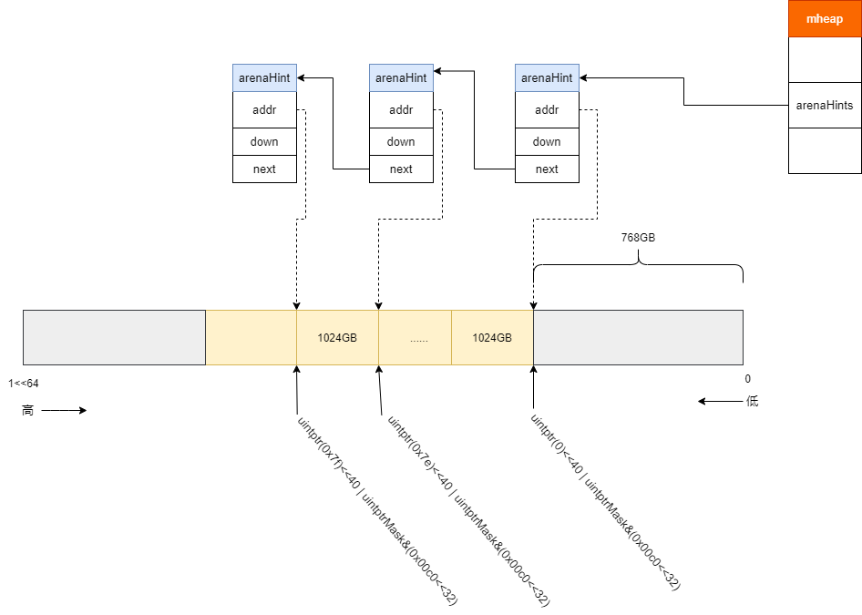

# go内存管理--初始化

内存初始化[mallocinit](https://github.com/6z7/go/blob/release-branch.go1.13-study/src/runtime/proc.go#L567)是在调度初始化schedinit中触发的。主要完成:

* 各种检查，如页大小是否对齐
* heap初始化
* 为m0分配一个mcache
* 初始化arena hit

主要代码如下:

```go
func mallocinit() {
 
      //......
	// Initialize the heap.
	// 初始化mspan\mcache\arenaHint内存分配器
	// 初始化mcentral
	mheap_.init()
	_g_ := getg()
	_g_.m.mcache = allocmcache()

	// Create initial arena growth hints.
	if sys.PtrSize == 8 {	    
		for i := 0x7f; i >= 0; i-- {
			var p uintptr
			switch {
			case GOARCH == "arm64" && GOOS == "darwin":
				p = uintptr(i)<<40 | uintptrMask&(0x0013<<28)
			case GOARCH == "arm64":
				p = uintptr(i)<<40 | uintptrMask&(0x0040<<32)
			case GOOS == "aix":
				if i == 0 {
					// We don't use addresses directly after 0x0A00000000000000
					// to avoid collisions with others mmaps done by non-go programs.
					continue
				}
				p = uintptr(i)<<40 | uintptrMask&(0xa0<<52)
			case raceenabled:
				// The TSAN runtime requires the heap
				// to be in the range [0x00c000000000,
				// 0x00e000000000).
				p = uintptr(i)<<32 | uintptrMask&(0x00c0<<32)
				if p >= uintptrMask&0x00e000000000 {
					continue
				}
			default:
				// uintptrMask&(0x00c0<<32)=1100000000000000000000000000000000000000(40位)
				// 0x7f= 1111111
				// 1111111 | 1100000000000000000000000000000000000000
				// 11111111100000000000000000000000000000000000000=140462610448384
				p = uintptr(i)<<40 | uintptrMask&(0x00c0<<32)
			}
			hint := (*arenaHint)(mheap_.arenaHintAlloc.alloc())
			hint.addr = p
			hint.next, mheap_.arenaHints = mheap_.arenaHints, hint
		}
	} else {
	    ......
	}
}
```

我们来具体看下具体的初始化流程

## 堆初始化

* 初始化各种类型的内存分配器，用户后续创建不同类型的对象
* 初始化mcentral

```go
func (h *mheap) init() {
	h.treapalloc.init(unsafe.Sizeof(treapNode{}), nil, nil, &memstats.other_sys)
	h.spanalloc.init(unsafe.Sizeof(mspan{}), recordspan, unsafe.Pointer(h), &memstats.mspan_sys)
	h.cachealloc.init(unsafe.Sizeof(mcache{}), nil, nil, &memstats.mcache_sys)
	h.specialfinalizeralloc.init(unsafe.Sizeof(specialfinalizer{}), nil, nil, &memstats.other_sys)
	h.specialprofilealloc.init(unsafe.Sizeof(specialprofile{}), nil, nil, &memstats.other_sys)
    h.arenaHintAlloc.init(unsafe.Sizeof(arenaHint{}), nil, nil, &memstats.other_sys)
    	 
	h.spanalloc.zero = false

	// h->mapcache needs no init
    // 初始化mcentral
	for i := range h.central {
		h.central[i].mcentral.init(spanClass(i))
	}
}
```

## 创建一个mcache对象

mcache是go进行内存管理所需的对象，为了进行内存管理所创建的对象需要从os上进行获取，属于堆外内存。

`allocmcache`使用对应的内存分配器从OS上分配合适的内存用于创建mcache。
```go
func allocmcache() *mcache {
	var c *mcache
	systemstack(func() {
		lock(&mheap_.lock)
		// 分配内存创建一个mcache对象
		c = (*mcache)(mheap_.cachealloc.alloc())
		c.flushGen = mheap_.sweepgen
		unlock(&mheap_.lock)
	})
	for i := range c.alloc {
        // mcahe上缓存的不同尺寸的mspan
		c.alloc[i] = &emptymspan
	}
	c.next_sample = nextSample()
	return c
}
```

## 64位机器上的arena hit初始化

`arenaHit`

```go
for i := 0x7f; i >= 0; i-- {
			var p uintptr
			switch {
			 ......
			default:
				// uintptrMask&(0x00c0<<32)=1100000000000000000000000000000000000000(40位)
				// 0x7f= 1111111
				// 1111111 | 1100000000000000000000000000000000000000
				// 11111111100000000000000000000000000000000000000=140462610448384
				p = uintptr(i)<<40 | uintptrMask&(0x00c0<<32)
			}
			hint := (*arenaHint)(mheap_.arenaHintAlloc.alloc())
			hint.addr = p
			hint.next, mheap_.arenaHints = mheap_.arenaHints, hint
```

内存中大致分配情况如图

