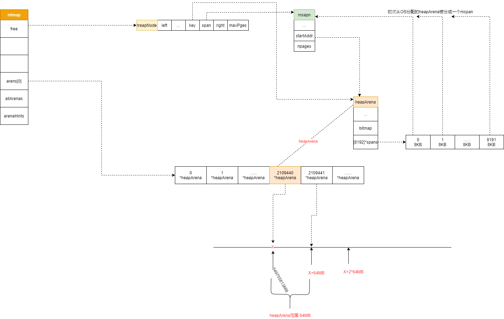
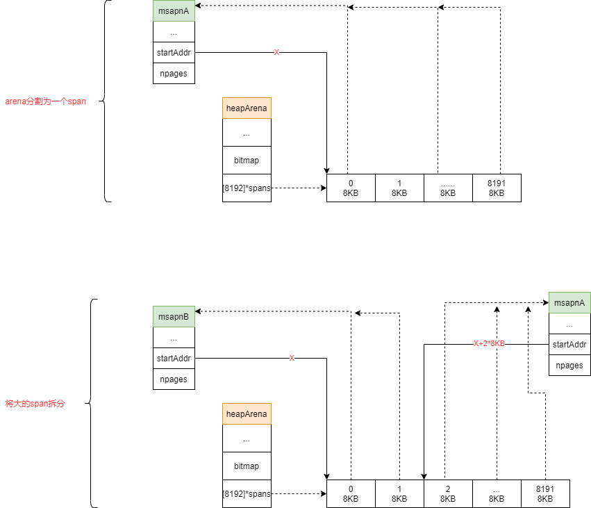

## 堆上分配内存

从heap上分配时，先遍历heap上空闲的span树上是否有满足需要的span，如果没有则从OS上去申请内存，申请的内存会根据内存的大小转为相应的span,保存到heap的空闲span树上。找到满足条件的span后，则如果span的大小正好合适，则直接选择该span并从heap上空闲的span树中移除对应span。如果找到的span大于所需的内存则将span分割为两份，一份满足所需的大小，剩余的转为新的span。

*启动时从OS申请的arena分割为一个大的span*



*分裂span*


详细流程如下:

 1. 遍历堆上空闲的span,尝试找页数大于等于npage的span
 2. 如果未找到则走扩容流程    
 3. 重新遍历heap.free 找到合适的span
 4. 如果找到的span正合适，则从h.free中移除，
 5. 如果找到的span大于所需的内存，则将span分裂为两部分   

```go
func (h *mheap) allocSpanLocked(npage uintptr, stat *uint64) *mspan {
	// 遍历heap上的空闲span,尝试找到页数满足需要的span
	t := h.free.find(npage)
	if t.valid() {
		goto HaveSpan
	}
	// 从heap上分配内存转为span
	if !h.grow(npage) {
		return nil
	}
	t = h.free.find(npage)
	if t.valid() {
		goto HaveSpan
	}
	throw("grew heap, but no adequate free span found")

HaveSpan:
	s := t.span()
	if s.state != mSpanFree {
		throw("candidate mspan for allocation is not free")
	}

	memstats.heap_released -= uint64(s.released())
    // span的页数正好
	if s.npages == npage {
		// 从空闲树中移除
		h.free.erase(t)
	} else if s.npages > npage {  //span的页数多数实际需要	
		n := (*mspan)(h.spanalloc.alloc())
		// 更新heap.free中的span节点
		// 更新heap.arenas中的span
		h.free.mutate(t, func(s *mspan) {
			n.init(s.base(), npage)
			s.npages -= npage
			// 修改地址
			s.startAddr = s.base() + npage*pageSize
			// 新的span将占据span的位置
			// s.base()=s.startAddr = s.base() + npage*pageSize
			//  [s.base() ,s.base() + npage*pageSize-1]
			h.setSpan(s.base()-1, n)
			// 更新旧的span在heap.arena上的位置
			h.setSpan(s.base(), s)
			// 新的span将占据span的位置
			h.setSpan(n.base(), n)
			n.needzero = s.needzero			
			n.scavenged = s.scavenged			
			if s.scavenged {
				start, end := s.physPageBounds()
				if start < end {
					memstats.heap_released += uint64(end - start)
				} else {
					s.scavenged = false
				}
			}
		})
		s = n
	} else {
		throw("candidate mspan for allocation is too small")
	}

	if s.scavenged {	
		sysUsed(unsafe.Pointer(s.base()), s.npages<<_PageShift)
		s.scavenged = false
	}

	// 计算span在对应的arena上所占范围
	h.setSpans(s.base(), npage, s)

	*stat += uint64(npage << _PageShift)
	memstats.heap_idle -= uint64(npage << _PageShift)

	if s.inList() {
		throw("still in list")
	}
	return s
}
```

**扩容堆**

1. 首先看当前areana的剩余空间是否足够
2. 如果不够，则从OS分配内存，如果新分配的内存与当前arena挨着，则直接扩大当前arena,否则则将当前arena剩余的内存转为对应的span
3. 将新分配的内存转为span
```go
// 从os申请n页的内存，并将这些内存转为span
func (h *mheap) grow(npage uintptr) bool {
	// 所需内存大小 B
	ask := npage << _PageShift
    // 对齐后需要的内存大小
	nBase := round(h.curArena.base+ask, physPageSize)
	// arena已经使用完，需要从os获取新的内存
	if nBase > h.curArena.end {	 
		// av:分配内存起始地址  asize:对齐后的内存大小
		av, asize := h.sysAlloc(ask)
		if av == nil {
			print("runtime: out of memory: cannot allocate ", ask, "-byte block (", memstats.heap_sys, " in use)\n")
			return false
		}
        //新分配的空间与旧的相邻,则直接扩大旧的空间
		if uintptr(av) == h.curArena.end {			 
			h.curArena.end = uintptr(av) + asize
		} else {			 
			// 剩余的空间转为span
			if size := h.curArena.end - h.curArena.base; size != 0 {
				h.growAddSpan(unsafe.Pointer(h.curArena.base), size)
			}
			// Switch to the new space.
			h.curArena.base = uintptr(av)
			h.curArena.end = uintptr(av) + asize
		} 
		memstats.heap_released += uint64(asize)
		memstats.heap_idle += uint64(asize)

		// Recalculate nBase
		// 对齐
		nBase = round(h.curArena.base+ask, physPageSize)
	}
	// Grow into the current arena.
	v := h.curArena.base
	h.curArena.base = nBase
	h.growAddSpan(unsafe.Pointer(v), nBase-v)
	return true
}
```

**将申请的内存转为span**

```go
// 将获取到的内存转为spam,并将span保存到mheap.free树上
func (h *mheap) growAddSpan(v unsafe.Pointer, size uintptr) {
	 
	h.scavengeIfNeededLocked(size)

	s := (*mspan)(h.spanalloc.alloc())
	s.init(uintptr(v), size/pageSize)
	// 在arena上分配mspan
	h.setSpans(s.base(), s.npages, s)
	s.state = mSpanFree
	// [v, v+size) is always in the Prepared state. The new span
	// must be marked scavenged so the allocator transitions it to
	// Ready when allocating from it.
	s.scavenged = true
	// This span is both released and idle, but grow already
	// updated both memstats.
	h.coalesce(s)
	// 保存空闲的span
	h.free.insert(s)
}
```

## 初始化span

从堆上的申请的内存会转为对应的span,此时的span只设置了对应内存的起始地址，页数等，还需要进一步进行初始化。

```go
func (h *mheap) alloc_m(npage uintptr, spanclass spanClass, large bool) *mspan {
	_g_ := getg()
    // ......
	lock(&h.lock)
	
	// 将mchache上的统计数据转到全局统计中
	memstats.heap_scan += uint64(_g_.m.mcache.local_scan)
	_g_.m.mcache.local_scan = 0
	memstats.tinyallocs += uint64(_g_.m.mcache.local_tinyallocs)
	_g_.m.mcache.local_tinyallocs = 0

	// 从heap上分配内存
	s := h.allocSpanLocked(npage, &memstats.heap_inuse)
	if s != nil {	
		atomic.Store(&s.sweepgen, h.sweepgen)
		h.sweepSpans[h.sweepgen/2%2].push(s) // Add to swept in-use list.
		s.state = mSpanInUse
		s.allocCount = 0
		s.spanclass = spanclass
		if sizeclass := spanclass.sizeclass(); sizeclass == 0 {
			s.elemsize = s.npages << _PageShift
			s.divShift = 0
			s.divMul = 0
			s.divShift2 = 0
			s.baseMask = 0
		} else {
			// span大小
			s.elemsize = uintptr(class_to_size[sizeclass])
			m := &class_to_divmagic[sizeclass]
			s.divShift = m.shift
			s.divMul = m.mul
			s.divShift2 = m.shift2
			s.baseMask = m.baseMask
		}

		// Mark in-use span in arena page bitmap.
		arena, pageIdx, pageMask := pageIndexOf(s.base())
		arena.pageInUse[pageIdx] |= pageMask

		// update stats, sweep lists
		h.pagesInUse += uint64(npage)
		if large {
			memstats.heap_objects++
			mheap_.largealloc += uint64(s.elemsize)
			mheap_.nlargealloc++
			atomic.Xadd64(&memstats.heap_live, int64(npage<<_PageShift))
		}
	}
    // ......
	unlock(&h.lock)
	return s
}

// pageIndexOf returns the arena, page index, and page mask for pointer p.
// The caller must ensure p is in the heap.
func pageIndexOf(p uintptr) (arena *heapArena, pageIdx uintptr, pageMask uint8) {
	ai := arenaIndex(p)
	arena = mheap_.arenas[ai.l1()][ai.l2()]
	pageIdx = ((p / pageSize) / 8) % uintptr(len(arena.pageInUse))
	pageMask = byte(1 << ((p / pageSize) % 8))
	return
}
```
## 清零

将获取的span清零

```go
func (h *mheap) alloc(npage uintptr, spanclass spanClass, large bool, needzero bool) *mspan {
	// Don't do any operations that lock the heap on the G stack.
	// It might trigger stack growth, and the stack growth code needs
	// to be able to allocate heap.
	var s *mspan
	systemstack(func() {
		s = h.alloc_m(npage, spanclass, large)
	})

	if s != nil {
		if needzero && s.needzero != 0 {
			memclrNoHeapPointers(unsafe.Pointer(s.base()), s.npages<<_PageShift)
		}
		s.needzero = 0
	}
	return s
}
```
 