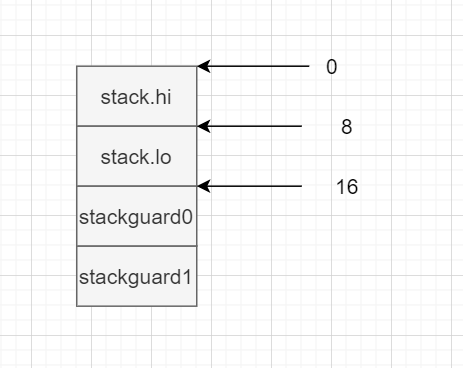
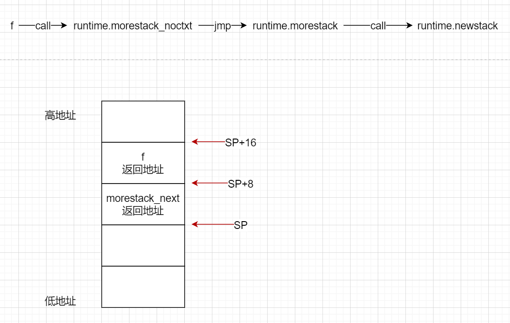
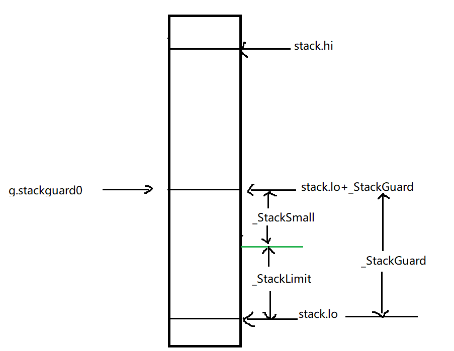

# 栈扩缩容与抢占

因为抢占是在栈扩容过程中发生的，所以这里就一块看了

## 栈扩容

Go的函数栈大小是可以进行扩容和收缩的，编译器在编译时会插入函数序言用来检测是否需要栈扩容。如下示例

```
"".abc STEXT size=455 args=0x8 locals=0xe8
	0x0000 00000 (demo.go:13)	TEXT	"".abc(SB), ABIInternal, $232-8
    // 当前g
	0x0000 00000 (demo.go:13)	MOVQ	(TLS), CX
    // sp=sp-104
	0x0009 00009 (demo.go:13)	LEAQ	-104(SP), AX
    // sp与g.stackguard0比较 如果小于则跳转到runtime.morestack_noctxt
	0x000e 00014 (demo.go:13)	CMPQ	AX, 16(CX)
	0x0012 00018 (demo.go:13)	JLS	445
	0x0018 00024 (demo.go:13)	SUBQ	$232, SP
	......
	0x01bd 00445 (demo.go:13)	CALL	runtime.morestack_noctxt(SB)
    // 从头重新开始执行函数
	0x01c2 00450 (demo.go:13)	JMP	0
```
可以看到函数序言关键是通过比较比较g与16(CX)的大小来判断是否需要进行栈扩容。16(CX)代表g的偏移16字节处即g.stackguard0



扩容时morestack函数中先将调用者f的SP和PC保存到m.gobuf中，在将当前函数的PC和SP保存到g.gobuf中，然后切换到g0执行newstack进行栈扩容。



```go
TEXT runtime·morestack(SB),NOSPLIT,$0-0
	// Cannot grow scheduler stack (m->g0).
	// tls
	get_tls(CX)
	// 当前g
	MOVQ	g(CX), BX
	// 当前g使用的m
	MOVQ	g_m(BX), BX
	// 当前g关联的g0
	MOVQ	m_g0(BX), SI
	CMPQ	g(CX), SI
	//  如果当前g是g0则报错，否则跳到PC+3继续执行
	JNE	3(PC)
	CALL	runtime·badmorestackg0(SB)
	CALL	runtime·abort(SB)

	// Cannot grow signal stack (m->gsignal).
	// gsignal上不进行栈扩容
	MOVQ	m_gsignal(BX), SI
	CMPQ	g(CX), SI
	JNE	3(PC)
	CALL	runtime·badmorestackgsignal(SB)
	CALL	runtime·abort(SB)

	// Called from f.
	// Set m->morebuf to f's caller.
	// 保存调用者的PC和SP寄存器的信息到M的gobuf中
	NOP	SP	// tell vet SP changed - stop checking offsets
	// 返回地址 即调用者的下一条指令
	MOVQ	8(SP), AX	// f's caller's PC
	MOVQ	AX, (m_morebuf+gobuf_pc)(BX)
	// 调用者的SP
	LEAQ	16(SP), AX	// f's caller's SP
	MOVQ	AX, (m_morebuf+gobuf_sp)(BX)
	get_tls(CX)
	// 当前g
	MOVQ	g(CX), SI
	// 当前g保存到M的gobuf中
	MOVQ	SI, (m_morebuf+gobuf_g)(BX)

	// Set g->sched to context in f.
	// 当前函数的返回地址
	MOVQ	0(SP), AX // f's PC
	MOVQ	AX, (g_sched+gobuf_pc)(SI)
	MOVQ	SI, (g_sched+gobuf_g)(SI)
	// 当前函数的起始SP
	LEAQ	8(SP), AX // f's SP
	MOVQ	AX, (g_sched+gobuf_sp)(SI)
	MOVQ	BP, (g_sched+gobuf_bp)(SI)
	MOVQ	DX, (g_sched+gobuf_ctxt)(SI)

	// Call newstack on m->g0's stack.
	// g0
	MOVQ	m_g0(BX), BX
	// tls=&g0
	MOVQ	BX, g(CX)
	// 切换到g0的堆栈空间
	MOVQ	(g_sched+gobuf_sp)(BX), SP
	CALL	runtime·newstack(SB)
	CALL	runtime·abort(SB)	// crash if newstack returns
	RET
```

newstack中栈会扩容2倍，然后切换g，继续执行。如果标记了可以抢占则会优先触发抢占逻辑。

```go
func newstack() {
	// g0
	thisg := getg()
	// TODO: double check all gp. shouldn't be getg().
	if thisg.m.morebuf.g.ptr().stackguard0 == stackFork {
		throw("stack growth after fork")
	}
	// m.morebuf中保存的时调用者f的寄存器上下文信息
	if thisg.m.morebuf.g.ptr() != thisg.m.curg {
		...
		throw("runtime: wrong goroutine in newstack")
	}

	gp := thisg.m.curg

	// 禁止栈分裂
	if thisg.m.curg.throwsplit {
		 ......
		throw("runtime: stack split at bad time")
	}

	morebuf := thisg.m.morebuf
	thisg.m.morebuf.pc = 0
	thisg.m.morebuf.lr = 0
	thisg.m.morebuf.sp = 0
	thisg.m.morebuf.g = 0
 
	// g是否标记了可以被抢占
	preempt := atomic.Loaduintptr(&gp.stackguard0) == stackPreempt

	if preempt {
		// runtime
		if thisg.m.locks != 0 || thisg.m.mallocing != 0 || thisg.m.preemptoff != "" || thisg.m.p.ptr().status != _Prunning {
			// Let the goroutine keep running for now.
			// gp->preempt is set, so it will be preempted next time.
			gp.stackguard0 = gp.stack.lo + _StackGuard
			gogo(&gp.sched) // never return
		}
	}

	if gp.stack.lo == 0 {
		throw("missing stack in newstack")
	}
	sp := gp.sched.sp
    ......

	if preempt {
		if gp == thisg.m.g0 {
			throw("runtime: preempt g0")
		}
		if thisg.m.p == 0 && thisg.m.locks == 0 {
			throw("runtime: g is running but p is not")
		}
		// Synchronize with scang.
		casgstatus(gp, _Grunning, _Gwaiting)
		......
		// Act like goroutine called runtime.Gosched.
		casgstatus(gp, _Gwaiting, _Grunning)
		// 解绑当前M运行的g，将g放入全局队列，并去调度执行其它g
		// 不会返回
		gopreempt_m(gp) // never return
	}

	// Allocate a bigger segment and move the stack.
	// 当前栈大小
	oldsize := gp.stack.hi - gp.stack.lo
	// 扩容2倍
	newsize := oldsize * 2
	...... 
	copystack(gp, newsize, true)
 
	casgstatus(gp, _Gcopystack, _Grunning)
	gogo(&gp.sched)
}
```

## 抢占

在上篇[sysmon](./go调度--9sysmon.md)一文中，我们知道对一直运行超过10ms的g会设置`preempt`抢占标记，同时也会将g.stackguard0标记为一个非常大的值(stackPreempt)，这些标记是在栈扩容中会使用到，从而进行实际的抢占操作。

> 现在的抢占逻辑只是添加一个标记，用于强制触发栈扩容。因为栈扩容逻辑在基本每个函数中都会插入，这么做应该是出于对现有代码的修改最小的考虑???

实际是否进行抢占需要同时满足以下条件:
* m.locks==0 即
* M上未禁止抢占功能
* 当前使用的P处于_Prunning状态

如果以上条件未能全部满足，则切换回之前的g重新执行调用者f;反之，则解绑当前m运行的g，将g放入全局队列，并去调度当前m去执行其它g。

```go
func newstack() {
	// g0
	thisg := getg()	
	gp := thisg.m.curg
	...... 
	// g是否标记了可以被抢占
	preempt := atomic.Loaduintptr(&gp.stackguard0) == stackPreempt

	if preempt {
		// runtime
		if thisg.m.locks != 0 || thisg.m.mallocing != 0 || thisg.m.preemptoff != "" || thisg.m.p.ptr().status != _Prunning {
			// Let the goroutine keep running for now.
			// gp->preempt is set, so it will be preempted next time.
			gp.stackguard0 = gp.stack.lo + _StackGuard
			gogo(&gp.sched) // never return
		}
	}

	if gp.stack.lo == 0 {
		throw("missing stack in newstack")
	}
	sp := gp.sched.sp
    ......

	if preempt {
		if gp == thisg.m.g0 {
			throw("runtime: preempt g0")
		}
		if thisg.m.p == 0 && thisg.m.locks == 0 {
			throw("runtime: g is running but p is not")
		}
		// Synchronize with scang.
		casgstatus(gp, _Grunning, _Gwaiting)
		......
		// Act like goroutine called runtime.Gosched.
		casgstatus(gp, _Gwaiting, _Grunning)
		// 解绑当前M运行的g，将g放入全局队列，并去调度执行其它g
		// 不会返回
		gopreempt_m(gp) // never return
	}

	// Allocate a bigger segment and move the stack.
	// 当前栈大小
	oldsize := gp.stack.hi - gp.stack.lo
	// 扩容2倍
	newsize := oldsize * 2
	...... 
	copystack(gp, newsize, true)
 
	casgstatus(gp, _Gcopystack, _Grunning)
	gogo(&gp.sched)
}
```

> 如果一个goroutine运行了很久，但是它并没有调用另一个函数，则它不会被抢占。当然，一个运行很久却不调用函数的代码并不是多数情况。
 

 ## 缩容

 栈缩容不是通过函数序言触发的而是由gc主动触发的。当实际使用的栈空间小于总量的1/4时则将栈缩容到1/2的量。

 ```go

 // Maybe shrink the stack being used by gp.
// Called at garbage collection time.
// gp must be stopped, but the world need not be.
func shrinkstack(gp *g) {
	gstatus := readgstatus(gp)
	if gp.stack.lo == 0 {
		throw("missing stack in shrinkstack")
	}
	if gstatus&_Gscan == 0 {
		throw("bad status in shrinkstack")
	}

	if debug.gcshrinkstackoff > 0 {
		return
	}
	f := findfunc(gp.startpc)
	if f.valid() && f.funcID == funcID_gcBgMarkWorker {
		// We're not allowed to shrink the gcBgMarkWorker
		// stack (see gcBgMarkWorker for explanation).
		return
	}

	oldsize := gp.stack.hi - gp.stack.lo
	// 缩小1/2
	newsize := oldsize / 2
	// Don't shrink the allocation below the minimum-sized stack
	// allocation.
	if newsize < _FixedStack {
		return
	}
	// Compute how much of the stack is currently in use and only
	// shrink the stack if gp is using less than a quarter of its
	// current stack. The currently used stack includes everything
	// down to the SP plus the stack guard space that ensures
	// there's room for nosplit functions.
	avail := gp.stack.hi - gp.stack.lo
	// 使用不足栈空间的1/4
	if used := gp.stack.hi - gp.sched.sp + _StackLimit; used >= avail/4 {
		return
	}

	// We can't copy the stack if we're in a syscall.
	// The syscall might have pointers into the stack.
	if gp.syscallsp != 0 {
		return
	}
	if sys.GoosWindows != 0 && gp.m != nil && gp.m.libcallsp != 0 {
		return
	}

	if stackDebug > 0 {
		print("shrinking stack ", oldsize, "->", newsize, "\n")
	}

	copystack(gp, newsize, false)
}
 ```

## 栈中常用参数

这些参数编译器会使用，在编译时会确定要不要进行栈扩容，如果需要会插入函数序言。

>以下参数的值是基于linux-amd64

* _StackSystem：0字节，根据操作系统不同保留的额外的栈空间

* _StackMin：2kb，栈空间的最小值

* _StackBig：4096字节，函数栈帧超过此阈值是，将执行堆栈拆分检查的额外指令

* _StackGuard： 880*sys.StackGuardMultiplier + _StackSystem，880字节，栈溢出门槛，SP位置低于这个门槛会进行栈扩容

* _StackSmall：128字节，用于小函数优化，允许函数可以突破StackGuard防线后，再向下占用最多StackSmall个字节。
* _StackLimit：_StackGuard - _StackSystem - _StackSmall，752字节，栈低位低于StackSmall剩余的那部分空间，这段空间表示了一个NOSPLIT拒绝栈溢出检测的函数最多还能使用的栈空间

* stackPreempt：大于所有SP的一个值，等于0xFFFFFADE，是一个抢占调度相关的参数，赋值给g.stackguard0，用于进行栈扩容，在栈扩容过程中会进行抢占调度检查

* stackFork：准备执行fork，赋值给g.stackguard0


