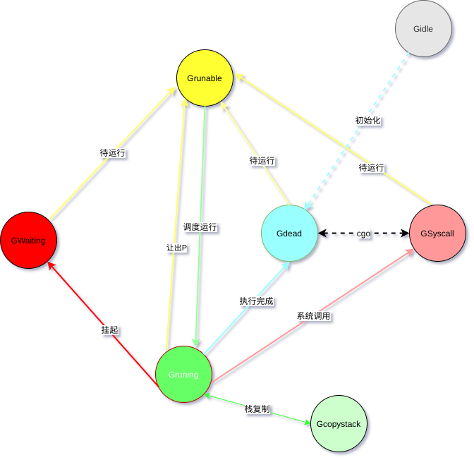
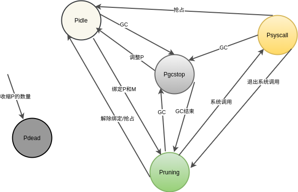

# GPM状态流转

## G状态变换

G的状态:

* _Gidle：g被创建还未出来还未初始化
* _Grunnable：g被加入待运行队列，等待被调度执行
* _Grunning：g正在运行
* _Gsyscall：g正在系统调用
* _Gwaiting：g被挂起
* _Gdead：刚被初始化或已经退出保存在空闲列表上
* _Gcopystack：g正在进行栈复制
* _Gscan
* _Gscanrunnable
* _Gscanrunning
* _Gscansyscall
* _Gscanwaiting

## P状态变换

P的状态：

* _Pidle： P未关联M
* _Prunning：P关联了M
* _Psyscall：系统调用
* _Pgcstop：gc stop/调整P时新增的P状态初始为
* _Pdead：GOMAXPROCS收缩时，多余的P被销毁

## M状态变换

