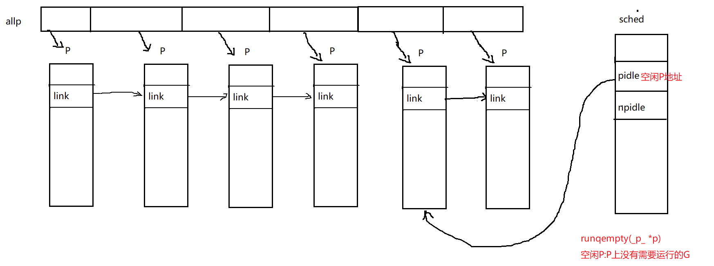

#  go调度--创建P

P的创建是在是在[schedinit](https://github.com/6z7/go/blob/release-branch.go1.13-study/src/runtime/proc.go#L551)函数初始化过程中进行的，通过调用[procresize](https://github.com/6z7/go/blob/e0489bf6f741f50ed19a05e431ac1f714b691449/src/runtime/proc.go#L592)函数来调整P的数量来达到指定的数量。在调整过程中如果P的数量大于设置的值，则销毁多余的P，反之则会创建新的P。

## procresize

调整P的数量达到指定的要求，默认情况下是cpu的核数，也可以通过环境变量`GOMAXPROCS`设置自定义的值。

1. 根据nprocs调整全局allp(保存所有P的切片)的容量

```go
func procresize(nprocs int32) *p {
	old := gomaxprocs     //初始是0
	if old < 0 || nprocs <= 0 {
		throw("procresize: invalid arg")
	}
	if trace.enabled {
		traceGomaxprocs(nprocs)
	}

	// update statistics
	now := nanotime()
	if sched.procresizetime != 0 {
		sched.totaltime += int64(old) * (now - sched.procresizetime)
	}
	sched.procresizetime = now

	//cpu数>P的数量则增加新建P
	// Grow allp if necessary.
	if nprocs > int32(len(allp)) {	 
		lock(&allpLock)
		// 已经创建的p数据大于cpu数量 则丢弃多余的
		if nprocs <= int32(cap(allp)) {
			// 只保留指定cpu数量的p
			allp = allp[:nprocs]
		} else {
			nallp := make([]*p, nprocs)		 
			copy(nallp, allp[:cap(allp)])
			allp = nallp
		}
		unlock(&allpLock)
    }
 ```
 2.  如果需要则创建P，并初始化,此时P的状态`_Pgcstop`；更新全局allp
 ```go   

	//循环创建nprocs个p并完成基本初始化 
	for i := old; i < nprocs; i++ {
		pp := allp[i]
		if pp == nil {
			pp = new(p)
		}
		pp.init(i)
		//保持P到全局allp数组
		atomicstorep(unsafe.Pointer(&allp[i]), unsafe.Pointer(pp))
	}
```
3. 如果当前的M已经关联了P，则判断使用的P在调整后是否还有效，如果有效则继续使用，并将P的状态修改为`_Prunning`，否则解除P和M的绑定，选择allp[0]与当前M绑定，并设置P的状态修改为`_Pidle`
```go
	_g_ := getg()
	// 如果当前已经关联p,则继续使用
	if _g_.m.p != 0 && _g_.m.p.ptr().id < nprocs {
		// continue to use the current P
		_g_.m.p.ptr().status = _Prunning
		_g_.m.p.ptr().mcache.prepareForSweep()
	} else {		 
		// 多余的P被丢弃，需要释放关联的多余的P
		if _g_.m.p != 0 {
			if trace.enabled {
				// Pretend that we were descheduled
				// and then scheduled again to keep
				// the trace sane.
				traceGoSched()
				traceProcStop(_g_.m.p.ptr())
			}
			// 清除无效的P关联的m
			_g_.m.p.ptr().m = 0
		}
		// 清除m与无效的P的关联
		_g_.m.p = 0
		_g_.m.mcache = nil
		p := allp[0]
		p.m = 0
		p.status = _Pidle
		acquirep(p)   //将P与M关联起来
		if trace.enabled {
			traceGoStart()
		}
	}
```
4. 销毁调整后多余的P，释放P上的资源
```
	//释放不在使用的P
	// release resources from unused P's
	for i := nprocs; i < old; i++ {
		p := allp[i]
		p.destroy()
		// can't free P itself because it can be referenced by an M in syscall
	}

	// Trim allp.
	if int32(len(allp)) != nprocs {
		lock(&allpLock)
		allp = allp[:nprocs]
		unlock(&allpLock)
	}
```
5. 将allp上的所有p的状态调整为`_Pidle`,并尝试将非空闲P与M进行关联；空闲的P和非空闲的P构成了两个不同的链表。
```
	var runnablePs *p
	for i := nprocs - 1; i >= 0; i-- {
		p := allp[i]
		if _g_.m.p.ptr() == p { //allp[0]已经关联过m
			continue
		}
		p.status = _Pidle
		if runqempty(p) { //判断P的本地队列上是否有g
			pidleput(p) //p加入sched.pidle指向的空闲链表
		} else {
			p.m.set(mget())// 如果取到空闲的m则与p关联
			p.link.set(runnablePs)
			runnablePs = p
		}
	}
	stealOrder.reset(uint32(nprocs))
	var int32p *int32 = &gomaxprocs
	atomic.Store((*uint32)(unsafe.Pointer(int32p)), uint32(nprocs))
	return runnablePs
}
```

