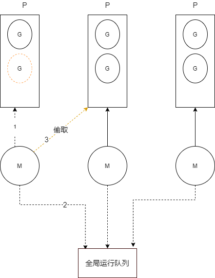

# M寻找G来运行

M寻找G的过程是发生在schedule函数中。优先寻找当前P上的本地运行队列，如果没有再去其它P上偷取，这个过程每执行61次就去全局运行队列上寻找G。从本地队列和全局队列获取G一目了然，下边我们重点看下如何偷取G。

```go
func schedule() {
	_g_ := getg()

...

top:
	if sched.gcwaiting != 0 {
		gcstopm()
		goto top
	}
	if _g_.m.p.ptr().runSafePointFn != 0 {
		runSafePointFn()
	}

	var gp *g
	var inheritTime bool	

	if gp == nil {		
		if _g_.m.p.ptr().schedtick%61 == 0 && sched.runqsize > 0 {
			lock(&sched.lock)
			gp = globrunqget(_g_.m.p.ptr(), 1)
			unlock(&sched.lock)
		}
	}
	if gp == nil {
		gp, inheritTime = runqget(_g_.m.p.ptr())
		if gp != nil && _g_.m.spinning {
			throw("schedule: spinning with local work")
		}
	}
	if gp == nil {
		gp, inheritTime = findrunnable() // blocks until work is available
	}

	if _g_.m.spinning {
		resetspinning()
	}

	...

	execute(gp, inheritTime)
}
```

## 偷取G

偷取G是一个持之以恒的过程,如果偷取不到，M就会被挂起加入空闲M队列，当runtime需要时唤醒M，继续偷，M就是这样一直自旋直到偷到为止。

偷取之前还是不死心的要先看下，本地和全局运行队列上是否有G、是否有就绪的epoll,如果有任一个满足的话拿到G就直接返回了。如果没有则只能去偷了，在偷之前还是要问下调度器其它P是否都空闲、有多少g在偷呢？，如果P都空闲或很多g在激烈竞争去偷，就不参与了，直接挂起M，有任务了在唤醒M继续执行。

方法都试了还是获取不到G啊，真的只能去偷了，先打个偷的标记`spinning`，遍历所有P去偷G，每次偷都是有底线的最多只偷一半，如果能偷取到则直接返回了，如果偷都没偷到，直接挂起面壁去了。

M太敬业了，在去挂起之前还要看下全局运行队列是否有G可以运行，万一有的话就可以直接返回了。没有的话只能将当前P和M解绑了并将P放入空闲队列。没有偷到也不能背着spinning标记了移除之，不然岂不是太亏了，但是你曾经去偷过。挂起之前再去看一眼所有P上是不是有任务了，如果有的话在重新去偷，说不定还能偷到不用去挂起了呢。还是没有的话，只能接受去挂起的命运了，等待调度系统需要时在唤醒M继续偷。

```go

func findrunnable() (gp *g, inheritTime bool) {
	_g_ := getg()	

top:
	_p_ := _g_.m.p.ptr()
...

	//再次看一下本地运行队列是否有需要运行的goroutine
	// local runq
	if gp, inheritTime := runqget(_p_); gp != nil {
		return gp, inheritTime
	}

	//再看看全局运行队列是否有需要运行的goroutine
	// global runq
	if sched.runqsize != 0 {
		lock(&sched.lock)
		gp := globrunqget(_p_, 0)
		unlock(&sched.lock)
		if gp != nil {
			return gp, false
		}
	}

	// Poll network.
	// This netpoll is only an optimization before we resort to stealing.
	// We can safely skip it if there are no waiters or a thread is blocked
	// in netpoll already. If there is any kind of logical race with that
	// blocked thread (e.g. it has already returned from netpoll, but does
	// not set lastpoll yet), this thread will do blocking netpoll below
	// anyway.
	if netpollinited() && atomic.Load(&netpollWaiters) > 0 && atomic.Load64(&sched.lastpoll) != 0 {
		if list := netpoll(false); !list.empty() { // non-blocking
			gp := list.pop()
			injectglist(&list)
			casgstatus(gp, _Gwaiting, _Grunnable)
			if trace.enabled {
				traceGoUnpark(gp, 0)
			}
			return gp, false
		}
	}

	// 其它P都已经空闲说明没有g需要执行
	// Steal work from other P's.
	procs := uint32(gomaxprocs)
	if atomic.Load(&sched.npidle) == procs-1 {
		// Either GOMAXPROCS=1 or everybody, except for us, is idle already.
		// New work can appear from returning syscall/cgocall, network or timers.
		// Neither of that submits to local run queues, so no point in stealing.
		goto stop
	}

	// If number of spinning M's >= number of busy P's, block.
	// This is necessary to prevent excessive CPU consumption
	// when GOMAXPROCS>>1 but the program parallelism is low.
	// g没有的偷取,但是在进行偷取的g的数量已经足够多 直接跳走
	if !_g_.m.spinning && 2*atomic.Load(&sched.nmspinning) >= procs-atomic.Load(&sched.npidle) {
		goto stop
	}
	if !_g_.m.spinning {
		//设置m的状态为spinning
		_g_.m.spinning = true
		//处于spinning状态的m数量+1
		atomic.Xadd(&sched.nmspinning, 1)
	}
	//从其它p的本地运行队列盗取goroutine
	for i := 0; i < 4; i++ {
		for enum := stealOrder.start(fastrand()); !enum.done(); enum.next() {
			if sched.gcwaiting != 0 {
				goto top
			}
			// 当本地队列上没有g时，是否偷取runNext g
			stealRunNextG := i > 2 // first look for ready queues with more than 1 g
			if gp := runqsteal(_p_, allp[enum.position()], stealRunNextG); gp != nil {
				return gp, false
			}
		}
	}

stop:

    ...

	allpSnapshot := allp

	// return P and block
	lock(&sched.lock)
	...
	if sched.runqsize != 0 {
		gp := globrunqget(_p_, 0)
		unlock(&sched.lock)
		return gp, false
	}
	// 当前工作线程解除与p之间的绑定，准备去休眠
	if releasep() != _p_ {
		throw("findrunnable: wrong p")
	}
	//把p放入空闲队列
	pidleput(_p_)
	unlock(&sched.lock)
	
	wasSpinning := _g_.m.spinning
	if _g_.m.spinning {
		//m即将睡眠，状态不再是spinning
		_g_.m.spinning = false
		if int32(atomic.Xadd(&sched.nmspinning, -1)) < 0 {
			throw("findrunnable: negative nmspinning")
		}
	}

	//休眠之前再看一下是否有工作要做
	// check all runqueues once again
	for _, _p_ := range allpSnapshot {
		if !runqempty(_p_) {
			lock(&sched.lock)
			_p_ = pidleget()
			unlock(&sched.lock)
			if _p_ != nil {
				acquirep(_p_)
				if wasSpinning {
					_g_.m.spinning = true
					atomic.Xadd(&sched.nmspinning, 1)
				}
				goto top
			}
			break
		}
	}

	// Check for idle-priority GC work again.
	if gcBlackenEnabled != 0 && gcMarkWorkAvailable(nil) {
		lock(&sched.lock)
		_p_ = pidleget()
		if _p_ != nil && _p_.gcBgMarkWorker == 0 {
			pidleput(_p_)
			_p_ = nil
		}
		unlock(&sched.lock)
		if _p_ != nil {
			acquirep(_p_)
			if wasSpinning {
				_g_.m.spinning = true
				atomic.Xadd(&sched.nmspinning, 1)
			}
			// Go back to idle GC check.
			goto stop
		}
	}

	// poll network
	if netpollinited() && atomic.Load(&netpollWaiters) > 0 && atomic.Xchg64(&sched.lastpoll, 0) != 0 {
		if _g_.m.p != 0 {
			throw("findrunnable: netpoll with p")
		}
		if _g_.m.spinning {
			throw("findrunnable: netpoll with spinning")
		}
		list := netpoll(true) // block until new work is available
		atomic.Store64(&sched.lastpoll, uint64(nanotime()))
		if !list.empty() {
			lock(&sched.lock)
			_p_ = pidleget()
			unlock(&sched.lock)
			if _p_ != nil {
				acquirep(_p_)
				gp := list.pop()
				injectglist(&list)
				casgstatus(gp, _Gwaiting, _Grunnable)
				if trace.enabled {
					traceGoUnpark(gp, 0)
				}
				return gp, false
			}
			injectglist(&list)
		}
	}
	//休眠
	stopm()
	goto top
}
```

M寻找G的大致过程如下:

