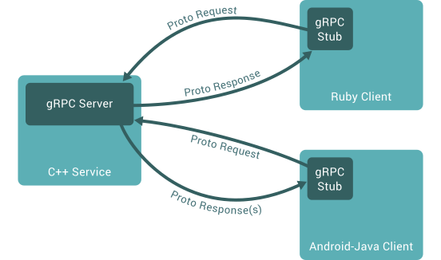

# gRpc简介

&emsp;本文件将对gRpc和protocol buffers进行介绍。gRpc可以使用pb作为IDL(Interface Definition Language)，也可以作为底层消息交换的格式。

## 概述

&emsp; &nbsp; 在gRpc中，一个客户端应用可以直接调用在不同机器上的服务端接口，就像本地调用一样 。和许多RPC系统一样，gRPC基于定义服务的思想，指定可以用参数和返回类型远程调用的方法。在服务端，实现接口并运行一个gRpc服务用来处理客户端调用。在客户端，client有一个stub（在某些语言中称为client），它提供与服务端相同的方法。

    

## 使用Protocol Buffers

&emsp; &nbsp;默认gRpc使用google开源的序列换数据的pb(当然可以使用其它序列化工具，如json)。下面是对pb使用的一个快速介绍，如果你已经熟悉pb，可以跳到下一小节。

使用PB的第一步是在proto file(一个普通的文本文件，使用.proto作为扩展名)中定义你想要的用于序列化的数据结构。PB中的数据结被构造成一个message,每个message是一个包含一系列name-value(被称为field)构成的逻辑结构。如下：

```
message Person {
  string name = 1;
  int32 id = 2;
  bool has_ponycopter = 3;
}
```

&emsp; &nbsp;一旦确定数据结构，你可以使用pb的编译器`protoc`，根据定义的proto生成你喜欢的语言的数据访问类。

&emsp; &nbsp;在proto文件中定义gRpc服务，RPC的参数与返回值都定义为pb message

```
// The greeter service definition.
service Greeter {
  // Sends a greeting
  rpc SayHello (HelloRequest) returns (HelloReply) {}
}

// The request message containing the user's name.
message HelloRequest {
  string name = 1;
}

// The response message containing the greetings
message HelloReply {
  string message = 1;
}
```

&emsp; &nbsp;gRpc使用`proc`和一个gRpc插件根据proto文件生成代码,将生成gRpc的client和server代码，以及用于填充、序列化和检索消息类型的常规pb代码。

&emsp; &nbsp;更多protocol buffers的使用说明，可以参考 [protocol buffers document](https://developers.google.com/protocol-buffers/docs/overview)


## Protocol buffer版本


&emsp; &nbsp;虽然pb已经开源有一段时间了，但是这个站点的大多数示例使用protocol buffers version 3(proto3)，它有一个稍微简化的语法，一些有用的新特性，并且支持更多的语言。Proto3可以在Java、C++、Dart、Python、Ruby、JavaScript和Go语言中使用。

&emsp; &nbsp;pb当前默认使用的是proto2，我们建议将proto3与gRPC一起使用，因为它允许你使用gRPC支持的所有语言，并避免proto2客户端与proto3服务器通信时的兼容性问题，反之亦然。