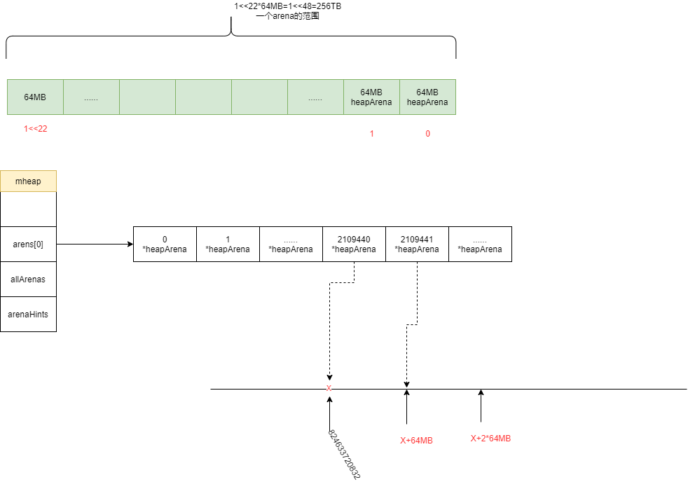

# 从OS上分配内存

arenaHints用于告诉从哪些地址开始分配内存，当需要从OS申请内存时，先遍历hint设置的起始地址开始分配内存。

大致流程如下:

1. 从os上分配内存时,按照64MB的正数倍进行，至少64MB

2. 遍历arenaHints,选择一个合适的arenaHint
    - a. 地址未溢出
    - b. 地址所属的arena索引在[0,1<<22)范围，可推测arena的总大小1<<22 *64MB =256TB
    - c. 如果在范围内，则从当前hint起始地址处预分配N字节
    - d. 分配失败则继续遍历下一个hint，
    
3. 如果遍历arenaHints未找到合适的hint，则从OS预分配虚拟内存。将分配的内存地址保存到arenaHint链表上

4. 将预分配的虚拟内存(不可读写)转为可用的虚拟内存(可读写)

5. 计算分配的内存范围[v,v+n]属于哪些heapArena的范围,创建heapArena保存到heap.arenas对应的索引位置

6. 将地址计算出来的arenaIndex保存到heap.allArenas

7. 返回分配的地址与实际分配的大小

```go
func (h *mheap) sysAlloc(n uintptr) (v unsafe.Pointer, size uintptr) {
	// 堆上每次开辟64MB的整数倍
	n = round(n, heapArenaBytes)

	// First, try the arena pre-reservation.
	v = h.arena.alloc(n, heapArenaBytes, &memstats.heap_sys)
	if v != nil {
		size = n
		goto mapped
	}

	// Try to grow the heap at a hint address.
	for h.arenaHints != nil {
		hint := h.arenaHints
		p := hint.addr
		if hint.down {
			p -= n
		}
		if p+n < p {
			// We can't use this, so don't ask.
			v = nil
		} else if arenaIndex(p+n-1) >= 1<<arenaBits {
			// Outside addressable heap. Can't use.
			v = nil
		} else {
			// 从p位置预分配n字节
			v = sysReserve(unsafe.Pointer(p), n)
		}
		if p == uintptr(v) {
			// Success. Update the hint.
			if !hint.down {
				p += n
			}
			hint.addr = p
			size = n
			break
		}		 
		// 预占用的内存 没有使用释放
		if v != nil {
			sysFree(v, n, nil)
		}
		// hint已经无法使用释放
		h.arenaHints = hint.next
		h.arenaHintAlloc.free(unsafe.Pointer(hint))
	}

	if size == 0 {
		// v:预占的内存地址   size:实际分配的内存大小
		v, size = sysReserveAligned(nil, n, heapArenaBytes)
		if v == nil {
			return nil, 0
		}

		// Create new hints for extending this region.
		hint := (*arenaHint)(h.arenaHintAlloc.alloc())
		hint.addr, hint.down = uintptr(v), true
		hint.next, mheap_.arenaHints = mheap_.arenaHints, hint
		hint = (*arenaHint)(h.arenaHintAlloc.alloc())
		hint.addr = uintptr(v) + size
		hint.next, mheap_.arenaHints = mheap_.arenaHints, hint
	}

	// Check for bad pointers or pointers we can't use.
	{
		var bad string
		p := uintptr(v)
		if p+size < p {
			bad = "region exceeds uintptr range"
		} else if arenaIndex(p) >= 1<<arenaBits {
			bad = "base outside usable address space"
		} else if arenaIndex(p+size-1) >= 1<<arenaBits {
			bad = "end outside usable address space"
		}
		if bad != "" {
			// This should be impossible on most architectures,
			// but it would be really confusing to debug.
			print("runtime: memory allocated by OS [", hex(p), ", ", hex(p+size), ") not in usable address space: ", bad, "\n")
			throw("memory reservation exceeds address space limit")
		}
	}

	if uintptr(v)&(heapArenaBytes-1) != 0 {
		throw("misrounded allocation in sysAlloc")
	}

	// Transition from Reserved to Prepared.
	// 将预占用的虚拟内存转为可用的虚拟内存
	sysMap(v, size, &memstats.heap_sys)

mapped:
	// Create arena metadata.
	for ri := arenaIndex(uintptr(v)); ri <= arenaIndex(uintptr(v)+size-1); ri++ {
		l2 := h.arenas[ri.l1()]
		// 创建[1 << 22]*heapArena 数组
		if l2 == nil {
			// Allocate an L2 arena map.
			// 分配持久内存heapArena
			l2 = (*[1 << arenaL2Bits]*heapArena)(persistentalloc(unsafe.Sizeof(*l2), sys.PtrSize, nil))
			if l2 == nil {
				throw("out of memory allocating heap arena map")
			}
			atomic.StorepNoWB(unsafe.Pointer(&h.arenas[ri.l1()]), unsafe.Pointer(l2))
		}

		if l2[ri.l2()] != nil {
			throw("arena already initialized")
		}
		var r *heapArena
		r = (*heapArena)(h.heapArenaAlloc.alloc(unsafe.Sizeof(*r), sys.PtrSize, &memstats.gc_sys))
		if r == nil {
			r = (*heapArena)(persistentalloc(unsafe.Sizeof(*r), sys.PtrSize, &memstats.gc_sys))
			if r == nil {
				throw("out of memory allocating heap arena metadata")
			}
		}

		// Add the arena to the arenas list.
		//
		if len(h.allArenas) == cap(h.allArenas) {
			size := 2 * uintptr(cap(h.allArenas)) * sys.PtrSize
			if size == 0 {
				size = physPageSize
			}
			newArray := (*notInHeap)(persistentalloc(size, sys.PtrSize, &memstats.gc_sys))
			if newArray == nil {
				throw("out of memory allocating allArenas")
			}
			oldSlice := h.allArenas
			*(*notInHeapSlice)(unsafe.Pointer(&h.allArenas)) = notInHeapSlice{newArray, len(h.allArenas), int(size / sys.PtrSize)}
			copy(h.allArenas, oldSlice)		 
		}
		h.allArenas = h.allArenas[:len(h.allArenas)+1]
		h.allArenas[len(h.allArenas)-1] = ri
 
		atomic.StorepNoWB(unsafe.Pointer(&l2[ri.l2()]), unsafe.Pointer(r))
	}

	// Tell the race detector about the new heap memory.
	if raceenabled {
		racemapshadow(v, size)
	}

	return
}
```


heapArenaBytes大小是64MB，所以arenaIndex是计算当前地址属于哪个heapArena的范围。

arenaBaseOffset=sys.GoarchAmd64 * (1 << 47) 加上这个偏移和amd64的硬件设计有关，具体不是很清楚。

```go
func arenaIndex(p uintptr) arenaIdx {
	return arenaIdx((p + arenaBaseOffset) / heapArenaBytes)
}
```

## 总结

遍历arenaHints选择合适的位置创建arena,如果从hints中没有找到合适的则从OS中申请arena。通过	`arenaIndex`方法将内存地址转为对应的arena数组索引，arena数组的长度为`1<<22`,由于其每个元素的大小是64MB，所以数组覆盖的范围为`(1<<22)*64MB=256TB`。分配的起始地址是在初始化的时选择的arenaHit的起始位置`uintptr(0)<<40 | uintptrMask&(0x00c0<<32)`(824633720832)。数组的的类型是一个heapArena。arena数组将会被保存到heap.arenas这个二维数组中作为二维，arenaIndex()的结果将会用来计算在二维数组中的位置。
 



