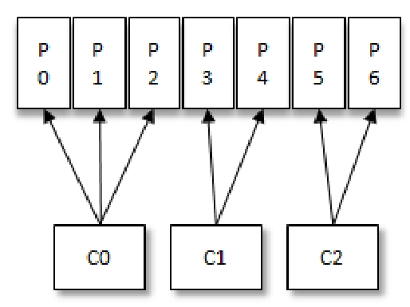
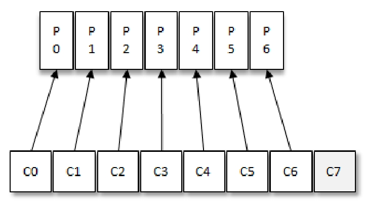

# Consumer

## 参数

* fetch.min.bytes

    Consumer在一次拉取请求（调用poll（）方法）中能从Kafka中拉取的最小数据量，默认值为1（B）。Kafka在收到Consumer的拉取请求时，如果返回给Consumer的数据量小于这个参数所配置的值，那么它就需要进行等待，直到数据量满足这个参数的配置大小。

* fetch.max.bytes

    配置Consumer在一次拉取请求中从Kafka中拉取的最大数据量，默认值为 52428800（B），也就是50MB。

* fetch.max.wait.ms

    该参数用于指定Kafka的等待时间，默认值为500（ms）。如果Kafka中没有足够多的消息而满足不了fetch.min.bytes参数的要求，那么最终会等待500ms

* max.poll.records

    配置Consumer在一次拉取请求中拉取的最大消息数，默认值为500（条）

* exclude.internal.topics

    Kafka中有两个内部的主题：__consumer_offsets和__transaction_state。exclude.internal.topics用来指定Kafka中的内部主题是否可以向消费者公开，默认值为true

* metadata.max.age.ms

    配置元数据的过期时间，默认值为300000（ms），即5分钟。如果元数据在此参数所限定的时间范围内没有进行更新，则会被强制更新，即使没有任何分区变化或有新的broker加入。

## 原理

与其他一些消息中间件不同的是：在Kafka的消费理念中还有一层消费组（Consumer Group）的概念，每个消费者都有一个对应的消费组。当消息发布到主题后，只会被投递给订阅它的每个消费组中的一个消费者。

对于分区数固定的情况，一味地增加消费者并不会让消费能力一直得到提升，如果消费者过多，出现了消费者的个数大于分区个数的情况，就会有消费者分配不到任何分区。

以上分配逻辑都是基于默认的分区分配策略进行分析的，可以通过消费者客户端参数partition.assignment.strategy 来设置消费者与订阅主题之间的分区分配策略。

消费组是一个逻辑上的概念，它将旗下的消费者归为一类，每一个消费者只隶属于一个消费组。每一个消费组都会有一个固定的名称，消费者在进行消费前需要指定其所属消费组的名称，这个可以通过消费者客户端参数group.id来配置，默认值为空字符串。

订阅topic的方式

* 指定topic名称
* 正则匹配
* 订阅topic的特定分区

Kafka中的消息消费是一个不断轮询的过程，消费者所要做的就是重复地调用poll（）方法，而poll（）方法返回的是所订阅的主题（分区）上的一组消息。poll（）方法里还有一个超时时间参数timeout，用来控制poll（）方法的阻塞时间，在消费者的缓冲区里没有可用数据时会发生阻塞。

在旧消费者客户端中，消费位移是存储在ZooKeeper中的。而在新消费者客户端中，消费位移存储在Kafka内部的主题__consumer_offsets中。

在 Kafka 中默认的消费位移的提交方式是自动提交，这个由消费者客户端参数enable.auto.commit 配置，默认值为 true。当然这个默认的自动提交不是每消费一条消息就提交一次，而是定期提交，这个定期的周期时间由客户端参数auto.commit.interval.ms配置，默认值为5秒，此参数生效的前提是enable.auto.commit参数为true。

在默认的方式下，消费者每隔5秒会将拉取到的每个分区中最大的消息位移进行提交。自动位移提交的动作是在poll（）方法的逻辑里完成的，在每次真正向服务端发起拉取请求之前会检查是否可以进行位移提交，如果可以，那么就会提交上一次轮询的位移。

KafkaConsumer 提供了对消费速度进行控制的方法，在有些应用场景下我们可能需要暂停某些分区的消费而先消费其他分区，当达到一定条件时再恢复这些分区的消费。KafkaConsumer中使用pause（）和resume（）方法来分别实现暂停某些分区在拉取操作时返回数据给客户端和恢复某些分区向客户端返回数据的操作。

在 Kafka 中每当消费者查找不到所记录的消费位移时，就会根据消费者客户端参数auto.offset.reset的配置来决定从何处开始进行消费，这个参数的默认值为“latest”，表示从分区末尾开始消费消息。如果将auto.offset.reset参数配置为“earliest”，那么消费者会从起始处，也就是0开始消费。

除了查找不到消费位移，位移越界也会触发auto.offset.reset 参数的执行。

auto.offset.reset参数还有一个可配置的值—“none”，配置为此值就意味着出现查到不到消费位移的时候，既不从最新的消息位置处开始消费，也不从最早的消息位置处开始消费，此时会报出NoOffsetForPartitionException异常。

有些时候，我们需要一种更细粒度的掌控，可以让我们从特定的位移处开始拉取消息，而 KafkaConsumer 中的 seek（）方法正好提供了这个功能。

再均衡是指分区的所属权从一个消费者转移到另一消费者的行为，它为消费组具备高可用性和伸缩性提供保障，使我们可以既方便又安全地删除消费组内的消费者或往消费组内添加消费者。不过在再均衡发生期间，消费组内的消费者是无法读取消息的。也就是说，在再均衡发生期间的这一小段时间内，消费组会变得不可用。另外，当一个分区被重新分配给另一个消费者时，消费者当前的状态也会丢失。比如消费者消费完某个分区中的一部分消息时还没有来得及提交消费位移就发生了再均衡操作，之后这个分区又被分配给了消费组内的另一个消费者，原来被消费完的那部分消息又被重新消费一遍，也就是发生了重复消费。