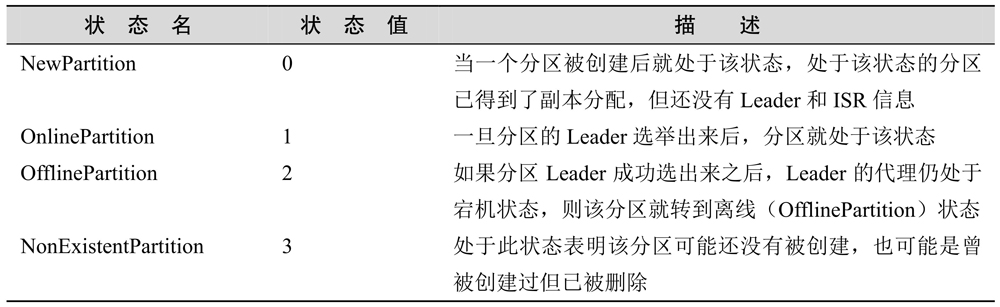
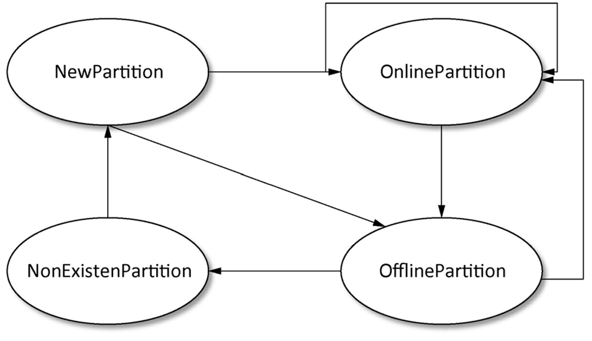
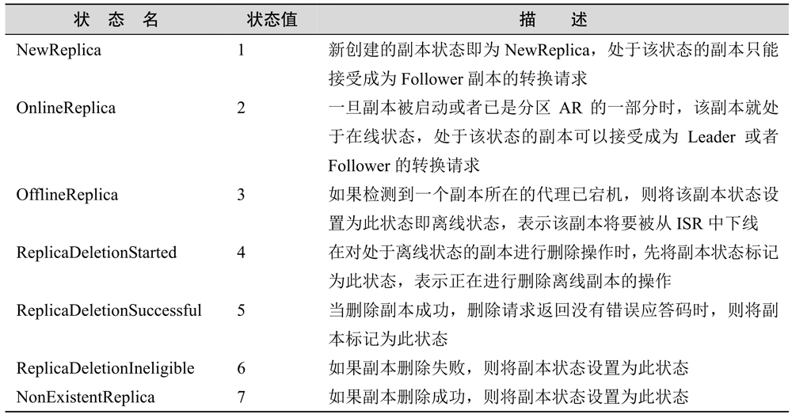
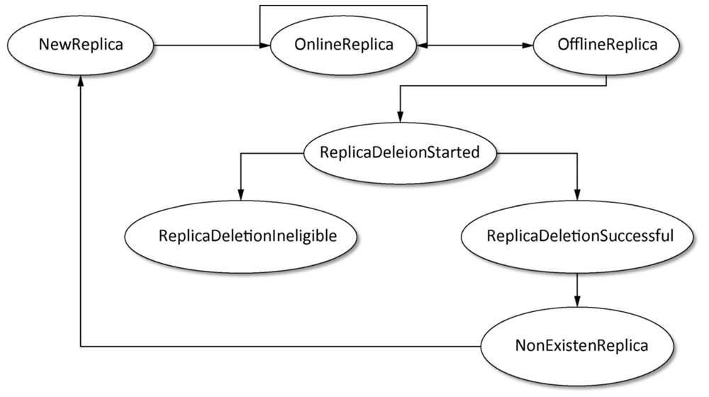

# 控制器

在启动Kafka集群时，每一个代理都会实例化并启动一个KafkaController，并将该代理的brokerId注册到ZooKeeper的相应节点当中。Kafka集群中各代理会根据选举机制(看谁先创建zk节点成功)选出其中一个代理作为Leader，即Leader控制器。当控制器发生宕机后其他代理再次竞选出新的控制器。控制器负责主题的创建与删除、分区和副本的管理以及代理故障转移处理等。当一个代理被选举成为控制器时，该代理对应的KafkaController就会注册（Register）控制器相应的操作权限，同时标记自己是Leader。当代理不再成为控制器时，就要注销掉（DeRegister）相应的权限。

在AR中，第一个副本称为preferred replica，也就是我们说的优先副本。理想情况下，优先副本即是该分区的Leader, Kafka要确保所有主题的优先副本在Kafka集群中均衡分布，这样就保证了所有分区的Leader均衡分布。保证Leader在集群中均衡分布很重要，因为所有的读写请求都由分区Leader副本进行处理，如果Leader分布过于集中，就会造成集群负载不均衡。为了保证优先副本的均衡分布，Kafka提供了5种分区选举器（PartitionLeaderSelector），当分区数发生变化或是分区Leader宕机时就会通过分区选举器及时选出分区新的Leader。

Kafka分区状态及描述:

分区状态机对应的4种状态的转换关系:

Kafka副本状态:

副本状态进转换：

