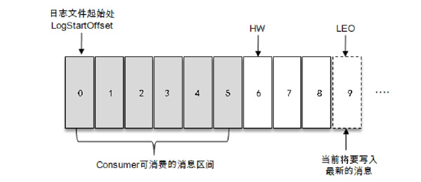

# 基本概念

分区中的所有副本统称为AR（AssignedReplicas）。所有与leader副本保持一定程度同步的副本（包括leader副本在内）组成ISR（In-Sync Replicas），ISR集合是AR集合中的一个子集。

消息会先发送到leader副本，然后follower副本才能从leader副本中拉取消息进行同步，同步期间内follower副本相对于leader副本而言会有一定程度的滞后。前面所说的“一定程度的同步”是指可忍受的滞后范围，这个范围可以通过参数进行配置。

与leader副本同步滞后过多的副本（不包括leader副本）组成OSR（Out-of-Sync Replicas），由此可见，AR=ISR+OSR。在正常情况下，所有的 follower 副本都应该与leader 副本保持一定程度的同步，即 AR=ISR，OSR集合为空。

leader副本负责维护和跟踪ISR集合中所有follower副本的滞后状态，当follower副本落后太多或失效时，leader副本会把它从ISR集合中剔除。如果OSR集合中有follower副本“追上”了leader副本，那么leader副本会把它从OSR集合转移至ISR集合。默认情况下，当leader副本发生故障时，只有在ISR集合中的副本才有资格被选举为新的leader，而在OSR集合中的副本则没有任何机会（不过这个原则也可以通过修改相应的参数配置来改变）。

LEO是Log End Offset的缩写，它标识当前日志文件中下一条待写入消息的offset。LEO的大小相当于当前日志分区中最后一条消息的offset值加1。分区ISR集合中的每个副本都会维护自身的LEO，而ISR集合中最小的LEO即为分区的HW，对消费者而言只能消费HW之前的消息。

Kafka 的复制机制既不是完全的同步复制，也不是单纯的异步复制。事实上，同步复制要求所有能工作的 follower 副本都复制完，这条消息才会被确认为已成功提交，这种复制方式极大地影响了性能。而在异步复制方式下，follower副本异步地从leader副本中复制数据，数据只要被leader副本写入就被认为已经成功提交。在这种情况下，如果follower副本都还没有复制完而落后于leader副本，突然leader副本宕机，则会造成数据丢失。Kafka使用的这种ISR的方式则有效地权衡了数据可靠性和性能之间的关系。
