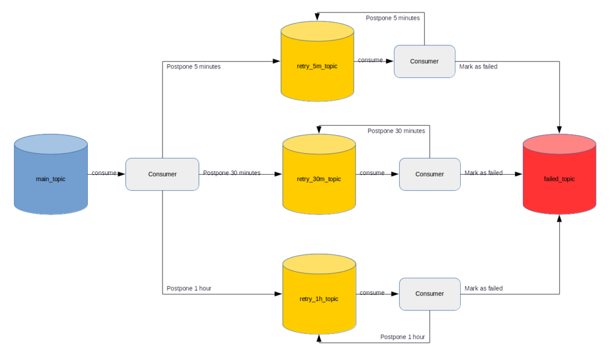

## 基于redis实现消息延迟重试

定义kafka消息失败重试的规则，如重试指定次数，或按时间间隔重试。

commit失败的消息，保存到redis的有序集合中，按照重试时间排序。指定次数的重试其重试时间为当前时间，时间间隔的方式的重试时间根据是第几次重试来动态计算出来到应该重试的时间

每次poll时先看下redis中是否有已经到期的重试消息(重试时间<=当前时间>)

手动commit消息时，将poll的消息保存到redis中，实际commit时在从redis中取出处理

以上方案实现kafka消费消息失败重试，需要一个包装层，来统一处理上边的操作和实现offset的维护。

## 基于kafak topic实现消息延迟重试

创建topic

‘retry_5m_topic’ — for retry in 5 minutes

‘retry_30m_topic’ — for retry in 30 minutes

‘retry_1h_topic’ — for retry in 1 hour

需要包装下消息，增加两个字段：

* retry_number：重试次数
* retry_timestamp ：重试时间

这种方式适合重试时间固定的场景，如果场景不固定，需要创建大量的topic，顺序写会变成随机写。