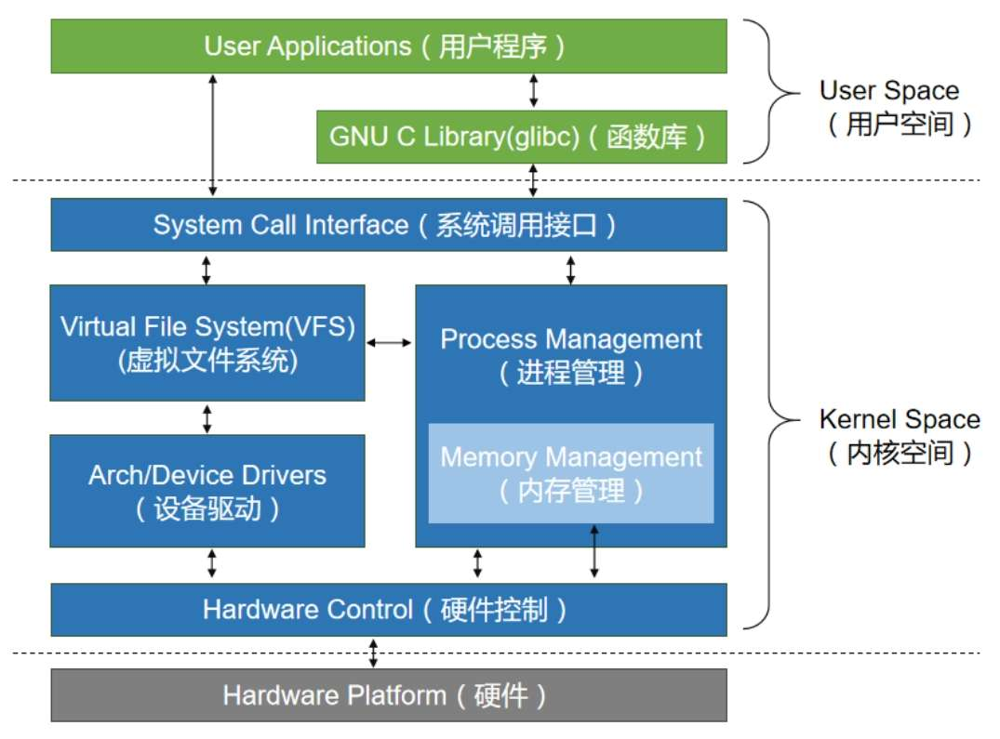
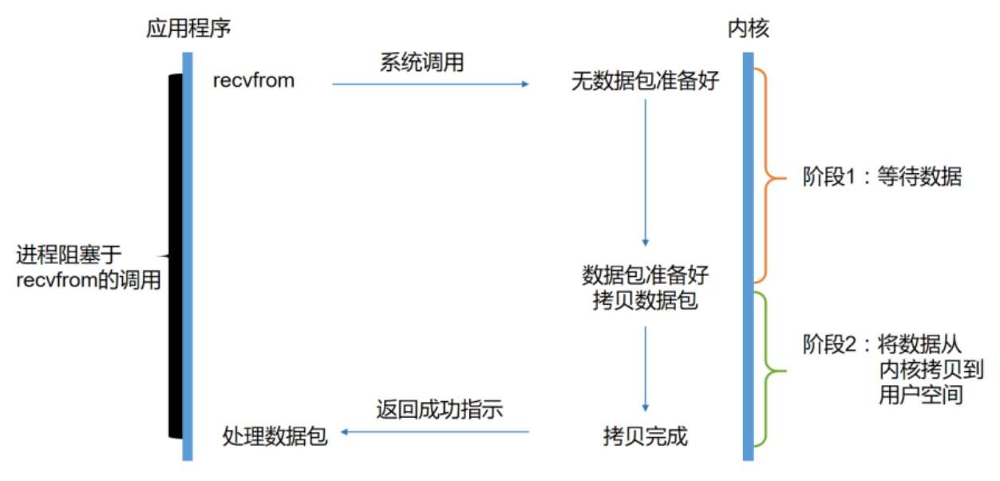
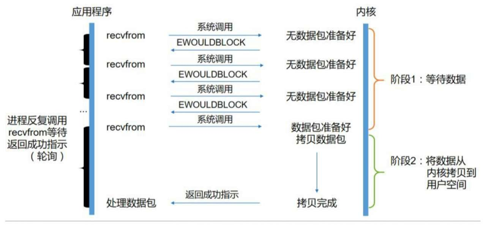
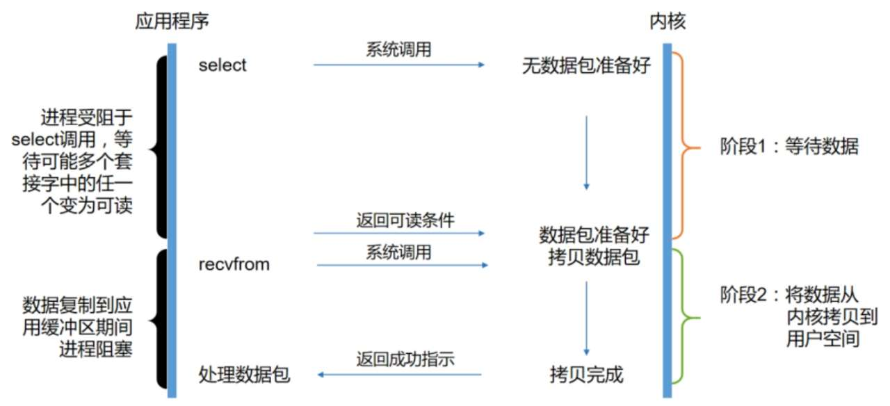
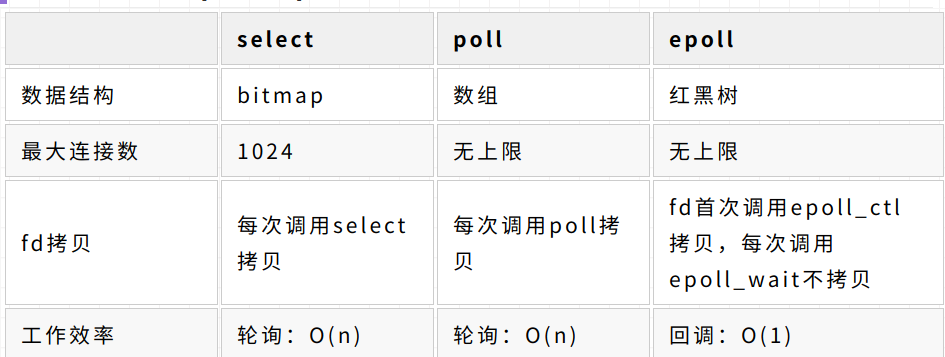
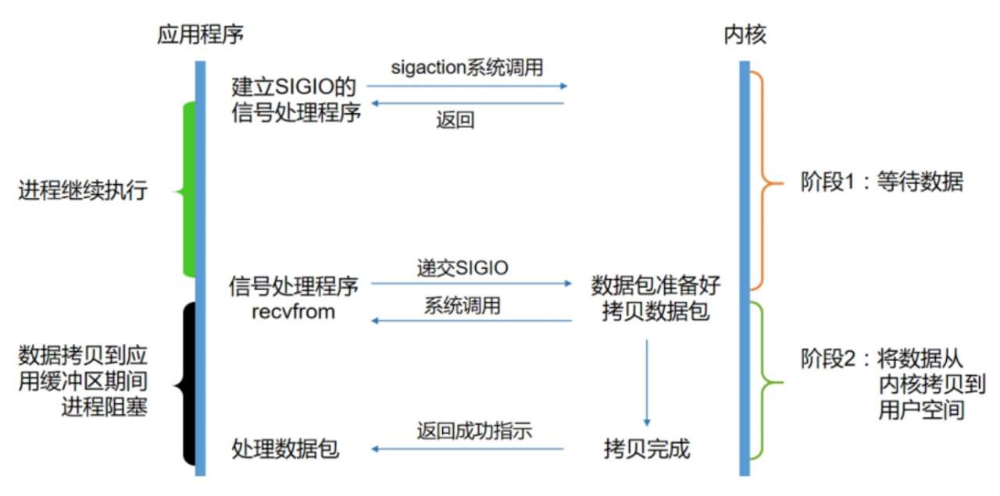
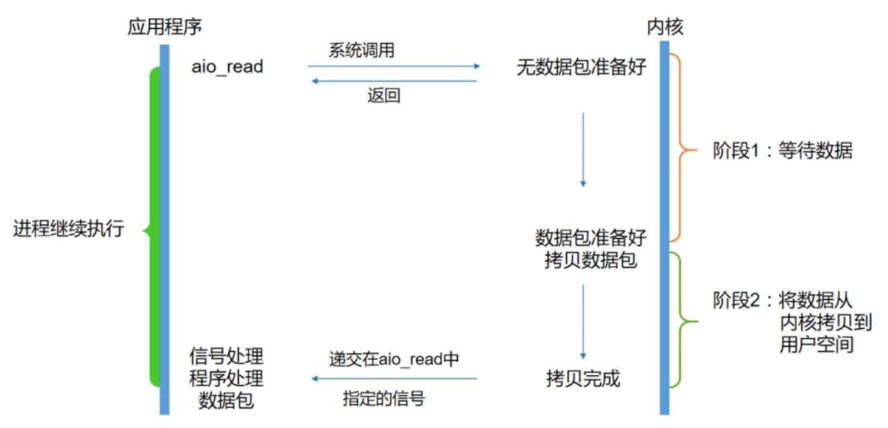
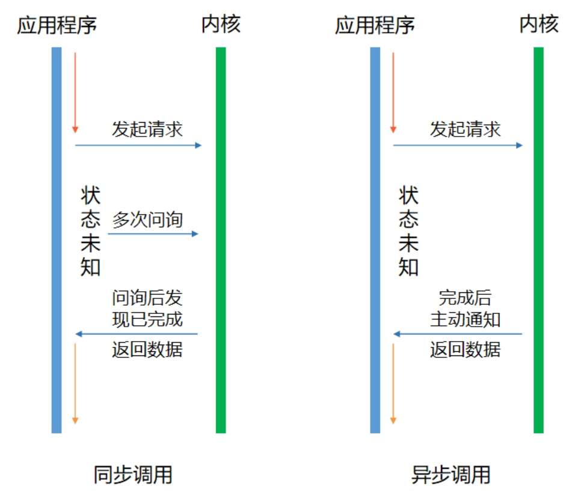
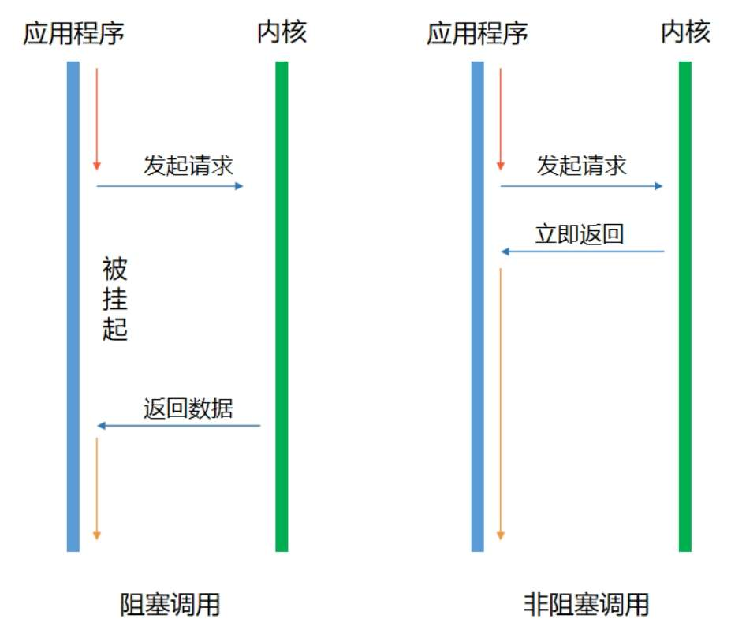
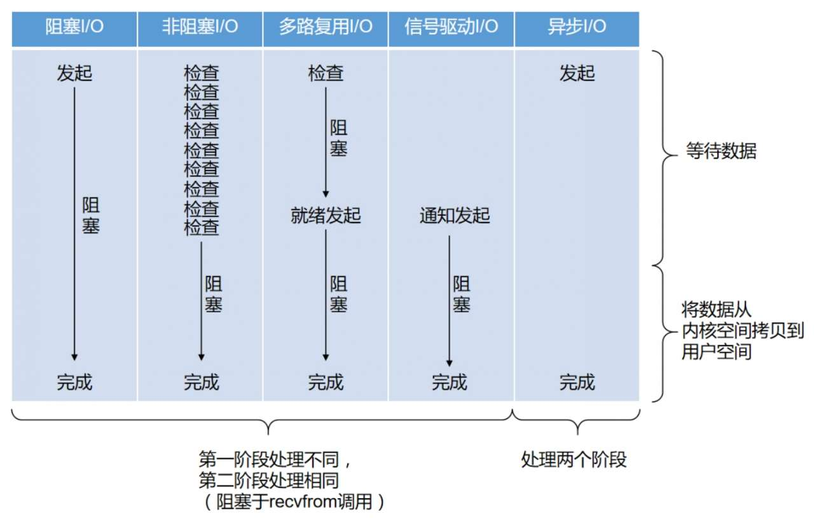

# I/O

在网络环境下，通俗地讲，将I/O分为两步：第一步是等待；第二步是数据搬迁。

如果想要提高I/O效率，需要将等待时间降低。因此发展出来五种I/O模型，分别是：阻塞I/O模型、非阻塞I/O模型、多路复用I/O模型、信号驱动I/O模型、异步I/O模型。其中，前四种被称为同步I/O。

**阻塞I/O模型**

当用户进程调用了recvfrom这个系统调用，内核就开始了I/O的第一个阶段：准备数据。对于网络I/O来说，很多时候数据在一开始还没有到达（比如，还没有收到一个完整的UDP包），这个时候内核就要等待足够的数据到来。而在用户进程这边，整个进程会被阻塞，当数据准备好时，它就会将数据从内核拷贝到用户内存，然后返回结果，用户进程才解除阻塞的状态，重新运行起来。

**非阻塞I/O模型**

当用户进程发出read操作时，如果内核中的数据还没有准备好，那么它并不会阻塞用户进程，而是立刻返回一个error。从用户进程角度讲，它发起一个read操作后，并不需要等待，而是马上就得到了一个结果，用户进程判断结果是一个error时，它就知道数据还没有准备好。于是它可以再次发送read操作，一旦内核中的数据准备好了，并且再次收到了用户进程的系统调用，那么它会马上将数据拷贝到用户内存，然后返回，非阻塞型接口相比于阻塞型接口的显著差异在于，在被调用之后立即返回。

**多路复用I/O模型**

多个进程的I/O可以注册到一个复用器（Selector）上，当用户进程调用该Selector，Selector会监听注册进来的所有I/O，如果Selector监听的所有I/O在内核缓冲区都没有可读数据，select调用进程会被阻塞，而当任一I/O在内核缓冲区中有可读数据时，select调用就会返回，而后select调用进程可以自己或通知另外的进程（注册进程）再次发起读取I/O，读取内核中准备好的数据，多个进程注册I/O后，只有一个select调用进程被阻塞。

实现方式:

* select
* poll
* epoll

select缺点:

* 单个进程所打开的FD是有限制的，通过FD_SETSIZE设置，默认1024
* 每次调用select，都需要把fd集合从用户态拷贝到内核态，这个开销在fd很多时会很大
* 对socket扫描时是线性扫描，采用轮询的方法，效率较低（高并发时）

poll缺点

* poll与select相比，只是没有fd的限制，其它基本一样

epoll LT与ET模式的区别

* epoll有EPOLLLT(水平触发)和EPOLLET(边缘触发)两种触发模式，LT是默认的模式，ET是“高速”模式。
* LT模式下，只要这个fd还有数据可读，每次 epoll_wait都会返回它的事件，提醒用户程序去操作
* ET模式下，它只会提示一次，直到下次再有数据流入之前都不会再提示了，无论fd中是否还有数据可读。所以在ET模式下，read一个fd的时候一定要把它的buffer读完，或者遇到EAGAIN错误

**信号驱动I/O模型**

信号驱动I/O是指进程预先告知内核，向内核注册一个信号处理函数，然后用户进程返回不阻塞，当内核数据就绪时会发送一个信号给进程，用户进程便在信号处理函数中调用I/O读取数据。从上图可以看出，实际上I/O内核拷贝到用户进程的过程还是阻塞的，信号驱动I/O并没有实现真正的异步，因为通知到进程之后，依然由进程来完成I/O操作。

**异步I/O模型**

## 同步vs异步

同步和异步其实是指CPU时间片的利用，主要看请求发起方对消息结果的获取是主动发起的，还是被动通知的。

## 阻塞vs非阻塞

阻塞和非阻塞通常是指在客户端发出请求后，在服务端处理这个请求的过程中，客户端本身是直接挂起等待结果，还是继续做其他的任务。而异步和同步则是对于请求结果的获取是客户端主动获取结果，还是由服务端来通知结果。从这一点来看，同步和阻塞其实描述的是两个不同角度的事情，阻塞和非阻塞指的是客户端等待消息处理时本身的状态，是挂起还是继续干别的。同步和异步指的是对于消息结果是客户端主动获取的，还是由服务端间接推送的。

