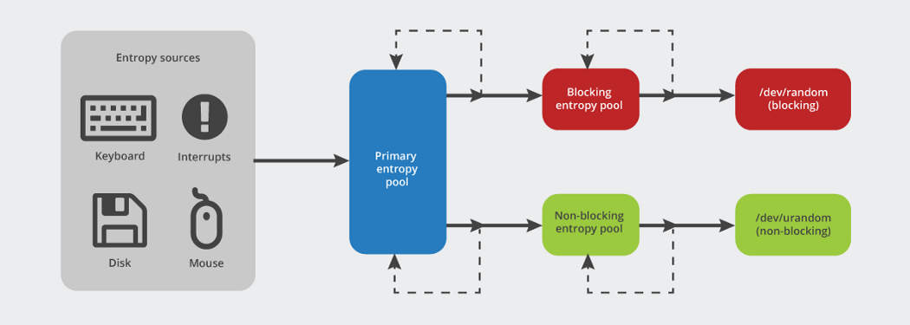

# 随机数

/dev/random:是真随机数生成器，它会消耗熵值来产生随机数，同时在熵耗尽的情况下(产生随机数需要的bit大于当前可用熵池中的bit)会阻塞，直到有新的熵生成.

/dev/urandom:是伪随机数生成器，它根据一个初始的随机种子(这个种子来源就是熵池中的熵)来产生一系列的伪随机数，而并不会在熵耗尽的情况下阻塞。



Linux内核采用熵来描述数据的随机性。熵（entropy）是描述系统混乱无序程度的物理量，一个系统的熵越大则说明该系统的有序性越差，即不确定性越大。在信息学中，熵被用来表征一个符号或系统的不确定性，熵越大，表明系统所含有用信息量越少，不确定度越大。

计算机本身是可预测的系统，因此，用计算机算法不可能产生真正的随机数。但是机器的环境中充满了各种各样的噪声，如硬件设备发生中断的时间，用户点击鼠标的时间间隔等是完全随机的，事先无法预测。Linux内核实现的随机数产生器正是利用系统中的这些随机噪声来产生高质量随机数序列。

```
// 熵池上限大小
cat /proc/sys/kernel/random/poolsize

// 当前可用熵数量
cat /proc/sys/kernel/random/entropy_avail

// 查看当前可用熵数量
cat /proc/sys/kernel/random/entropy_avail && date

// 每隔1秒打印当前可用熵数量
watch -n 1 cat /proc/sys/kernel/random/entropy_avail
```

**解决熵池不够的问题**

1. 更换随机源为`/dev/urandom`，

   java中指定
 `-Djava.security.egd=file:///dev/urandom`或 修改`cat $JAVA_HOME/jre/lib/security/java.security|grep securerandom`中的配置

2. 安装提高熵的程序包
   
   haveged或rng-tools


由于openssl、tomcat等高加密要求的软件需要/dev/random所生成的真随机数来确保公匙不易于被猜测，与此同时由于Linux从2.4至2.6版本砍掉了大量的外来噪音来源，以及VPS由于是虚拟主机环境过于安静而缺乏各种噪音，因此会出现随机数生成速度过慢所产生的阻塞现象。


