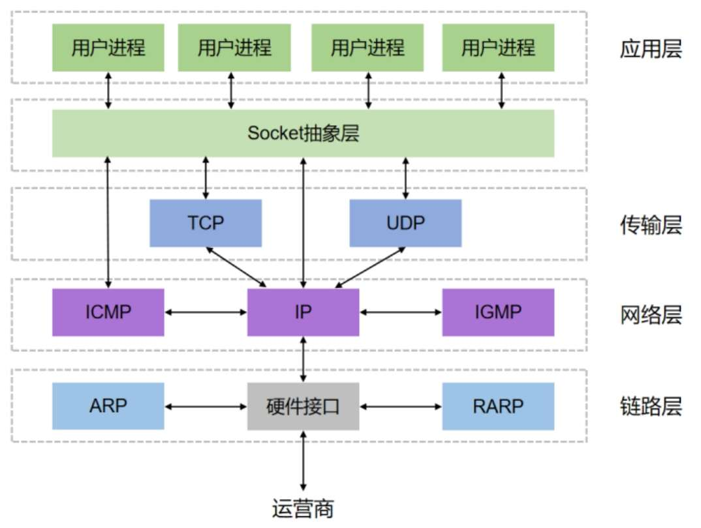

# 网络通信之“魂”—Socket

我们知道两个进程进行通信一个最基本的前提是能够唯一地标识一个进程。在本地进程通信中，我们可以使用PID来唯一标识一个进程，但PID只在本地唯一，网络中的两个进程PID冲突概率很大，这时候就需要另辟蹊径了。我们知道IP层的IP地址可以唯一标识主机，而TCP层的协议和端口号可以唯一标识主机的一个进程，可以用IP地址+协议+端口号唯一标识网络中的一个进程。

能够唯一标识网络中的进程后，它们就可以利用Socket进行通信了。那么，什么是Socket呢？我们经常把Socket翻译为套接字，Socket是在应用层和传输层之间的一个抽象层，它把TCP/IP层复杂的操作抽象为几个简单的接口供应用层调用，以实现进程在网络中的通信，具体结构如下图所示。

