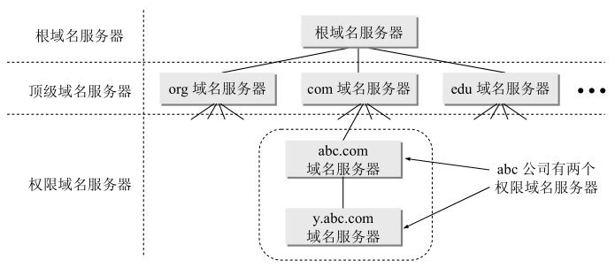

# DNS

域名系统DNS (Domain Name System)是因特网使用的命名系统，用来把便于人们使用的机器名字转换为IP地址。    

一个服务器所负责管辖的（或有权限的）范围叫做区(zone)。各单位根据具体情况来划分自己管辖范围的区。但在一个区中的所有节点必须是能够连通的。每一个区设置相应的权限域名服务器(authoritative name server)，用来保存该区中的所有主机的域名到IP地址的映射。总之，DNS服务器的管辖范围不是以“域”为单位，而是以“区”为单位。区是DNS服务器实际管辖的范围。区可能等于或小于域，但一定不可能大于域。

根域名服务器(root name server)：根域名服务器是最高层次的域名服务器，也是最重要的域名服务器。所有的根域名服务器都知道所有的顶级域名服务器的域名和IP地址。根域名服务器是最重要的域名服务器，因为不管是哪一个本地域名服务器，若要对因特网上任何一个域名进行解析（即转换为IP地址），只要自己无法解析，就首先要求助于根域名服务器。假定所有的根域名服务器都瘫痪了，那么整个的DNS系统就无法工作。在因特网上共有13个不同IP地址的根域名服务器，它们的名字是用一个英文字母命名，从a一直到m （前13个字母）。这些根域名服务器相应的域名分别是 a.rootservers.net, …,m.rootservers.net。但请注意，这些根域名服务器并不是简单由13个机器所组成（如果仅仅依靠这13个机器，根本不可能为全世界的因特网用户提供令人满意的服务），而是13套装置。

需要注意的是，在许多情况下，根域名服务器并不直接把待查询的域名直接转换成IP地址（根域名服务器也没有存放这种信息），而是告诉本地域名服务器下一步应当找哪一个顶级域名服务器进行查询。

顶级域名服务器（即TLD 服务器）：这些域名服务器负责管理在该顶级域名服务器注册的所有二级域名。当收到DNS查询请求时，就给出相应的回答（可能是最后的结果，也可能是下一步应当找的域名服务器的IP地址）。

权限域名服务器：这就是前面已经讲过的负责一个区的域名服务器。当一个权限域名服务器还不能给出最后的查询回答时，就会告诉发出查询请求的DNS客户，下一步应当找哪一个权限域名服务器。 

本地域名服务器(local name server)：本地域名服务器并不属于图6-3所示的域名服务器层次结构，但它对域名系统非常重要。当一个主机发出DNS查询请求时，这个查询请求报文就发送给本地域名服务器。

下面简单讨论一下域名的解析过程。这里要注意两点。

第一，主机向本地域名服务器的查询一般都是采用递归查询(recursive query)。所谓递归查询就是：如果主机所询问的本地域名服务器不知道被查询域名的IP地址，那么本地域名服务器就以DNS客户的身份，向其他根域名服务器继续发出查询请求报文（即替该主机继续查询），而不是让该主机自己进行下一步的查询。因此，递归查询返回的查询结果或者是所要查询的IP地址，或者是报错，表示无法查询到所需的IP地址。

第二，本地域名服务器向根域名服务器的查询通常是采用迭代查询(iterative query)。迭代查询的特点是这样的：当根域名服务器收到本地域名服务器发出的迭代查询请求报文时，要么给出所要查询的IP地址，要么告诉本地域名服务器：“你下一步应当向哪一个域名服务器进行查询”。然后让本地域名服务器进行后续的查询（而不是替本地域名服务器进行后续的查询）。根域名服务器通常是把自己知道的顶级域名服务器的IP地址告诉本地域名服务器，让本地域名服务器再向顶级域名服务器查询。顶级域名服务器在收到本地域名服务器的查询请求后，要么给出所要查询的IP地址，要么告诉本地域名服务器下一步应当向哪一个权限域名服务器进行查询，本地域名服务器就这样进行迭代查询。最后，知道了所要解析的域名的IP地址，然后把这个结果返回给发起查询的主机。当然，本地域名服务器也可以采用递归查询，这取决于最初的查询请求报文的设置是要求使用哪一种查询方式。

