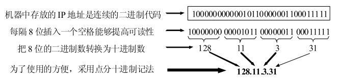
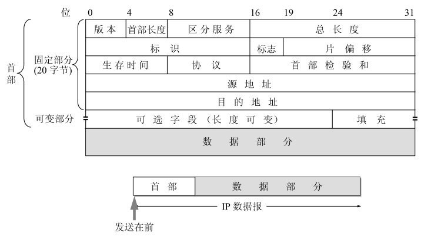
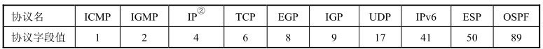
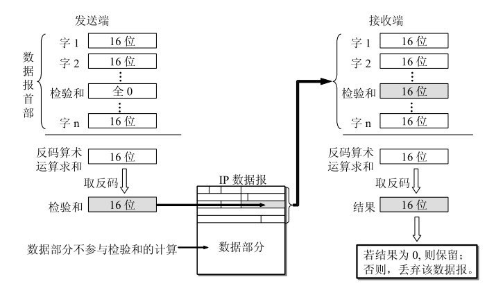
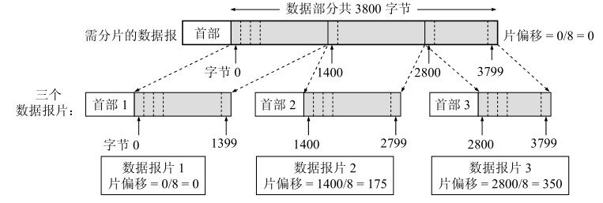

# IP

整个的因特网就是一个单一的、抽象的网络。IP地址就是给因特网上的每一个主机（或路由器）的每一个接口分配一个在全世界范围是唯一的32位的标识符。IP地址的结构使我们可以在因特网上很方便地进行寻址。IP地址现在由因特网名字和数字分配机构ICANN(Internet Corporation for Assigned Names and Numbers)进行分配。

所谓“分类的IP地址”就是将IP地址划分为若干个固定类，每一类地址都由两个固定长度的字段组成，其中第一个字段是网络号(net-id)，它标志主机（或路由器）所连接到的网络。一个网络号在整个因特网范围内必须是唯一的。第二个字段是主机号(host-id)，它标志该主机（或路由器）。一个主机号在它前面的网络号所指明的网络范围内必须是唯一的。由此可见，一个IP地址在整个因特网范围内是唯一的。

● A类、B类和C类地址的网络号字段（在图中这个字段是灰色的）分别为1，2和3字节长，而在网络号字段的最前面有1∼3位的类别位，其数值分别规定为0，10和110。

● A类、B类和C类地址的主机号字段分别为3个、2个和1个字节长。

● D类地址（前4位是1110）用于多播（一对多通信）。我们将在本章4.6节讨论IP多播。

● E类地址（前4位是1111）保留为以后用。

## IP协议格式

一个IP数据报由首部和数据两部分组成。首部的前一部分是固定长度，共20字节，是所有IP数据报必须具有的。在首部的固定部分的后面是一些可选字段，其长度是可变的。

1. 版本 占4位，指IP协议的版本。通信双方使用的IP协议的版本必须一致。目前广泛使用的IP协议版本号为4 (即IPv4)

2. 首部长度 占4位，可表示的最大十进制数值是15。请注意，首部长度字段所表示数的单位是32位字(1个32位字长是4字节)。因此，首部长度字段的最小值是5（即二进制的0101），相当于IP首部长度为5×4 = 20字节。而当首部长度为1111时（即十进制的15），首部长度就达到最大值15个32位字长，即60字节。当IP分组的首部长度不是4字节的整数倍时，必须利用最后的填充字段加以填充。因此IP数据报的数据部分永远在4字节的整数倍时开始，这样在实现IP协议时较为方便。首部长度限制为60字节的缺点是有时可能不够用。但这样做是希望用户尽量减少开销。最常用的首部长度就是20字节（即首部长度为0101），这时不使用任何选项。

3. 区分服务 占8位，用来获得更好的服务。这个字段在旧标准中叫做服务类型，但实际上一直没有被使用过。1998年IETF把这个字段改名为区分服务 DS (Differentiated Services)。只有在使用区分服务时，这个字段才起作用。

4. 总长度 总长度指首部和数据之和的长度，单位为字节。总长度字段为16位，因此数据报的最大长度为2^16 - 1 = 65 535字节。 然而实际上传送这样长的数据报在现实中是极少遇到的。

5. 标识(identification) 占16位。IP软件在存储器中维持一个计数器，每产生一个数据报，计数器就加1，并将此值赋给标识字段。但这个“标识”并不是序号，因为IP是无连接服务，数据报不存在按序接收的问题。当数据报由于长度超过网络的MTU而必须分片时，这个标识字段的值就被复制到所有的数据报片的标识字段中。相同的标识字段的值使分片后的各数据报片最后能正确地重装成为原来的数据报。

6. 标志(flag) 占3位，但目前只有两位有意义。

    * 标志字段中的最低位记为MF (More Fragment)。MF = 1即表示后面“还有分片”的数据报。MF = 0表示这已是若干数据报片中的最后一个。

    * 标志字段中间的一位记为DF (Don't Fragment)，意思是“不能分片”。只有当DF = 0时才允许分片。

7. 片偏移 占13位。片偏移指出：较长的分组在分片后，某片在原分组中的相对位置。也就是说，相对于用户数据字段的起点，该片从何处开始。片偏移以8个字节为偏移单位。这就是说，每个分片的长度一定是8字节（64位）的整数倍。

8. 生存时间 占8位，生存时间字段常用的英文缩写是TTL (Time ToLive)，表明是数据报在网络中的寿命。由发出数据报的源点设置这个字段。其目的是防止无法交付的数据报无限制地在因特网中兜圈子（例如从路由器R1转发到R2，再转发到R3，然后又转发到R1），因而白白消耗网络资源。最初的设计是以秒作为TTL值的单位。每经过一个路由器时，就把TTL减去数据报在路由器所消耗掉的一段时间。若数据报在路由器消耗的时间小于1秒，就把TTL值减1。当TTL值减为零时，就丢弃这个数据报。然而，随着技术的进步，路由器处理数据报所需的时间不断在缩短，一般都远远小于1秒钟，后来就把TTL字段的功能改为“跳数限制”（但名称不变）。路由器在转发数据报之前就把TTL值减1。若TTL值减小到零，就丢弃这个数据报，不再转发。因此，现在TTL的单位不再是秒，而是跳数。TTL的意义是指明数据报在因特网中至多可经过多少个路由器。显然，数据报能在因特网中经过的路由器的最大数值是255。若把TTL的初始值设置为1，就表示这个数据报只能在本局域网中传送。因为这个数据报一传送到局域网上的某个路由器，在被转发之前TTL值就减小到零，因而就会被这个路由器丢弃。

9. 协议 占8位，协议字段指出此数据报携带的数据是使用何种协议，以便使目的主机的IP层知道应将数据部分上交给哪个处理过程。

     

10. 首部检验和 占16位。这个字段只检验数据报的首部，但不包括数据部分。这是因为数据报每经过一个路由器，路由器都要重新计算一下首部检验和（一些字段，如生存时间、标志、片偏移等都可能发生变化）。不检验数据部分可减少计算的工作量。为了进一步减小计算检验和的工作量，IP首部的检验和不采用复杂的CRC检验码而采用下面的简单计算方法：在发送方，先把IP数据报首部划分为许多16位字的序列，并把检验和字段置零。用反码算术运算把所有16位字相加后，将得到的和的反码写入检验和字段。接收方收到数据报后，将首部的所有16位字再使用反码算术运算相加一次。将得到的和取反码，即得出接收方检验和的计算结果。若首部未发生任何变化，则此结果必为0，于是就保留这个数据报。否则即认为出差错，并将此数据报丢弃。

     

11. 源地址 占32位

12. 目的地址 占32位

 一数据报的总长度为3 820字节，其数据部分为3 800字节长（使用固定首部），需要分片为长度不超过1 420字节的数据报片。因固定首部长度为20字节，因此每个数据报片的数据部分长度不能超过1 400字节。于是分为3个数据报片，其数据部分的长度分别为1 400，1 400和1000字节。原始数据报首部被复制为各数据报片的首部，但必须修改有关字段的值。图4-14给出分片后得出的结果（请注意片偏移的数值）。

 