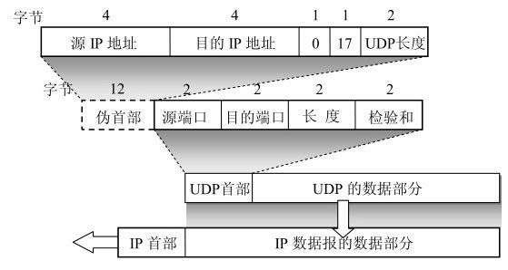

# UDP

用户数据报协议UDP只在IP的数据报服务之上增加了很少一点的功能，这就是复用和分用的功能以及差错检测的功能。UDP的主要特点是：

* UDP是无连接的，即发送数据之前不需要建立连接（当然，发送数据结束时也没有连接可释放），因此减少了开销和发送数据之前的时延。

* UDP使用尽最大努力交付，即不保证可靠交付，因此主机不需要维持复杂的连接状态表

* UDP是面向报文的。发送方的UDP对应用程序交下来的报文，在添加首部后就向下交付IP层。UDP对应用层交下来的报文，既不合并，也不拆分，而是保留这些报文的边界。这就是说，应用层交给UDP多长的报文，UDP就照样发送，即一次发送一个报文，如图5-4所示。在接收方的UDP，对IP层交上来的UDP用户数据报，在去除首部后就原封不动地交付上层的应用进程。也就是说，UDP一次交付一个完整的报文。因此，应用程序必须选择合适大小的报文。若报文太长，UDP把它交给IP层后，IP层在传送时可能要进行分片，这会降低IP层的效率。反之，若报文太短，UDP把它交给IP层后，会使IP数据报的首部的相对长度太大，这也降低了IP层的效率。

    

* UDP没有拥塞控制,因此网络出现的拥塞不会使源主机的发送速率降低

* UDP支持一对一、一对多、多对一和多对多的交互通信。

* UDP的首部开销小，只有8个字节，比TCP的20个字节的首部要短。

## UDP的首部格式

用户数据报UDP有两个字段：数据字段和首部字段。首部字段很简单，只有8个字节，由四个字段组成，每个字段的长度都是两个字节。各字段意义如下：

* 源端口 源端口号。在需要对方回信时选用。不需要时可用全0。

* 目的端口 目的端口号。这在终点交付报文时必须要使用到。

* 长度 UDP用户数据报的长度，其最小值是8（仅有首部）。

* 检验和 检测UDP用户数据报在传输中是否有错。有错就丢弃

UDP用户数据报首部中检验和的计算方法有些特殊。在计算检验和时，要在UDP用户数据报之前增加12个字节的伪首部。所谓“伪首部”是因为这种伪首部并不是UDP用户数据报真正的首部。只是在计算检验和时，临时添加在UDP用户数据报前面，得到一个临时的UDP用户数据报。检验和就是按照这个临时的UDP用户数据报来计算的。伪首部既不向下传送也不向上递交，而仅仅是为了计算检验和。

UDP计算检验和的方法和计算IP数据报首部检验和的方法相似。但不同的是：IP数据报的检验和只检验IP数据报的首部，但UDP的检验和是把首部和数据部分一起都检验。

