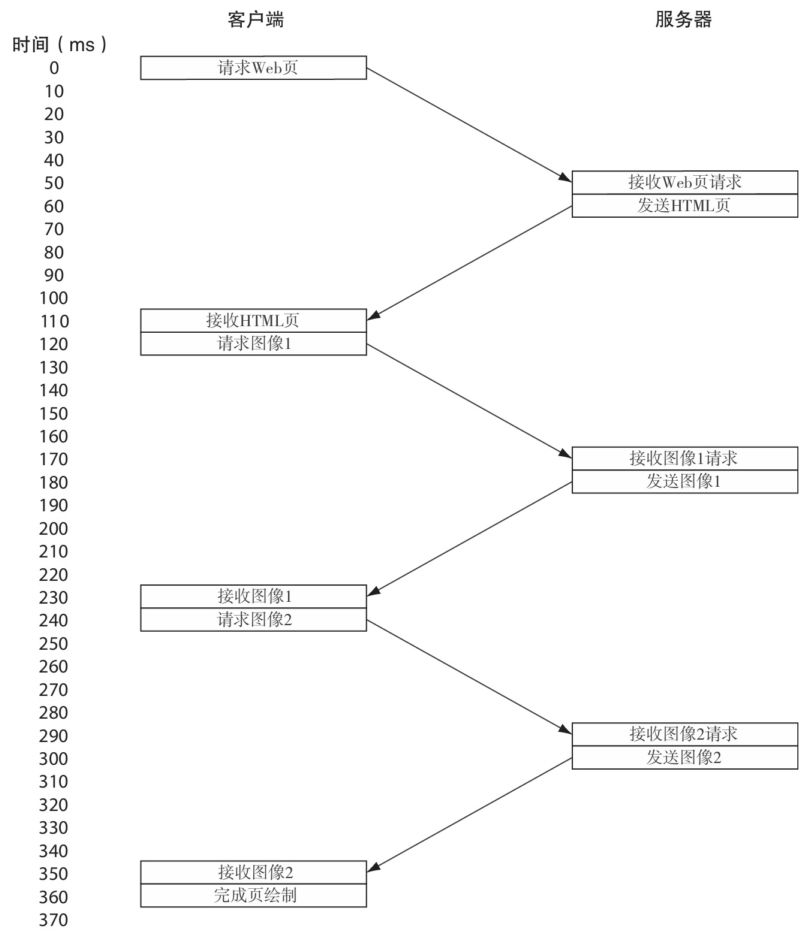
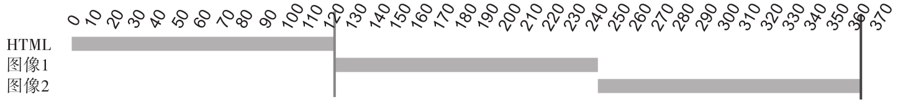
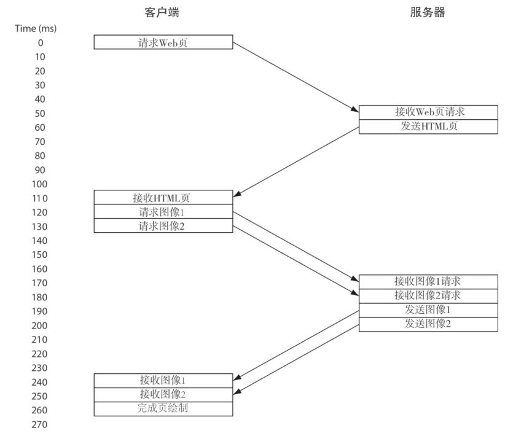
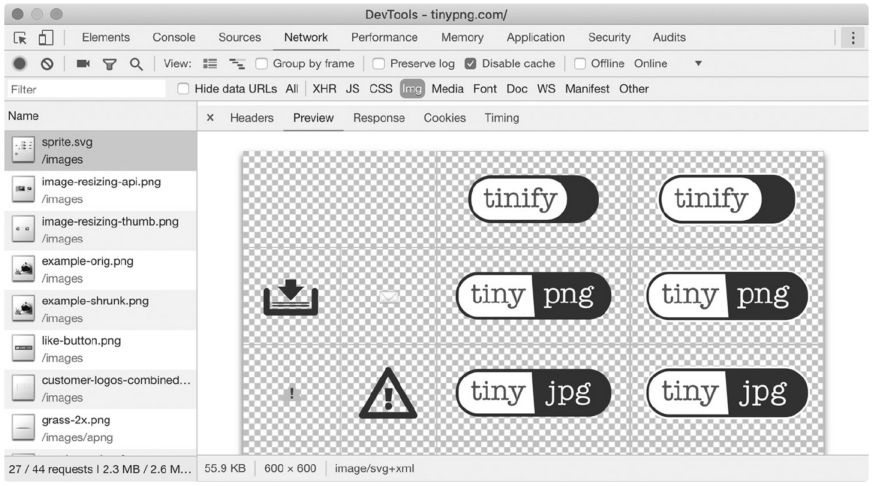

## http性能问题

* 同一个域名下，第二个请求需要等待第一个请求完成

    
    

* HTTP/1.1尝试引入管道化，从而在收到响应之前并发发出请求，实现并行发送请求。初始的HTML仍然需要单独请求，但是当浏览器知道它需要两个图像时，它可以先后连续发出两个请求。需要按照请求的顺序返回响应。如果图像2可用，但必须从另一台服务器获取图像1，则图像2的响应会等待，即使应该可以立即发送图像2。此问题被称为队头（HOL）阻塞问题。

    
    

    
## http性能优化

* 使用多个HTTP连接
* 合并HTTP请求

打开多个连接是解决HTTP/1.1阻塞问题的最简单方法，这样可以同时开启多个HTTP请求。另外，与管道化技术不同，该技术不会导致HOL阻塞，因为每个HTTP连接都独立于其他HTTP连接。因此，大多数浏览器可以为每个域名打开6个连接。

为了进一步突破6个连接的限制，许多网站从子域（例如，static.example.com）提供静态资源，如图像、CSS和JavaScript，Web浏览器从而可以为每个新域名打开另外6个连接。这种技术称为域名分片。

开启多个HTTP连接的主要问题是，没有充分利用底层的TCP协议。开启TCP会存在建立连接的开销和慢启动问题。所以，在TCP和HTTPS的层面，开启多个连接并不高效，尽管在HTTP的层面这么做是一种很棒的优化。这个解决HTTP/1.1延迟问题的方案需要更多额外的请求和响应，所以这个方案反而可能会导致延迟问题，这本是它应该解决的问题。另外，当这些新增的TCP连接达到了TCP的最佳效率，网页所需要的大量资源已经加载完成后，这些增加的连接就没用了。

另外一个常见的优化技术是发送更少的请求，包括：减少不必要的请求（比如在浏览器中缓存静态资源），以更少的HTTP请求获取同样的资源。前一种方法会使用到HTTP首部配置，后一种方法需要打包合并静态资源。

对于图片来说，这种打包技术叫作精灵图。例如，如果你网站上有很多社交网站图标，则每个网站图标都可以使用一个单独的图片。但这种方式会导致很多低效的HTTP请求排队，因为图片比较小，所以相对于下载这些图片所需要的时间，发送请求的时间可能会较长。所以，可以将它们合并到一张大的图片里面，然后使用CSS来定位图片位置，让它们看起来像是独立的图片，这样更高效。

如果是CSS和JavaScript文件，很多网站就将多个文件合并为一个文件，这样需要的请求数就少了，但是总的代码量并不少。在合并文件的时候，通常还会去掉代码中不必要的空格、注释和其他不必要的元素，以减小CSS和JavaScript的文件尺寸。

其他的技术还包括内联资源到其他文件。比如，Critical CSS经常直接被内联在HTML的\<style>标签中。图片可以包含在CSS中，通过行内SVG，或者转换为Base64编码，也能减少HTTP请求数。

这个方案的主要问题是它引入的复杂度。创建精灵图需要额外的操作，通过独立的文件来提供图片更简单。

另外一个问题是，合并会导致文件的浪费。一些网页可能只用到一张精灵图中的一两个图标，但却要下载整张精灵图。我们很难知道精灵图中哪些元素还在用，哪些需要删掉。当有新的精灵图时，还要重写CSS文件，以防止新的精灵图中图标的位置发生变化。同样，如果合并了太多文件，JavaScript也可能会变得臃肿。有时候我们只需要其中的很少一部分，却要下载一个大得多的文件。无论是从网络的方面（特别在开始的时候，TCP启动慢）还是从浏览器执行的方面（浏览器需要处理它不需要的代码）来说，这种技术都不够高效。

归根到底，优化HTTP/1性能的方法是一些解决HTTP/1基础缺陷的小技巧。应该有更好的办法在协议层面解决这个问题，从而节省时间，这正是HTTP/2要做的。