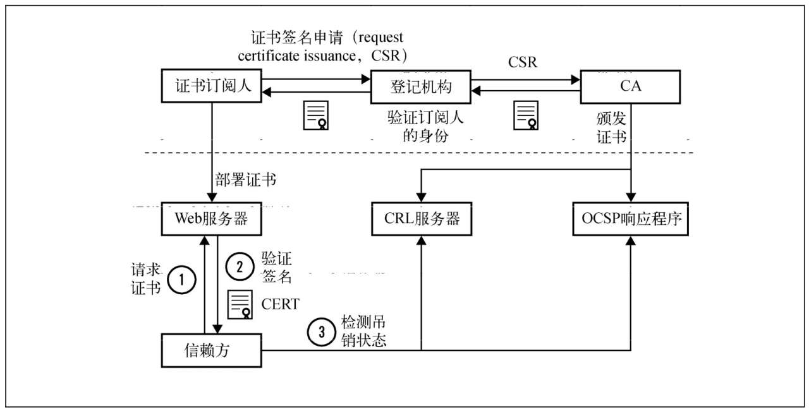
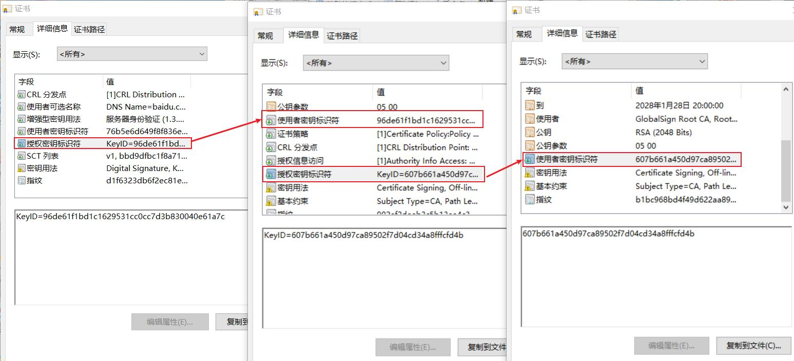
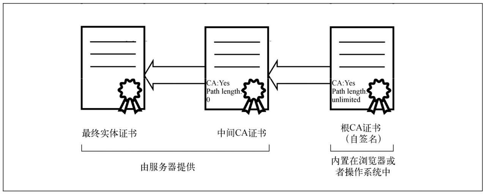

# PKI

如果部署了加密，攻击者也许有能力得到加密数据的访问权限，但是不能解密数据或者篡改数据。为了避免伪装攻击，SSL和TLS依赖另外一项被称为公钥基础设施（public keyinfrastructure, PKI）的重要技术，确保将流量发送到正确的接收端。

SSL协议由Netscape公司开发，历史可以追溯到NetscapeNavigator浏览器统治互联网的时代。协议的第一个版本从未发布过，第二版则于1994年11月发布。第一次部署是在Netscape Navigator 1.1浏览器上，发行于1995年3月。SSL 2的开发基本上没有与Netscape以外的安全专家进行过商讨，所以有严重的弱点，被认为是失败的协议，最终退出了历史的舞台。这次失败使Netscape专注于SSL 3，并于1995年年底发布。虽然名称与早先的协议版本相同，但SSL 3是完全重新设计的协议。该设计一直沿用到今天。1996年5月，TLS工作组成立，开始将SSL从Netscape迁移至IETF。由于Microsoft和Netscape当时正在为Web的统治权争得不可开交，整个迁移过程进行得非常缓慢、艰难。最终，TLS1.0于1999年1月问世，见RFC 2246。尽管与SSL 3相比，版本修改并不大，但是为了取悦Microsoft，协议还是进行了更名。

## 互联网PKI证书生命周期

PKI的目标就是实现不同成员在不见面的情况下进行安全通信，我们当前采用的模型是基于可信的第三方机构，也就是证书颁发机构（certification authority或certificate authority, CA）签发的证书。互联网PKI证书生命周期如图:

CA会根据不同类型的证书申请，执行不同的验证流程：

* 域名验证 

    域名验证（domain validated, DV）证书需要CA验证订阅人对域名的所有权之后才能进行签发。大多数情况下CA会发送一封确认邮件给域名的管理邮箱，管理员通过之后（按照邮件里面的步骤和链接）CA就会签发证书。如果无法通过邮件确认，那么CA通过别的通信手段（例如电话或者邮寄信件）或者合理的方式证明订阅人对域名的所有权之后就可以签发证书。签发IP地址证书的步骤也是类似的。

* 组织验证

    组织验证（organization validated, OV）证书会对身份和真实性进行验证。直到采用了Baseline Requirements之后，OV证书的验证流程才标准化起来，但是在如何签发OV证书以及如何将这些信息编码到证书中等方面，依旧存在很多前后不一致的情况。

* 扩展验证

    扩展验证（extended validation, EV）证书以更加严格的要求验证身份和真实性。它是为了解决OV证书缺乏的前后一致性而引入的，所以EV证书的验证流程非常详细，几乎不会出现前后不一致的情况。

>CA在验证成功之后就会签发证书。除了证书本身，CA还会提供所有的中间证书，从而构建证书链到对应的根证书上    

## PKI标准X.509
互联网公钥基础设施可以追溯到X.509，它是一种公钥基础设施的国际标准，最初是为了支持X.500而设计的。X.500是电子目录服务的标准，但是从来没有被广泛使用过；X.509经PKIX工作组的改造，适合在互联网上使用。

## 证书

证书是一个包含公钥、订阅人相关信息以及证书颁发者数字签名的数字文件，也就是一个让我们可以交换、存储和使用公钥的壳。因此，证书成为了整个PKI体系的基础组成元素。

 ASN.1、BER、DER和PEM

 抽象语法表示法一（abstract syntaxnotation one, ASN.1）是支持复杂数据结构和对象的定义、传输、交换的一系列规则。ASN.1是为了支持不同平台的网络通信而设计，与机器架构以及语言实现无关。

 ASN.1以一种抽象的方式定义数据，如何编码数据则在另外一份标准里面。基本编码规则（basic encoding rules, BER）是第一个数据编码标准。X.509依赖于的唯一编码规则（distinguished encoding rules, DER）是BER的子集，只允许一种方式编码ASN.1的值，这种唯一性对密码学尤其是数字签名的使用非常关键。PEM（privacy-enhanced mail的简写，在此上下文中无含义）是DER使用Base64编码后的ASCII编码格式。 
 
 大多数的证书都是PEM格式（因为这种格式更容易发送、复制和粘贴），当然有时候你也许会遇到DER格式。可以使用OpenSSL x509命令进行不同格式之间的转换。

 ### 证书字段

 证书由一些字段组成，在版本3里还包括一些扩展。从表面上来看，证书的结构是扁平而线性的，但是一些字段还包括了别的结构。

 * 版本

    证书一共有3个版本号，分别用0、1、2编码表示版本1、版本2和版本3。版本1只支持简单的字段，版本2增加了两个标识符（新增的字段），而版本3则增加了扩展功能。

* 序列号

    CA用来唯一标识其所签发的证

* 签名算法

    这个字段指明证书签名所用的算法，需要放到证书里面，这样才能被证书签名保护。

* 颁发者

    颁发者（issuer）字段包括了证书颁发者的可分辨名称（distinguished name,DN），这个字段比较复杂，根据不同的实体会包含许多部分。举例来说，Verisign根证书的可分辨名称是/C=US/O=VeriSign, Inc./OU=Class 3Public Primary Certification Authority；它包括了国家、组织和组织单位三个部分。

* 有效期

    证书的有效期包括开始日期和结束日期，在这段时间内证书是有效的。

* 使用者

    使用者是实体的可分辨名称，和公钥一起用于证书的签发。在自签名证书里，使用者（subject）和颁发者（issuer）字段的可分辨名称是一样的。在最开始，可分辨名称里面的公用名（common name,CN）主要用于服务器主机名（例如/CN=www.example.com用于www.example.com域名的证书），但是如何为一个证书匹配多个主机名就变得比较麻烦了。如今，使用者字段已经废弃，转而使用使用者可选名称扩展。

* 公钥

    这个字段包含了公钥，以使用者公钥信息（subject public-key info）结构呈现（主要是算法ID，可选参数以及公钥本身）

### 证书扩展

为了让原本死板的证书格式变得更加灵活，版本3引入了证书扩展。每一个扩展都包括唯一的对象标识符（object identifier, OID）、关键扩展标识器以及ASN.1格式的值。如果将某个扩展设置为关键扩展，那么客户端必须能够解析和处理这个扩展，否则就应该拒绝整张证书。

* 使用者可选名称

    原本使用者证书字段（更准确地说是其中的通用名部分）是用来将身份信息和公钥绑定在一起的。而在实际使用的时候发现使用者字段不够灵活，只能支持与一个主机名进行绑定，无法同时处理多个身份信息。使用者可选名称扩展就是为了替换使用者字段，它支持通过DNS名称、IP地址和URI来将多个身份绑定在一起。

* 名称约束

    名称约束扩展可以限制CA签发证书的对象，这样命名空间就在可控范围内。这个功能非常有用，例如，它允许一个组织可以拥有一个二级CA，而这个CA只能签发这个公司所拥有的那些域名下的证书。

 * 基础约束

    基础约束扩展用来表明证书是否为CA证书，同时通过路径长度（path length）约束字段，来限制二级CA证书路径的深度（例如限制CA证书是否可以签发更深一层的CA证书以及能签发多少层）。

* 密钥用法

    该扩展定义了证书中密钥可以使用的场景，这些场景已经定义好了，可以通过设置来让证书支持某个场景。例如CA证书一般都设置了证书签名者（certificatesigner）和CRL签名者（CRL signer）

* 扩展密钥用法

    为了更加灵活地支持和限制公钥的使用场景，该扩展可以通过OID支持更多的场景。

* 证书策略

    该扩展包含了一个或多个策略，每个策略都包括一个OID和可选限定符（qualifier）。限定符一般包括一个URI，从这个URI可以获得完整的策略说明。Baseline Requirements要求每一张最终实体证书需要包括至少一条策略信息，来表明该证书是在何种条款下签发的。另外这个扩展还能表明证书的验证类型。

* CRL分发点

    该扩展用来确定证书吊销列表（certificaterevocation list, CRL）的LDAP或者HTTPURI地址。按照Baseline Requirements，每一张证书都至少需要包括CRL或者OCSP吊销信息。

* 颁发机构信息访问

    颁发机构信息访问扩展表明如何访问签发CA提供的额外信息和服务，其中之一就是OCSP响应程序的HTTP URI地址。信赖方可以使用这个服务来实时检测证书的吊销信息。另外还有一些证书包含了签发CA的URI地址，有了这个地址，即便服务器返回的证书链中缺少了签发CA的证书，客户端也可以通过下载签发CA重新构建证书链。

* 使用者密钥标识符

    该扩展包含了唯一的值，可以用来识别包含特别公钥的证书，一般建议使用公钥本身来建立这个标识符（例如通过散列）。所有的CA证书都必须包含这个扩展，并且它的值要与CA签发出来的证书上的授权密钥标识符的值一样。

* 授权密钥标识符

    这个扩展的内容是签发此证书的CA的唯一标识符(等于签发者的使用者密钥标识符)，通常用于在构建证书链时找到颁发者的证书。 

* ...

  

## 证书链

在大多数情况下，仅仅有最终实体证书是无法进行有效性验证的，所以在实践中，服务器需要提供证书链才能一步步地最终验证到可信根证书。

### 交叉证书

交叉证书是可以让新的CA立即投入运营的唯一方式。因为想要在短期内让新的根证书部署得足够广泛是不可能的，所以新的CA都会找已经进行广泛内置的CA对他们的根密钥进行签名。随着时间的流逝，那些老的设备会逐渐淘汰掉，新的CA才能最终独立使用。

### 划分

CA在将它的操作分散给很多二级CA的同时有可能会带来更多的风险。例如不同的二级CA用于签发不同的证书类型，或者由不同的业务部门使用。与根证书不同的是，二级CA一般都是在线的，而且使用自动化系统签发证书。

### 委派

还有一些情况是CA希望给外部其他组织签发一个二级CA。例如一家大的公司可能希望可以自己签发它所拥有的那些域名的证书（这种方式通常比去维护私有CA，并确保所有设备都内置这个CA来说成本更低）。有时候一些组织希望能够完全保管这个二级CA，这时候CA就会从技术上限制这个二级CA只能签发某些域名；其他情况下CA依旧可以控制二级CA签发出来的证书。

服务器一次只能提供一条证书链，而实际上可能存在多条可信路径。以交叉证书为例，一条可信路径可以一直到CA的主要根证书，另外一条则是到可选根证书上。路径的建立让整个事情变复杂了，而且导致了很多问题。服务器必须提供完整并且有效的证书链。

## 吊销

当出现私钥泄露或者不再需要使用的时候，我们就需要吊销证书。但是这里存在误用的风险。吊销协议和流程的设计是为了确保证书是有效的，否则就需要将吊销情况通知信赖方。现在有下面两种证书吊销标准。

* 证书吊销列表

    证书吊销列表（certificate revocation list, CRL）是一组未过期、但是却已经被吊销的证书序列号列表，CA维护了一个或多个这样的列表。每一张证书都需要在CRL分发点（CRL distributionpoint）扩展中包含对应的CRL地址。CRL最大的问题在于它越来越大，实时查询起来会非常慢。

* 在线证书状态协议

    在线证书状态协议（online certificate status protocol, OCSP）允许信赖方获得一张证书的吊销信息。OCSP服务器通常称为OCSP响应程序，OCSP响应程序的地址编码在颁发机构信息访问（authority information access, AIA）证书扩展中。OCSP支持实时查询并且解决了CRL最大的缺点，但是并没有解决所有的吊销问题：因为OCSP的使用带来了性能、隐私方面的问题和新的漏洞。其中一部分问题可以通过OCSP stapling技术来解决，它允许服务器在TLS握手的过程中直接嵌入OCSP响应。

 >HTTP严格传输安全（HTTP strict transport security, HSTS）的新标准出现了，它要求所有实现它的浏览器用错误替换警告，并且不允许忽略错误。 
