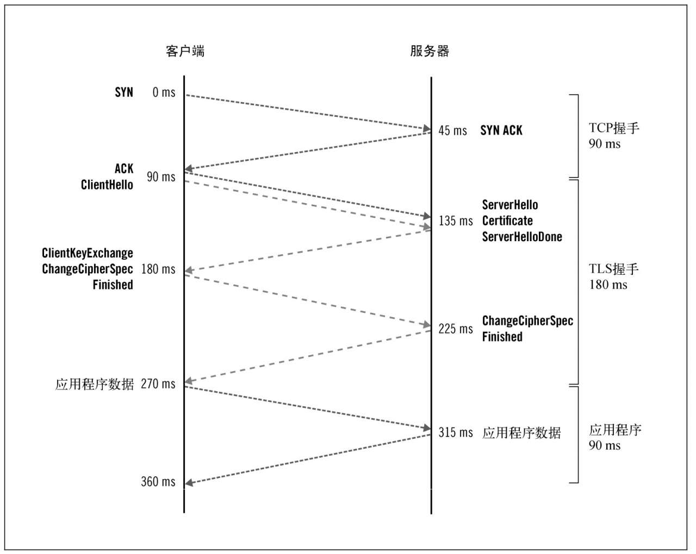

# 性能优化

## 延迟和连接管理

网络通讯的速度由两个主要因素决定：带宽和延迟。带宽用来衡量在单位时间内有多少数据可发送；延迟则描述一个消息从一端发送到另一端接收所需的时间。在这两者中，带宽是相对次要因素，因为通常你可以随时购买更多带宽；而延迟是无法避免的，因为它是在数据通过网络连接传输时被强加的限制。

延迟对于交互消息是一大限制因素。在典型的请求-响应协议中，请求到达其目的地并且等待响应返回需要一定的时间。这是我们测量延迟的措施，被称为往返时间（round-trip time, RTT）。

例如，每个TCP连接以三次握手开始：(1) 客户端发送一个SYN消息请求新的连接；(2) 服务器接受并以SYN ACK作出响应；(3) 客户端以ACK确认响应，并开始发送数据。它采用1.5次往返完成握手。在实践中，使用客户端先行（client-speaks-first）的协议，如HTTP和TLS协议，实际的延迟是一次往返，因为客户端可以在ACK信号之后立即发送数据。如下图：

### TCP优化

TCP内置的拥塞控制（congestion control）机制。在一个新的连接开始时，你不知道对端有多快。如果有足够的带宽，你可以用最快的速度传送数据，但如果你正在处理一个缓慢的移动网络连接呢？如果发送的数据太多，你会压跨连接，导致连接中断。出于这个原因，每一个TCP连接都有一个称为拥塞窗口（congestion window）的速度极限。这个窗口最初时较小，在可靠性能保证的情况下随时间增长。这种机制被称为慢启动（slow start）。

TLS握手消息消耗了宝贵的初始连接字节（当拥塞窗口较小时）。如果拥塞窗口足够大，那么慢启动不会有额外的延迟。但是，如果较长的握手消息超过了拥塞窗口大小，发送方将必须把它拆分成两块，先发送一块，等待确认（一个往返），增加拥塞窗口，然后再发送剩下的部分。

1. 初始拥塞窗口调优

    启动速度限制被称为初始拥塞窗口（initial congestion window,initcwnd）。如果要在现代平台上部署，则很可能已将初始拥塞窗口设置为一个较高的值。

2. 防止空闲时慢启动

    慢启动可以作用于一段时间内没有任何流量的连接上，降低其速度，并且速度下降非常快。可以在连接空闲时禁用慢启动

### 长连接

大部分TLS性能影响集中在每一个连接的开始握手阶段。一个重要的优化技术是在连接数允许的情况下尽可能保持每个连接不断开。有了长连接，可以最小化TLS开销，同时也提高了TCP的性能。

长连接的缺点是在最后一个HTTP连接完成之后，服务器在关闭连接之前会等待一定时间（保持活动状态超时，keep-alivetimeout）。

