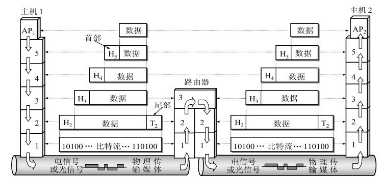

# TCP/IP五层模型

计算机与计算机之间要有统一的连接标准才能够完成相互通信，这个标准被称为互联网协议，而网络就是物理链接介质+互联网协议。按照功能不同，人们将互联网协议从不同维度分为OSI七层、TCP/IP五层或TCP/IP四层，如下图所示。

每层运行的常见设备如下图所示

建立七层模型的主要目的是解决异种网络互联时所遇到的兼容性问题。它的最大优点是将服务、接口和协议这三个概念明确地区分开来：服务说明某一层为上一层提供一些什么功能，接口说明上一层如何使用下一层的服务，而协议涉及如何实现本层的服务；这样各层之间具有很强的独立性，互联网络中各实体采用什么样的协议是没有限制的，只要向上提供相同的服务并且不改变相邻层的接口就可以。其详细结构如下图所示。

## 物理层(physical layer)

物理层主要是基于电器特性发送高低电平信号，电平即“电压平台”，指的是电路中某一点电压的高低状态，在网络信号中高电平用数字“1”表示，低电平用数字“0”表示。电平的高低是个相对概念，3V对于7V是低电平，但对于1V就是高电平。

可以将物理层的主要任务描述为确定与传输媒体的接口有关的一些特性，即：

(1) 机械特性 指明接口所用接线器的形状和尺寸，引脚数目和排列，固定和锁定装置，等等。平时常见的各种规格的接插件都有严格的标准化的规定。         

(2) 电气特性 指明在接口电缆的各条线上出现的电压的范围。

(3) 功能特性 指明某条线上出现的某一电平的电压表示何种意义。

(4) 过程特性 指明对于不同功能的各种可能事件的出现顺序。

通信的目的是传送消息(message)。如话音、文字、图像、视频等都是消息。数据(data)是运送消息的实体，通常是有意义的符号序列；这种信息的表示可用计算机处理或产生，信号(signal)则是数据的电气或电磁的表现。

## 数据链路层(data link layer)

数据链路层常简称为链路层。我们知道，两台主机之间的数据传输，总是在一段一段的链路上传送的，这就需要使用专门的链路层的协议。在两个相邻结点之间传送数据时，数据链路层将网络层交下来的IP数据报组装成帧（framing），在两个相邻结点间的链路上传送帧（frame）。每一帧包括数据和必要的控制信息（如同步信息、地址信息、差错控制等）。在接收数据时，控制信息使接收端能够知道一个帧从哪个比特开始和到哪个比特结束。这样，数据链路层在收到一个帧后，就可从中提取出数据部分，上交给网络层。

>由于单纯的电平信号“0”和“1”没有任何意义，在实际应用中，我们会将电平信号进行分组处理，多少位一组、每组什么意思，这样数据才有具体的含义。数据链路层的功能就是定义电平信号的分组方式。

据链路层协议有许多种，但有三个基本问题则是共同的。这三个基本问题是：封装成帧、透明传输和差错检测。

1. 封装成帧

    装成帧(framing)就是在一段数据的前后分别添加首部和尾部，这样就构成了一个帧。接收端在收到物理层上交的比特流后，就能根据首部和尾部的标记，从收到的比特流中识别帧的开始和结束。分组交换的一个重要概念就是：所有在因特网上传送的数据都是以分组（即IP数据报）为传送单位的。网络层的IP数据报传送到数据链路层就成为帧的数据部分。在帧的数据部分的前面和后面分别添加上首部和尾部，构成了一个完整的帧。这样的帧就是数据链路层的数据传送单元。一个帧的帧长等于帧的数据部分长度加上帧首部和帧尾部的长度。首部和尾部的一个重要作用就是进行帧定界（即确定帧的界限）。此外，首部和尾部还包括许多必要的控制信息。在发送帧时，是从帧首部开始发送。各种数据链路层协议都对帧首部和帧尾部的格式有明确的规定。显然，为了提高帧的传输效率，应当使帧的数据部分长度尽可能地大于首部和尾部的长度。但是，每一种链路层协议都规定了所能传送的帧的数据部分长度上限—最大传送单元MTU (Maximum Transfer Unit)。

    

2. 透明传输

    由于帧的开始和结束的标记是使用专门指明的控制字符，因此，所传输的数据中的任何8比特的组合一定不允许和用作帧定界的控制字符的比特编码一样，否则就会出现帧定界的错误。    

    为了解决透明传输问题，就必须设法使数据中可能出现的控制字符“SOH”(Start Of Header，表示帧开始)和“EOT” (End Of Transmission，表示帧结束)在接收端不被解释为控制字符。具体的方法是：发送端的数据链路层在数据中出现控制字符“SOH”或“EOT”的前面插入一个转义字符“ESC”(其十六进制编码是1B，二进制是00011011)。而在接收端的数据链路层在把数据送往网络层之前删除这个插入的转义字符。这种方法称为字节填充(byte stuffing)或字符填充(character stuffing)。如果转义字符也出现在数据当中，那么解决方法仍然是在转义字符的前面插入一个转义字符。因此，当接收端收到连续的两个转义字符时，就删除其中前面的一个。下图表示用字节填充法解决透明传输的问题。

    

3. 差错检测

    在数据链路层使用CRC检验，能够实现无比特差错的传输，但这还不是可靠传输。

    过去OSI的观点是：必须让数据链路层向上提供可靠传输。因此在CRC检错的基础上，增加了帧编号、确认和重传机制。收到正确的帧就要向发送端发送确认。发送端在一定的期限内若没有收到对方的确认，就认为出现了差错，因而就进行重传，直到收到对方的确认为止。这种方法在历史上曾经起到很好的作用。但现在的通信线路的质量已经大大提高了，由通信链路质量不好引起差错的概率已经大大降低。因此，现在因特网就采取了区别对待的方法：对于通信质量良好的有线传输链路，数据链路层协议不使用确认和重传机制，即不要求数据链路层向上提供可靠传输的服务。如果在数据链路层传输数据时出现了差错并且需要进行改正，那么改正差错的任务就由上层协议（例如，运输层的TCP协议）来完成。
    
    对于通信质量较差的无线传输链路，数据链路层协议使用确认和重传机制，数据链路层向上提供可靠传输的服务

在通信线路质量较差的年代，在数据链路层使用可靠传输协议曾经是一种好办法。因此，能实现可靠传输的高级数据链路控制HDLC (High-level DataLink Control)就成为当时比较流行的数据链路层协议。但现在HDLC已很少使用了。对于点对点的链路，简单得多的点对点协议PPP (Point-to-PointProtocol)则是目前使用得最广泛的数据链路层协议。

PPP这种数据链路层的协议非常简单：接收方每收到一个帧，就进行CRC检验。如CRC检验正确，就收下这个帧；反之，就丢弃这个帧，其他什么也不做。

1. 以太网协议

    数据链路层使用以太网协议进行数据传输，基于MAC地址的广播方式实现数据传输，只能在局域网内广播。早期各个公司都有自己的分组方式，后来形成了统一的标准，即以太网协议Ethernet。

2. Ethernet以太网

    由一组电平信号构成一个数据包，叫作“帧”，每一数据帧由报头Head和数Data两部分组成，如下图所示。

    

    Head：固定18字节，其中发送者/源地址6字节，接收者/目标地址6字节，数据类型6字节。
    
    Data：最短46字节，最长1500字节。

    数据包的具体内容格式为：Head长度+Data长度=最短64字节，最长1518字节（超过最大限制就分片发送）。

3. MAC地址

    Head中包含的源地址和目标地址的由来：Ethernet规定接入Internet的设备必须配有网卡，发送端和接收端的地址便是指网卡的地址，即MAC地址。

    MAC地址：每块网卡出厂时都被印上一个世界唯一的MAC地址，它是一个长度为48位的二进制数，通常用12位十六进制数表示（前6位是厂商编号，后6位是流水线号）。

4. Broadcast广播

    有了MAC地址，同一网络内的两台主机就可以通信了（一台主机通过ARP协议获取另外一台主机的MAC地址）。以太网通信数据帧的详细示意图：

    

其实Ethernet采用非常原始的广播方式进行通信，也就是说计算机之间的通信基本靠“吼”。例如，有多台PC组成了一个网络，并通过硬件设施链接具备了通信条件，如下图所示。

 

上图中，PC1按照固定协议格式以广播的方式发送以太网包给PC4，然而，PC2、PC3、PC5都会收到PC1发来的数据包，拆开后如果发现目标MAC地址不是自己就会丢弃，如果是自己就响应。

## 网络层(network layer)

网络层负责为分组交换网上的不同主机提供通信服务。在发送数据时，网络层把运输层产生的报文段或用户数据报封装成分组或包(packet)进行传送。在TCP/IP体系中，由于网络层使用IP协议，因此分组也叫作 IP数据报，或简称为数据报(datagram).

有了Ethernet、MAC地址、广播的发送方式，世界上的计算机就可以彼此进行通信了，问题是世界范围的互联网是由一个个彼此隔离的小的局域网组成的（如下图所示），如果所有的通信都采用以太网的广播方式，那么一台机器发送的数据包全世界都会收到，这就不仅仅是效率低的问题了，这会是一种灾难。

 

 全世界的大网络由一个个小的彼此隔离的局域网组成，以太网包只能在一个局域网内发送，一个局域网是一个广播域，跨广播域通信只能通过路由转发。由此得出结论：必须找出一种方法来区分哪些计算机属于同一广播域，哪些不是。如果是就采用广播的方式发送，如果不是就采用路由的方式发送（向不同广播域/子网分发数据包），MAC地址是无法区分的，它只跟厂商有关，网络层就是用来解决这一问题的。网络层的作用就是引入一套新的地址来区分不同的广播域/子网，这套地址叫作网络地址。

与IP协议配套使用的还有三个协议： 

* 地址解析协议ARP (Address Resolution Protocol)
* 网际控制报文协议ICMP (Internet Control MessageProtocol)
* 网际组管理协议IGMP (Internet Group ManagementProtocol)

 

 从一般的概念来讲，将网络互相连接起来要使用一些中间设备。根据中间设备所在的层次，可以有以下四种不同的中间设备：
 
 (1) 物理层使用的中间设备叫做转发器(repeater)。
 
 (2) 数据链路层使用的中间设备叫做网桥或桥接器(bridge)。
 
 (3) 网络层使用的中间设备叫做路由器(router)。
 
 (4) 在网络层以上使用的中间设备叫做网关(gateway)。用网关连接两个不兼容的系统需要在高层进行协议的转换。

 所谓虚拟互连网络也就是逻辑互连网络，它的意思就是互连起来的各种物理网络的异构性本来是客观存在的，但是我们利用IP协议就可以使这些性能各异的网络在网络层上看起来好像是一个统一的网络。这种使用IP协议的虚拟互连网络可简称为IP网

 

物理地址是数据链路层和物理层使用的地址，而IP地址是网络层和以上各层使用的地址，是一种逻辑地址（称IP地址是逻辑地址是因为IP地址是用软件实现的）。

 1. IP

    网络地址的协议叫作IP（Internet Protocol，网际互联协议），它定义的地址称为IP地址。广泛采用v4版本即IPv4，规定网络地址由32位二进制数表示。其取值范围为：0.0.0.0～255.255.255.255。

    IP地址由两部分组成：网络部分（用来标识子网）和主机部分（用来标识主机）。

    >单纯的IP地址段只是标识了IP地址的种类，从网络部分或主机部分都无法辨识一个IP地址所处的子网。

2. 子网掩码

    所谓“子网掩码”，就是表示子网络特征的一个参数。它在形式上等同于IP地址，也是一个32位二进制数字，它的网络部分全部为1，主机部分全部为0。

    我们根据“子网掩码”就能判断任意两个IP地址是否处于同一个子网络。方法是将两个IP地址与子网掩码分别进行&运算，然后比较结果是否相同，如果相同，就表明它们在同一个子网络中，否则就不在。

> IP的作用主要有两个，一个是为每一台计算机分配IP地址，另一个是确定哪些地址在同一个子网络中。

3. IP数据包

    IP数据包也分为Head和Data两部分，无须为IP数据包定义单独的栏位，直接放入以太网包的Data部分即可。
    
    Head（IP头部）：长度为20～60字节。
    
    Data（IP数据）：最长为65515字节。

    而以太网数据包的Data部分，最长只有1500字节。因此，如果IP数据包超过1500字节，它就需要分割成几个以太网数据包，分开发送。其具体结构如下图所示。

     

4. ARP

    我们已经知道计算机通信方式基本靠“吼”，也就是广播的方式。所有上层的数据包到最后都要封装到以太网头，然后通过以太网协议发送。在谈及以太网协议的时候，我们已经了解到，通信基于MAC地址的广播方式实现的，计算机在发送数据包时，获取自身的MAC地址是容易的，获取目标主机的MAC地址，需要通过ARP（Address Resolution Protocol，地址解析协议）来实现。

## 传输层(transport layer)

传输层的任务就是负责向两个主机中进程之间的通信提供通用的数据传输服务。应用进程利用该服务传送应用层报文。

>网络层的IP地址帮我们区分子网，以太网层的MAC地址帮我们找到主机。大家使用的都是应用程序，你的计算机上可能同时开启QQ、微信等多个应用程序，那么我们通过IP地址和MAC地址找到了一台特定的主机，如何标识这台主机上的应用程序？答案就是端口，端口就是应用程序与网卡关联的编号。那么传输层就是用来建立端口到端口的通信机制的。

>主机端口的取值范围为0～65535，其中0～1023为系统保留端口的取值范围，也叫作BSD保留端口。用户可注册端口的取值范围为1024～49152，还有随机动态端口的取值范围为49152～65535。为什么取值范围只能为0～65535，多一个都不行？从协议来讲，在TCP头部留给存储端口的空间只有2字节，最大值就是65535。

运输层主要使用以下两种协议：

1. TCP(Transmission Control Protocol)

    TCP（Transmission Control Protocol，传输控制协议）提供面向连接的、可靠的数据传输服务，其数据传输的单位是报文段(segment)。其数据结构如下图所示。

    

2. UDP(User Datagram Protocol)

    UDP（User Datagram Protocol，用户数据报协议）提供无连接的、尽最大努力(best-effort)的数据传输服务（不保证数据传输的可靠性），其数据传输的单位是用户数据报。“报头”部分总共有8字节，总长度不超过65535字节，其数据结构如下图所示。

    

端口分为两大类:

* 服务器端使用的端口号

    * 系统端口号(熟知端口号) 数值为0～1023
    * 登记端口号 数值为1024～49151。这类端口号是为没有熟知端口号的应用程序使用的

* 客户端使用的端口号 数值为49152～65535。由于这类端口号仅在客户进程运行时才动态选择，因此又叫做短暂端口号。这类端口号是留给客户进程选择暂时使用。当服务器进程收到客户进程的报文时，就知道了客户进程所使用的端口号，因而可以把数据发送给客户进程。通信结束后，刚才已使用过的客户端口号就不复存在，这个端口号就可以供其他客户进程使用。

    

UDP在传送数据之前不需要先建立连接。远地主机的运输层在收到UDP报文后，不需要给出任何确认。

TCP则提供面向连接的服务。在传送数据之前必须先建立连接，数据传送结束后要释放连接。

## 应用层(application layer)

应用层的任务是通过应用进程间的交互来完成特定网络应用。应用层协议定义的是应用进程间通信和交互的规则。这里的进程(process)就是指主机中正在运行的程序。对于不同的网络应用需要有不同的应用层协议。

## 数据在各层之间的传递过程

假定主机1的应用进程AP1向主机2的应用进程AP2传送数据。AP1先将其数据交给本主机的第5层（应用层）。第5层加上必要的控制信息H5就变成了下一层的数据单元。第4层（运输层）收到这个数据单元后，加上本层的控制信息H4，再交给第3层（网络层），成为第3层的数据单元。依此类推。不过到了第2层（数据链路层）后，控制信息被分成两部分，分别加到本层数据单元的首部（H2）和尾部（T2）；而第1层（物理层）由于是比特流的传送，所以不再加上控制信息。请注意，传送比特流时应从首部开始传送。

当这一串的比特流离开主机1的物理层经网络的物理媒体（传输信道）传送到路由器时，就从路由器的第1层（物理层）依次上升到第3层（网络层）。每一层都是根据控制信息进行必要的操作，然后将控制信息剥去，将该层剩下的数据单元上交给更高的一层。当分组上升到了第3层时，就根据首部中的目的地址查找路由器中的路由表，找出转发分组的接口，然后往下传送到第2层（链路层），加上新的首部和尾部后，再到最下面的第1层，然后在物理媒体上把每一个比特发送出去。当这一串的比特流离开路由器到达目的站主机2时，就从主机2的第1层按照上面讲过的方式，依次上升到第5层。最后，把应用进程AP1发送的数据交给目的站的应用进程AP2。

