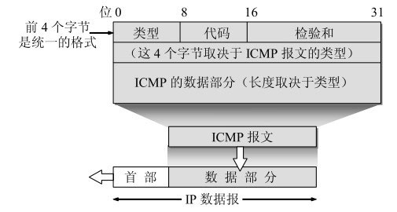
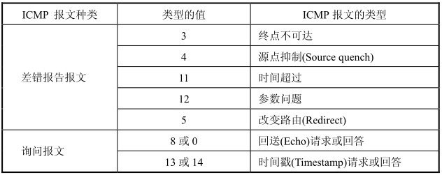
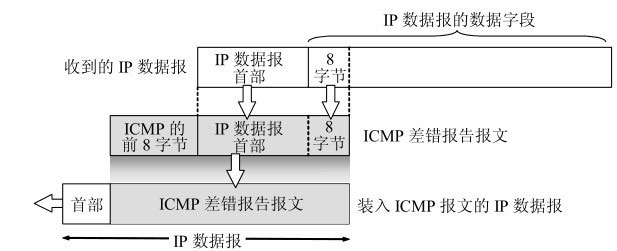

# ICMP

为了更有效地转发IP数据报和提高交付成功的机会，在网际层使用了网际控制报文协议ICMP (Internet Control Message Protocol)。ICMP允许主机或路由器报告差错情况和提供有关异常情况的报告。ICMP允许主机或路由器报告差错情况和提供有关异常情况的报告。ICMP是因特网的标准协议。但ICMP不是高层协议（看起来好像是高层协议，因为ICMP报文是装在IP数据报中，作为其中的数据部分），而是IP层的协议。ICMP报文作为IP层数据报的数据，加上数据报的首部，组成IP数据报发送出去。ICMP报文格式如图:

ICMP报文的种类有两种，即ICMP差错报告报文和ICMP询问报文。

ICMP报文的前4个字节是统一的格式，共有三个字段：即类型、代码和检验和。接着的4个字节的内容与ICMP的类型有关。最后面是数据字段，其长度取决于ICMP的类型。常用的ICMP报文类型：

ICMP报文的代码字段是为了进一步区分某种类型中的几种不同的情况。

检验和字段用来检验整个ICMP报文。我们应当还记得，IP数据报首部的检验和并不检验IP数据报的内容，因此不能保证经过传输的ICMP报文不产生差错。

ICMP差错报告报文共有五种：

* 终点不可达 当路由器或主机不能交付数据报时就向源点发送终点不可达报文

* 源点抑制 当路由器或主机由于拥塞而丢弃数据报时，就向源点发送源点抑制报文，使源点知道应当把数据报的发送速率放慢。

* 时间超过 当路由器收到生存时间为零的数据报时，除丢弃该数据报外，还要向源点发送时间超过报文。当终点在预先规定的时间内不能收到一个数据报的全部数据报片时，就把已收到的数据报片都丢弃，并向源点发送时间超过报文。

* 参数问题 当路由器或目的主机收到的数据报的首部中有的字段的值不正确时，就丢弃该数据报，并向源点发送参数问题报文

* 改变路由（重定向） 路由器把改变路由报文发送给主机，让主机知道下次应将数据报发送给另外的路由器（可通过更好的路由）。

所有的ICMP差错报告报文中的数据字段都具有同样的格式（图4-28）。把收到的需要进行差错报告的IP数据报的首部和数据字段的前8个字节提取出来，作为ICMP报文的数据字段。再加上相应的ICMP差错报告报文的前8个字节，就构成了ICMP差错报告报文。提取收到的数据报的数据字段的前8个字节是为了得到运输层的端口号（对于TCP和UDP）以及运输层报文的发送序号（对于TCP）。这些信息对源点通知高层协议是有用的。

常用的ICMP询问报文有两种：

* 回送请求和回答 ICMP回送请求报文是由主机或路由器向一个特定的目的主机发出的询问。收到此报文的主机必须给源主机或路由器发送ICMP回送回答报文。这种询问报文用来测试目的站是否可达以及了解其有关状态。

* 时间戳请求和回答 ICMP时间戳请求报文是请某个主机或路由器回答当前的日期和时间。在ICMP时间戳回答报文中有一个32位的字段，其中写入的整数代表从1900年1月1日起到当前时刻一共有多少秒。时间戳请求与回答可用来进行时钟同步和测量时间。

ICMP的一个重要应用就是分组网间探测PING (Packet InterNetGroper)，用来测试两个主机之间的连通性。PING使用了ICMP回送请求与回送回答报文。PING是应用层直接使用网络层ICMP的一个例子。它没有通过运输层的TCP或UDP。

另一个非常有用的应用是traceroute（这是UNIX操作系统中名字），它用来跟踪一个分组从源点到终点的路径。在Windows操作系统中这个命令是tracert。下面简单介绍这个程序的工作原理。Traceroute从源主机向目的主机发送一连串的IP数据报，数据报中封装的是无法交付的UDP用户数据报。第一个数据报P1的生存时间TTL设置为1。当P1到达路径上的第一个路由器R1时，路由器R1先收下它，接着把TTL的值减1。由于TTL等于零了，R1就把P1丢弃了，并向源主机发送一个ICMP时间超过差错报告报文。源主机接着发送第二个数据报P2，并把TTL设置为2。P2先到达路由器R1，R1收下后把TTL减1再转发给路由器R2。R2收到P2时TTL为1，但减1后TTL变为零了。R2就丢弃P2，并向源主机发送一个ICMP 时间超过差错报告报文。这样一直继续下去。当最后一个数据报刚刚到达目的主机时，数据报的TTL是1。主机不转发数据报，也不把TTL值减1。但因IP数据报中封装的是无法交付的运输层的UDP用户数据报，因此目的主机要向源主机发送ICMP终点不可达差错报告报文。这样，源主机达到了自己的目的，因为这些路由器和最后目的主机发来的ICMP报文正好给出了源主机想知道的路由信息—到达目的主机所经过的路由器的IP地址，以及到达其中的每一个路由器的往返时间。