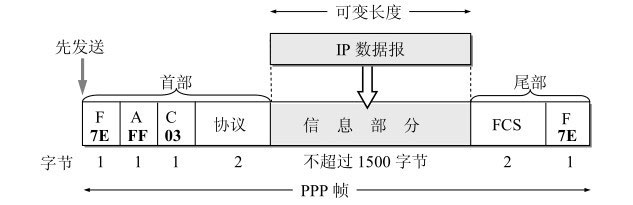

# PPP协议

## PPP协议的帧格式

1. 各字段的意义

    首部的第一个字段和尾部的第二个字段都是标志字段F (Flag)，规定为0x7E。标志字段表示一个帧的开始或结束。因此标志字段就是PPP帧的定界符。连续两帧之间只需要用一个标志字段。如果出现连续两个标志字段，就表示这是一个空帧，应当丢弃。

    首部中的地址字段A规定为0xFF（即11111111），控制字段C规定为0x03（即00000011）。最初曾考虑以后再对这两个字段的值进行其他定义，但至今也没有给出。可见这两个字段实际上并没有携带PPP帧的信息。

    PPP首部的第四个字段是2字节的协议字段。当协议字段为0x0021时，PPP帧的信息字段就是IP数据报。若为0xC021,则信息字段是PPP链路控制协议LCP的数据，而0x8021表示这是网络层的控制数据。

    信息字段的长度是可变的，不超过1500字节。尾部中的第一个字段（2字节）是使用CRC的帧检验序列FCS。

2. 字节填充

    当信息字段中出现和标志字段一样的比特(0x7E)组合时，就必须采取一些措施使这种形式上和标志字段一样的比特组合不出现在信息字段中。

    当PPP使用异步传输时，它把转义符定义为0x7D（即01111101），并使用字节填充， RFC 1662规定了如下所述的填充方法：(1) 把信息字段中出现的每一个0x7E字节转变成为2字节序列(0x7D,0x5E)。(2) 若信息字段中出现一个0x7D的字节（即出现了和转义字符一样的比特组合）, 则把0x7D转变成为2字节序列(0x7D, 0x5D)。(3) 若信息字段中出现ASCII码的控制字符（即数值小于0x20的字符），则在该字符前面要加入一个0x7D字节，同时将该字符的编码加以改变。例如，出现0x03（在控制字符中是“传输结束”ETX）就要把它转变为2字节序列(0x7D, 0x23)。由于在发送端进行了字节填充，因此在链路上传送的信息字节数就超过了原来的信息字节数。但接收端在收到数据后再进行与发送端字节填充相反的变换，就可以正确地恢复出原来的信息。

3. 零比特填充    

    ...

