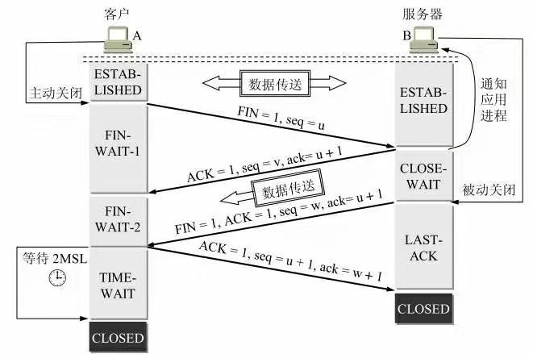

# TCP

## TCP报文结构

*  端口：用来标识同一台计算机的不同应用进程。

    源端口：源端口和IP地址的作用是标识报文的返回地址。

    目的端口：目的端口指明接收方计算机上的应用程序接口。

* 序号 占4字节。序号范围是[0, 232 - 1]，共232（即4 294 967296）个序号。序号增加到232 - 1后，下一个序号就又回到0。TCP是面向字节流的。在一个TCP连接中传送的字节流中的每一个字节都按顺序编号。整个要传送的字节流的起始序号必须在连接建立时设置。首部中的序号字段值则指的是本报文段所发送的数据的第一个字节的序号。

* 确认号 占4字节，是期望收到对方下一个报文段的第一个数据字节的序号。若确认号 = N，则表明：到序号N - 1为止的所有数据都已正确收到。

*  数据偏移 占4位，它指出TCP报文段的数据起始处距离TCP报文段的起始处有多远。这个字段实际上是指出TCP报文段的首部长度。由于首部中还有长度不确定的选项字段，因此数据偏移字段是必要的。但应注意，“数据偏移”的单位是32位字（即以4字节长的字为计算单位）。由于4位二进制数能够表示的最大十进制数字是15，因此数据偏移的最大值是60字节，这也是TCP首部的最大长度（即选项长度不能超过40字节）。

* 保留 占6位，保留为今后使用，但目前应置为0。

* 标志位：URG、ACK、PSH、RST、SYN、FIN，共6个，每一个标志位都表示一个控制功能，具体含义如下表所示。

    

* 窗口：滑动窗口大小，用来告知发送端接收端的缓存大小，以此控制发送端发送数据的速率，从而达到流量控制。窗口大小是一个16位属性，因而窗口大小最大为65535(64kb)。  

* 校验和：奇偶校验，此校验和针对整个TCP报文段，包括TCP头部和TCP数据

* 紧急URG (URGent) 当URG = 1时，表明紧急指针字段有效。它告诉系统此报文段中有紧急数据，应尽快传送(相当于高优先级的数据)，而不要按原来的排队顺序来传送。例如，已经发送了很长的一个程序要在远地的主机上运行。但后来发现了一些问题，需要取消该程序的运行。因此用户从键盘发出中断命令（Control + C）。如果不使用紧急数据，那么这两个字符将存储在接收TCP的缓存末尾。只有在所有的数据被处理完毕后这两个字符才被交付接收方的应用进程。这样做就浪费了许多时间。

* 选项 长度可变，最长可达40字节。当没有使用“选项”时，TCP的首部长度是20字节。

    * 最大报文段长度 MSS (MaximumSegment Size)，MSS是每一个TCP报文段中的数据字段的最大长度。数据字段加上TCP首部才等于整个的TCP报文段。
    * 窗口扩大选项
    * 时间戳选项
    * 选择确认选项

* 填充

10. 数据部分：TCP报文段中的数据部分是可选的。在一个连接建立和一个连接终止时，双方交换的报文段仅有TCP头部。如果一方没有数据要发送，也使用没有任何数据的头部来确认收到的数据。在处理超时的许多情况中，也会发送不带任何数据的报文段。

## 滑动窗口

TCP的滑动窗口是以字节为单位的。为了便于说明，我们故意把后面图5-15至图5-18中的字节编号都取得很小。现假定A收到了B 发来的确认报文段，其中窗口是20（字节），而确认号是31（这表明B期望收到的下一个序号是31，而序号30为止的数据已经收到了）。根据这两个数据，A就构造出自己的发送窗口，其位置如图:

我们先讨论发送方A的发送窗口。发送窗口表示：在没有收到B的确认的情况下，A可以连续把窗口内的数据都发送出去。凡是已经发送过的数据，在未收到确认之前都必须暂时保留，以便在超时重传时使用。

发送窗口里面的序号表示允许发送的序号。显然，窗口越大，发送方就可以在收到对方确认之前连续发送更多的数据，因而可能获得更高的传输效率。但接收方必须来得及处理这些收到的数据。发送窗口后沿的后面部分表示已发送且已收到了确认。这些数据显然不需要再保留了。而发送窗口前沿的前面部分表示不允许发送的，因为接收方都没有为这部分数据保留临时存放的缓存空间。

发送窗口的位置由窗口前沿和后沿的位置共同确定。发送窗口后沿的变化情况有两种可能，即不动（没有收到新的确认）和前移（收到了新的确认）。发送窗口后沿不可能向后移动，因为不能撤销掉已收到的确认。发送窗口前沿通常是不断向前移动，但也有可能不动。这对应于两种情况：一是没有收到新的确认，对方通知的窗口大小也不变；二是收到了新的确认但对方通知的窗口缩小了，使得发送窗口前沿正好不动。

发送窗口前沿也有可能向后收缩。这发生在对方通知的窗口缩小了。但TCP的标准强烈不赞成这样做。因为很可能发送方在收到这个通知以前已经发送了窗口中的许多数据，现在又要收缩窗口，不让发送这些数据，这样就会产生一些错误。

发送方的应用进程把字节流写入TCP的发送缓存，接收方的应用进程从TCP的接收缓存中读取字节流。下面我们就进一步讨论前面讲的窗口和缓存的关系。下图画出了发送方维持的发送缓存和发送窗口，以及接收方维持的接收缓存和接收窗口。

发送缓存用来暂时存放：

(1) 发送应用程序传送给发送方TCP准备发送的数据  
(2) TCP已发送出但尚未收到确认的数据。

发送窗口通常只是发送缓存的一部分。已被确认的数据应当从发送缓存中删除，因此发送缓存和发送窗口的后沿是重合的。发送应用程序最后写入发送缓存的字节减去最后被确认的字节，就是还保留在发送缓存中的被写入的字节数。发送应用程序必须控制写入缓存的速率，不能太快，否则发送缓存就会没有存放数据的空间。

接收缓存用来暂时存放：

(1) 按序到达的、但尚未被接收应用程序读取的数据  
(2) 未按序到达的数据

如果收到的分组被检测出有差错，则要丢弃。如果接收应用程序来不及读取收到的数据，接收缓存最终就会被填满，使接收窗口减小到零。反之，如果接收应用程序能够及时从接收缓存中读取收到的数据，接收窗口就可以增大，但最大不能超过接收缓存的大小。。图(b)中还指出了下一个期望收到的字节号。这个字节号也就是接收方给发送方的报文段的首部中的确认号。

根据以上所讨论的，我们还要再强调以下三点。

第一，虽然A的发送窗口是根据B的接收窗口设置的，但在同一时刻，A的发送窗口并不总是和B的接收窗口一样大。这是因为通过网络传送窗口值需要经历一定的时间滞后（这个时间还是不确定的）。另外，发送方A还可能根据网络当时的拥塞情况适当减小自己的发送窗口数值。

第二，对于不按序到达的数据应如何处理，TCP标准并无明确规定。如果接收方把不按序到达的数据一律丢弃，那么接收窗口的管理将会比较简单，但这样做对网络资源的利用不利（因为发送方会重复传送较多的数据）。因此TCP通常对不按序到达的数据是先临时存放在接收窗口中，等到字节流中所缺少的字节收到后，再按序交付上层的应用进程。

第三，TCP要求接收方必须有累积确认的功能，这样可以减小传输开销。接收方可以在合适的时候发送确认，也可以在自己有数据要发送时把确认信息顺便捎带上。但请注意两点，一是接收方不应过分推迟发送确认，否则会导致发送方不必要的重传，这反而浪费了网络的资源。TCP标准规定，确认推迟的时间不应超过0.5秒。若收到一连串具有最大长度的报文段，则必须每隔一个报文段就要发送一个确认。二是捎带确认实际上并不经常发生，因为大多数应用程序不同时在两个方向上发送数据。

## 超时重传时间的选择

TCP采用了一种自适应算法，它记录一个报文段发出的时间，以及收到相应的确认的时间。这两个时间之差就是报文段的往返时间RTT。TCP保留了RTT的一个加权平均往返时间 RTTS（这又称为平滑的往返时间，S表示Smoothed。因为进行的是加权平均，因此得出的结果更加平滑）。每当第一次测量到RTT样本时，RTTS值就取为所测量到的RTT样本值。

## TCP的流量控制

流量控制(flow control)就是让发送方的发送速率不要太快，要让接收方来得及接收。

利用滑动窗口机制可以很方便地在TCP连接上实现对发送方的流量控制。

TCP为每一个连接设有一个持续计时器(persistence timer)。只要TCP连接的一方收到对方的零窗口通知，就启动持续计时器。若持续计时器设置的时间到期，就发送一个零窗口探测报文段（仅携带1字节的数据），而对方就在确认这个探测报文段时给出了现在的窗口值。如果窗口仍然是零，那么收到这个报文段的一方就重新设置持续计时器。如果窗口不是零，那么死锁的僵局就可以打破了。

## TCP的拥塞控制

拥塞控制就是防止过多的数据注入到网络中，这样可以使网络中的路由器或链路不致过载。拥塞控制所要做的都有一个前提，就是网络能够承受现有的网络负荷。拥塞控制是一个全局性的过程，涉及到所有的主机、所有的路由器，以及与降低网络传输性能有关的所有因素。流量控制往往指点对点通信量的控制，是个端到端的问题（接收端控制发送端）。流量控制所要做的就是抑制发送端发送数据的速率，以便使接收端来得及接收。

1999年公布的因特网建议标准RFC 2581定义了进行拥塞控制的四种算法，即慢开始(slow-start)、拥塞避免(congestion avoidance)、快重传(fast retransmit)和快恢复(fast recovery)。

## TCP的连接建立

 
&emsp;&emsp;B的TCP服务器进程先创建传输控制块TCB，准备接受客户进程的连接请求。然后服务器进程就处于LISTEN（收听）状态，等待客户的连接请求。如有，即作出响应。

&emsp;&emsp;A的TCP客户进程也是首先创建传输控制模块TCB，然后向B发出连接请求报文段，这时首部中的同步位SYN = 1，同时选择一个初始序号seq = x。TCP规定，SYN报文段（即SYN = 1的报文段）不能携带数据，但要消耗掉一个序号。这时，TCP客户进程进入SYN-SENT（同步已发送）状态。
B收到连接请求报文段后，如同意建立连接，则向A发送确认。在确认报文段中应把SYN位和ACK位都置1，确认号是ack = x + 1，同时也为自己选择一个初始序号seq = y。请注意，这个报文段也不能携带数据，但同样要消耗掉一个序号。这时TCP服务器进程进入SYN-RCVD（同步收到）状态。

&emsp;&emsp;TCP客户进程收到B的确认后，还要向B给出确认。确认报文段的ACK置1，确认号ack = y + 1，而自己的序号seq = x + 1。TCP的标准规定，ACK报文段可以携带数据。但如果不携带数据则不消耗序号，在这种情况下，下一个数据报文段的序号仍是seq = x + 1。这时，TCP连接已经建立，A进入ESTABLISHED（已建立连接）状态。当B收到A的确认后，也进入STABLISHED状态。

### 为什么要进行三次握手

&emsp;&emsp;这主要是为了防止已失效的连接请求报文段突然又传送到了B，因而产生错误。

&emsp;&emsp;所谓“已失效的连接请求报文段”是这样产生的。考虑一种正常情况。A发出连接请求，但因连接请求报文丢失而未收到确认。于是A再重传一次连接请求。后来收到了确认，建立了连接。数据传输完毕后，就释放了连接。A共发送了两个连接请求报文段，其中第一个丢失，第二个到达了B。没有“已失效的连接请求报文段”。

&emsp;&emsp;现假定出现一种异常情况，即A发出的第一个连接请求报文段并没有丢失，而是在某些网络结点长时间滞留了，以致延误到连接释放以后的某个时间才到达B。本来这是一个早已失效的报文段。但B收到此失效的连接请求报文段后，就误认为是A又发出一次新的连接请求。于是就向A发出确认报文段，同意建立连接。假定不采用三次握手，那么只要B发出确认，新的连接就建立了。由于现在A并没有发出建立连接的请求，因此不会理睬B的确认，也不会向B发送数据。但B却以为新的运输连接已经建立了，并一直等待A发来数据。B的许多资源就这样白白浪费了。采用三次握手的办法可以防止上述现象的发生。例如在刚才的情况下，A不会向B的确认发出确认。B由于收不到确认，就知道A并没有要求建立连接。

## TCP的连接释放

&emsp;&emsp;数据传输结束后，通信的双方都可释放连接。现在A和B都处于ESTABLISHED状态。A的应用进程先向其TCP发出连接释放报文段，并停止再发送数据，主动关闭TCP连接。A把连接释放报文段首部的终止控制位FIN置1，其序号seq = u，它等于前面已传送过的数据的最后一个字节的序号加1。这时A进入FIN-WAIT-1（终止等待1）状态，等待B的确认。请注意，TCP规定，FIN报文段即使不携带数据，它也消耗掉一个序号。

&emsp;&emsp;TCP连接释放的过程B收到连接释放报文段后即发出确认，确认号是ack = u + 1，而这个报文段自己的序号是v，等于B前面已传送过的数据的最后一个字节的序号加1。然后B就进入CLOSE-WAIT（关闭等待）状态。TCP服务器进程这时应通知高层应用进程，因而从A到B这个方向的连接就释放了，这时的TCP连接处于半关闭(half-close)状态，即A已经没有数据要发送了，但B若发送数据，A仍要接收。

&emsp;&emsp;也就是说，从B到A这个方向的连接并未关闭，这个状态可能会持续一些时间。A收到来自B的确认后，就进入FIN-WAIT-2（终止等待2）状态，等待B发出的连接释放报文段。若B已经没有要向A发送的数据，其应用进程就通知TCP释放连接。这时B发出的连接释放报文段必须使FIN = 1。现假定B的序号为w（在半关闭状态B可能又发送了一些数据）。B还必须重复上次已发送过的确认号ack = u + 1。这时B就进入LAST-ACK（最后确认）状态，等待A的确认。A在收到B的连接释放报文段后，必须对此发出确认。在确认报文段中把ACK置1，确认号ack = w + 1，而自己的序号是seq = u + 1（根据TCP标准，前面发送过的FIN报文段要消耗一个序号）。然后进入到TIME-WAIT（时间等待）状态。

&emsp;&emsp;请注意，现在TCP连接还没有释放掉。必须经过时间等待计时器(TIME-WAIT timer)设置的时间2MSL后，A才进入到CLOSED状态。时间MSL叫做最长报文段寿命(Maximum Segment Lifetime)。

### 为什么A在TIME-WAIT状态必须等待2MSL的时间呢？

&emsp;&emsp;第一，为了保证A发送的最后一个ACK报文段能够到达B。这个ACK报文段有可能丢失，因而使处在LAST-ACK状态的B收不到对已发送的FIN + ACK报文段的确认。B会超时重传这个FIN + ACK报文段，而A就能在2MSL时间内收到这个重传的FIN + ACK报文段。接着A重传一次确认，重新启动2MSL计时器。最后，A和B都正常进入到CLOSED状态。如果A在TIME-WAIT状态不等待一段时间，而是在发送完ACK报文段后立即释放连接，那么就无法收到B重传的FIN + ACK报文段，因而也不会再发送一次确认报文段。这样，B就无法按照正常步骤进入CLOSED状态。

&emsp;&emsp;第二，防止上一节提到的“已失效的连接请求报文段”出现在本连接中。A在发送完最后一个ACK报文段后，再经过时间2MSL，就可以使本连接持续的时间内所产生的所有报文段都从网络中消失。这样就可以使下一个新的连接中不会出现这种旧的连接请求报文段。
B只要收到了A发出的确认，就进入CLOSED状态。同样，B在撤销相应的传输控制块TCB后，就结束了这次的TCP连接。我们注意到，B结束TCP连接的时间要比A早一些。

## TCP的有限状态机

&emsp;&emsp;请注意图中有三种不同的箭头。粗实线箭头表示对客户进程的正常变迁。粗虚线箭头表示对服务器进程的正常变迁。另一种细线箭头表示异常变迁。

## TCP交互流程

