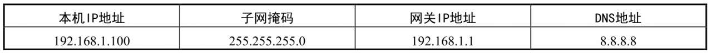
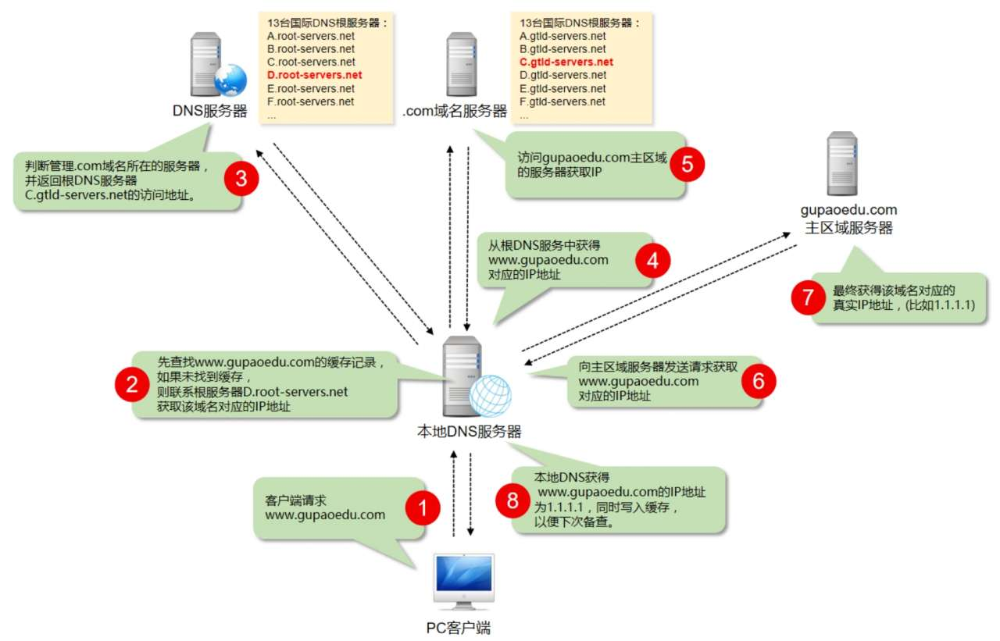
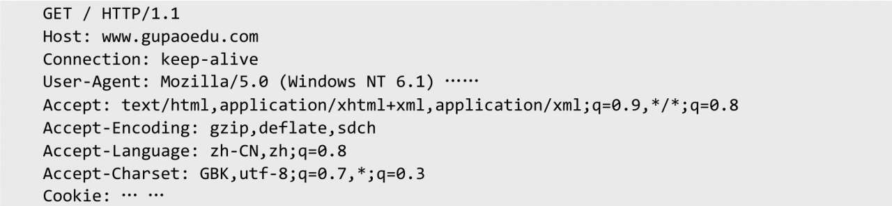
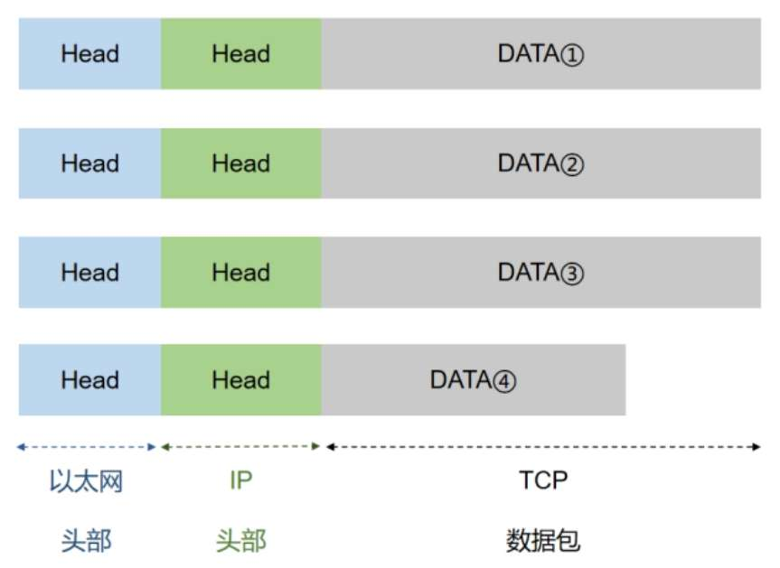

# 向浏览器输入URL后发生了什么

当在浏览器地址栏中输入网址后，浏览器是怎么把最终的页面呈现出来的呢？这个过程大致可以分为两个部分：网络通信和页面渲染。下面详细分析完整的通信过程。

1. 本机设置以下信息

    

2. 打开浏览器，想要访问咕泡官网，在地址栏中输入网址 www.gupaoedu.com。

3. 通过访问DNS域名系统服务器（基于UDP）获得IP地址。

     

     域名有顶级域名和二级域名。顶级域名如 .com、.net、.org、.cn等属于国际顶级域名。根据目前的国际互联网域名体系，国际顶级域名分为两类：类别顶级域名（gTLD）和地理顶级域名（ccTLD）。类别顶级域名是以“com”“net”“org”“biz”“info”等结尾的域名，均由国外公司负责管理。地理顶级域名是以国家或地区代码为结尾的域名，如“cn”代表中国，“uk”代表英国。地理顶级域名一般由各个国家或地区负责管理。

4. 向目标机器发起HTTP请求，获得如下格式的数据内容

    

    我们假定这个部分的长度为4960字节，它会被嵌在TCP数据包中。

5. TCP。TCP数据包需要设置端口，接收方（咕泡官网）的HTTP端口默认是80，发送方（本机）的端口是一个随机生成的1024～65535之间的整数，假定为51775。TCP数据包的头部长度为20字节，加上嵌入HTTP的数据包，总长度变为4980字节。

6. IP。TCP数据包再嵌入IP数据包。IP数据包需要设置双方的IP地址，这是已知的。IP数据包的头部长度为20字节，加上嵌入的TCP数据包，总长度变为5000字节。

7. 以太网协议。IP数据包嵌入以太网数据包。以太网数据包需要设置双方的MAC地址，发送方为本机的网卡MAC地址，接收方为网关192.168.1.1的MAC地址（通过ARP得到）。以太网数据包的数据部分最大长度为1500字节，而现在的IP数据包长度为5000字节。因此，IP数据包必须分割成四个包。因为每个包都有自己的IP头部（20字节），所以四个包的长度分别为1500字节、1500字节、1500字节、560字节。如下图所示是以太网数据包示意图。   

    

8. 服务器响应。经过多个网关的转发，咕泡官网的服务器收到了这四个以太网数据包。

根据IP头部的序号，咕泡官网将四个包拼起来，取出完整的TCP数据包，然后读出里面的“HTTP请求”，接着做出“HTTP响应”，再用TCP发回来。本机收到HTTP响应以后，就可以将网页显示出来，完成一次网络通信。