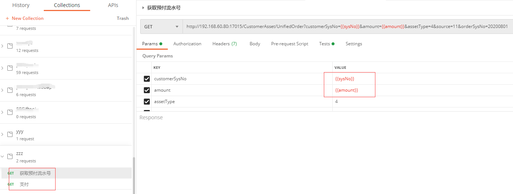
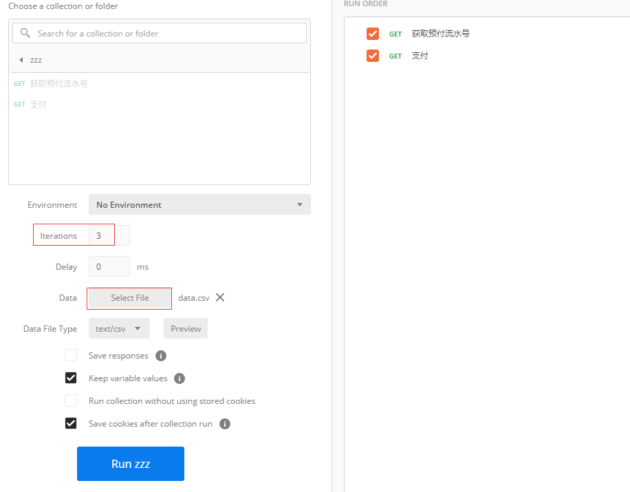
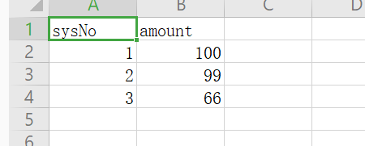
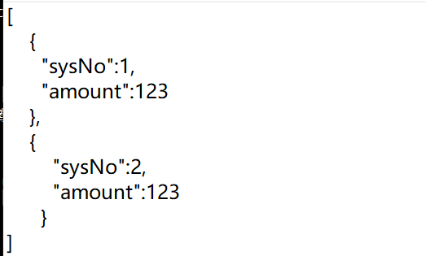
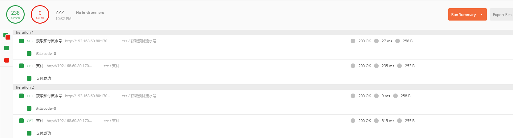

## Runner

通过postman的runner可以进行模拟请求从而可以进行接口自动测试和数据修复。

1. 新建一个Collection,在其中按照调用顺序新建接口

    接口中定义需要的参数，这些参数值在的在Runner中进行导入。

    

    如果第一个接口的结果需要传递到第二个接口中，需要在`Tests`中解析响应数据，将需要的数据通过postman提供的environment或类似的机制同步。

    `pm.environment.set("payId", payId);`

2. 打开Runner，选择对应的Collection

    导入数据，根据数据行数，确定需要调用接口的次数；调用Collection中所有的接口完成算一次。

    

    目前支持csv格式和json格式的数据源

    

    

3. 运行Runner

    

    根据需要可以在每个请求的`Tests`中写测试用例，这样就可以在运行结果中看到打印的测试信息。

## demo

 [数据修复demo.postman_collection.json](./img/数据修复demo.postman_collection.json)   